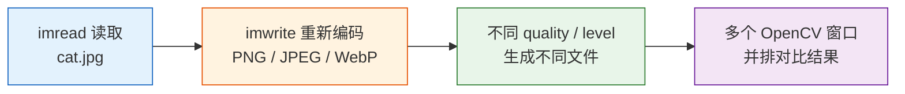
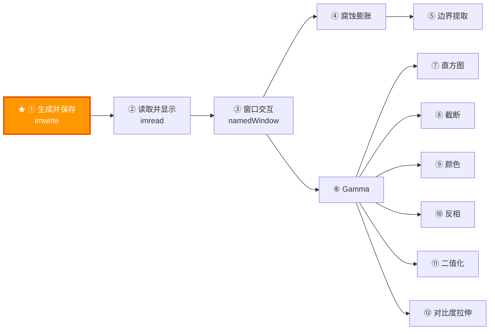

# 课程 01：生成并保存图片（cv::imwrite）

> 适合人群：零基础初学者 | 预计阅读时间：20 分钟

> 当前仓库中的示例代码版本，已经改为：**直接读取 `cat.jpg`，再保存成 PNG / JPEG / WebP 的不同参数版本，并通过多个 OpenCV 窗口并排对比效果**。参数也故意拉得更开，比如 JPEG 会直接对比高质量和极低质量，方便更明显地看到压缩伪影。

---

## 零、预备知识

在开始之前，你需要了解以下概念：

### 什么是"像素"？

**像素（Pixel）** 是图片的最小组成单位，就像马赛克瓷砖一样。一张 640×480 的图片，就是由 640 列 × 480 行 = **307,200 个小方块**组成的。

```
一张 8×6 像素的"图片"长这样（每个 ■ 是一个像素）：

  ■ ■ ■ ■ ■ ■ ■ ■    ← 第 0 行（共 8 个像素）
  ■ ■ ■ ■ ■ ■ ■ ■    ← 第 1 行
  ■ ■ ■ ■ ■ ■ ■ ■    ← 第 2 行
  ■ ■ ■ ■ ■ ■ ■ ■    ← 第 3 行
  ■ ■ ■ ■ ■ ■ ■ ■    ← 第 4 行
  ■ ■ ■ ■ ■ ■ ■ ■    ← 第 5 行

  总共 8 × 6 = 48 个像素
```

### 什么是"通道"？

每个像素可以有多个数值来描述它的颜色：

| 通道数 | 名称 | 含义 | 每个像素存什么 |
|--------|------|------|--------------|
| 1 | 灰度图 | 只有亮暗之分 | 1 个数：亮度（0=黑，255=白） |
| 3 | BGR 彩色图 | 蓝/绿/红三色混合 | 3 个数：B, G, R 各 0~255 |
| 4 | BGRA 图 | 彩色 + 透明度 | 4 个数：B, G, R, A（A=透明度） |

```
灰度像素：  [128]              → 中灰色
BGR 像素：  [255, 0, 0]        → 纯蓝色（OpenCV 用 BGR 不是 RGB！）
BGRA 像素： [255, 0, 0, 200]   → 蓝色 + 半透明
```

> **注意**：OpenCV 的颜色顺序是 **B-G-R**（蓝绿红），而不是日常说的 R-G-B（红绿蓝）。这是 OpenCV 的历史遗留设计，初学者很容易搞混。

### 什么是 cv::Mat？

`cv::Mat` 是 OpenCV 中**最核心的数据结构**，用于存储图片。你可以把它想象成一个**二维表格**（矩阵），每个格子里存着一个或多个数字：

```
一张 4×3 的灰度图在 cv::Mat 中的存储方式：

    列0   列1   列2   列3
  ┌─────┬─────┬─────┬─────┐
行0│ 0   │ 64  │ 128 │ 192 │
  ├─────┼─────┼─────┼─────┤
行1│ 32  │ 96  │ 160 │ 224 │
  ├─────┼─────┼─────┼─────┤
行2│ 64  │ 128 │ 192 │ 255 │
  └─────┴─────┴─────┴─────┘

  Mat.rows = 3（行数 = 图片高度）
  Mat.cols = 4（列数 = 图片宽度）
  Mat.channels() = 1（灰度图只有 1 个通道）
```

---

## 一、本课目标

本课你将学会：

1. **读取一张真实图片 `cat.jpg`**
2. **用 `cv::imwrite` 重新编码为不同格式和不同参数**
3. **通过多个 OpenCV 窗口并排对比压缩效果**
4. 深入理解 **PNG / JPEG / WebP** 的压缩原理与参数含义



---

## 二、cv::imwrite 详解

### 2.1 函数签名

```cpp
bool cv::imwrite(const std::string& filename, 
                 const cv::Mat& img,
                 const std::vector<int>& params = std::vector<int>());
```

| 参数 | 含义 | 示例 |
|------|------|------|
| `filename` | 输出文件路径（含扩展名） | `"output.png"`, `"result.jpg"` |
| `img` | 要保存的图片（cv::Mat） | 你创建或处理后的图片 |
| `params` | 可选参数（压缩质量等） | 通常省略 |
| 返回值 | `true` 成功，`false` 失败 | — |

### 2.2 支持的图片格式

`imwrite` 通过**文件扩展名**自动判断要保存为什么格式：

| 扩展名 | 格式 | 特点 | 适合场景 |
|--------|------|------|---------|
| `.png` | PNG | 无损压缩，支持透明度 | 需要精确保留像素值、需要透明背景 |
| `.jpg` / `.jpeg` | JPEG | 有损压缩，文件小 | 照片、网页图片 |
| `.bmp` | BMP | 无压缩，文件大 | 简单场景、调试 |
| `.tiff` | TIFF | 无损，支持高位深 | 科研、医疗影像 |
| `.webp` | WebP | 有损/无损，文件很小 | 网页优化 |

```
格式选择决策树：

  需要透明度？──── 是 ──▶ .png
       │
      否
       │
  需要无损？──── 是 ──▶ .png 或 .tiff
       │
      否
       │
  文件大小重要？── 是 ──▶ .jpg（quality 调低）或 .webp
       │
      否
       │
  ──▶ .png（默认安全选择）
```

**同一张 640×480 BGRA 图片保存为不同格式的文件大小对比**：

```
  格式        文件大小     压缩比     原始数据 1,228,800 字节
  ────────────────────────────────────────────────────────
  .bmp       1,228 KB    ██████████████████████████ 1:1
  .png        ~150 KB    ███                        ~1:8
  .jpg(95)    ~100 KB    ██                         ~1:12
  .jpg(50)     ~25 KB    █                          ~1:49
  .webp        ~40 KB    █                          ~1:30

  注意：JPEG 保存 BGRA 图片时会自动丢弃 Alpha 通道
```

| 格式 | 有损/无损 | 支持透明 | 支持16位 | 典型压缩比 |
|------|----------|---------|---------|-----------|
| PNG | 无损 | ✅ Alpha | ✅ | 2~10× |
| JPEG | 有损 | ❌ | ❌ | 10~50× |
| BMP | 无压缩 | ❌ | ❌ | 1× |
| TIFF | 无损 | ✅ | ✅ 32位 | 1~3× |
| WebP | 可选 | ✅ Alpha | ❌ | 10~30× |

### 2.3 压缩原理：为什么同一张图会有不同大小和不同画质？

理解压缩，先分清两件事：

1. **你希望文件更小**
2. **你是否允许像素被修改**

这两件事决定了压缩算法的路线。

#### 2.3.1 无损压缩：文件变小，但像素一个都不能改

PNG 属于典型的**无损压缩**。

它的核心思想不是“把图像变模糊”，而是：

1. 先观察像素之间有没有规律
2. 把“规律”编码出来，而不是把每个像素原样重复写进去
3. 用通用压缩算法把重复模式进一步压缩

比如一条纯色区域：

```
原始像素：255 255 255 255 255 255 255 255

如果直接保存，要写 8 次 255
如果用“模式”描述，可以写成：
“255 连续出现 8 次”
```

真实 PNG 比这个复杂得多，但思路类似：

1. **先做行内预测（filter）**
2. **把当前像素改写成“它和左边/上边像素的差值”**
3. **差值通常更集中、更容易重复**
4. **再用 DEFLATE 压缩这些重复数据**

从工程角度看，PNG 的压缩链路可以写成：

$$
\mathrm{Raw\ Scanline} \xrightarrow{\text{Filter}} \text{Residual Bytes} \xrightarrow{\text{DEFLATE(LZ77+Huffman)}} \text{Bitstream}
$$

其中每一行都会在 5 种 Filter 中选一种：

1. `None`：不做预测
2. `Sub`：用左邻像素预测
3. `Up`：用上一行同列像素预测
4. `Average`：用左和上的平均值预测
5. `Paeth`：用左 `a`、上 `b`、左上 `c` 的局部线性预测

Paeth 的核心计算：

$$
p = a + b - c
$$

再从 $a,b,c$ 中选与 $p$ 最接近者作为预测值。最后写入的是“真实值 - 预测值”的残差。自然图像中残差通常更接近 0，因此更容易被后续的 LZ77 重复匹配和 Huffman 熵编码压缩。

为什么这样有效？

因为自然图像里相邻像素往往很接近。比如天空区域：

```
原始值： 120 121 121 122 122 123 123 123
差分后： 120  1   0   1   0   1   0   0
```

后面这串数据明显更容易压缩。

##### 代码实验：验证“无损”和“级别只影响体积/速度”

下面代码一次性做三件事：

1. 保存 PNG level 0/3/6/9，比较编码耗时与文件大小
2. 保存 JPEG(90) 与 WebP(80) 做体积对比
3. 回读后计算像素差异，验证 PNG 是否严格无损

```cpp
#include <opencv2/opencv.hpp>
#include <filesystem>
#include <chrono>
#include <iostream>

namespace fs = std::filesystem;

double encodeAndStat(const cv::Mat& img,
           const std::string& path,
           const std::vector<int>& params,
           std::uintmax_t& sizeBytes) {
  auto t0 = std::chrono::high_resolution_clock::now();
  cv::imwrite(path, img, params);
  auto t1 = std::chrono::high_resolution_clock::now();
  sizeBytes = fs::file_size(path);
  return std::chrono::duration<double, std::milli>(t1 - t0).count();
}

int main() {
  cv::Mat src = cv::imread("cat.jpg", cv::IMREAD_COLOR);
  if (src.empty()) {
    std::cerr << "failed to load image\n";
    return 1;
  }

  for (int level : {0, 3, 6, 9}) {
    std::string out = "png_l" + std::to_string(level) + ".png";
    std::uintmax_t bytes = 0;
    double ms = encodeAndStat(src, out, {cv::IMWRITE_PNG_COMPRESSION, level}, bytes);

    cv::Mat back = cv::imread(out, cv::IMREAD_COLOR);
    cv::Mat diff;
    cv::absdiff(src, back, diff);
    int nonZero = cv::countNonZero(diff.reshape(1));

    std::cout << out
          << "  size=" << bytes
          << " bytes  time=" << ms << " ms"
          << "  pixel_diff_count=" << nonZero
          << "\n";
  }

  {
    std::uintmax_t bytes = 0;
    double ms = encodeAndStat(src, "jpeg_q90.jpg", {cv::IMWRITE_JPEG_QUALITY, 90}, bytes);
    cv::Mat back = cv::imread("jpeg_q90.jpg", cv::IMREAD_COLOR);
    cv::Mat diff;
    cv::absdiff(src, back, diff);
    int nonZero = cv::countNonZero(diff.reshape(1));
    std::cout << "jpeg_q90.jpg"
          << "  size=" << bytes
          << " bytes  time=" << ms << " ms"
          << "  pixel_diff_count=" << nonZero
          << "\n";
  }

  {
    std::uintmax_t bytes = 0;
    double ms = encodeAndStat(src, "webp_q80.webp", {cv::IMWRITE_WEBP_QUALITY, 80}, bytes);
    cv::Mat back = cv::imread("webp_q80.webp", cv::IMREAD_COLOR);
    cv::Mat diff;
    cv::absdiff(src, back, diff);
    int nonZero = cv::countNonZero(diff.reshape(1));
    std::cout << "webp_q80.webp"
          << "  size=" << bytes
          << " bytes  time=" << ms << " ms"
          << "  pixel_diff_count=" << nonZero
          << "\n";
  }

  return 0;
}
```

你大概率会观察到：

1. PNG `level` 越高，编码时间通常越长，文件通常更小
2. 各个 PNG `level` 的 `pixel_diff_count` 都应为 `0`
3. JPEG/WebP(有损设置) 的 `pixel_diff_count` 通常远大于 `0`，但文件可能更小

##### 与 JPEG/WebP 的算法对比（用于选型）

| 维度 | PNG（无损） | JPEG（有损） | WebP（有损） |
|------|-------------|--------------|--------------|
| 核心机制 | Filter + DEFLATE | DCT + 量化 + 熵编码 | 块预测 + 变换 + 量化 + 熵编码 |
| 是否改像素 | 否 | 是 | 是（有损模式） |
| 强项场景 | UI、图标、文字、截图、透明图 | 自然照片 | 同等体积下常比 JPEG 细节更好 |
| 常见问题 | 纹理复杂照片压缩率一般 | 低质量时块效应和振铃 | 编码更复杂，参数敏感 |

**关键结论（务必记住这 3 条）**：

1. PNG 的本质是“预测去相关 + DEFLATE”，不是靠模糊图像来变小。
2. `IMWRITE_PNG_COMPRESSION` 改的是编码策略与时间预算，不改解码后的像素。
3. 如果回读 PNG 后像素不一致，通常不是 PNG 压缩导致，而是颜色空间、位深或读写流程不一致。

#### 2.3.2 有损压缩：允许“看起来差不多”，换取更小文件

JPEG 和有损 WebP 的思路完全不同：

它们会主动丢掉一部分人眼不太敏感的信息，换更高压缩率。

下面按“编码器真正做了什么”逐步拆解 JPEG（以最常见的 Baseline DCT JPEG 为主）：

##### 第 1 步：颜色空间变换（RGB/BGR -> YCbCr）

JPEG 不直接在 RGB 上压缩，而是先转到 YCbCr：

1. Y：亮度（人眼最敏感）
2. Cb/Cr：蓝色差与红色差（人眼相对不敏感）

常见近似关系：

$$
Y = 0.299R + 0.587G + 0.114B
$$

关键意义：把“视觉最敏感信息”和“相对不敏感信息”分开处理，为后面的有损策略做准备。

##### 第 2 步：色度子采样（Chroma Subsampling）

很多 JPEG 会对 Cb/Cr 做降采样，如 4:2:0、4:2:2。

可以直观理解为：

1. 亮度 Y 基本全分辨率保留
2. 色度 Cb/Cr 以更低空间分辨率保存

为什么可行？因为人眼对亮度细节比对颜色细节敏感得多。

副作用：

1. 彩色细线和小字边缘可能出现彩边
2. 高饱和边界处容易出现色度模糊

##### 第 3 步：分块（8x8 Block）

每个分量会被切成很多 8x8 小块；若尺寸不是 8 的倍数，编码器会补齐边界。

这一设计让后续变换和统计建模可控，但也引入一个已知风险：

1. 每块相对独立编码
2. 量化较强时容易出现“块边界不连续”
3. 这就是常说的块效应（blocking artifact）来源之一

##### 第 4 步：电平平移（Level Shift）

对 8 位图像，块内样本通常从 [0,255] 平移到 [-128,127]，即：

$$
f'(x,y) = f(x,y) - 128
$$

这样做是为了让 DCT 处理以 0 为中心的数据，更符合变换假设，也有利于数值稳定性。

##### 第 5 步：二维 DCT（空间域 -> 频域）

每个 8x8 块做二维 DCT，得到 64 个频率系数：

1. 左上角是 DC（平均亮度）
2. 越往右下频率越高（细节、纹理、噪声）

二维 DCT 可写为：

$$
F(u,v)=\frac{1}{4}C(u)C(v)\sum_{x=0}^{7}\sum_{y=0}^{7}f'(x,y)
\cos\frac{(2x+1)u\pi}{16}\cos\frac{(2y+1)v\pi}{16}
$$

其中 $C(0)=\frac{1}{\sqrt{2}}$，其余 $C(k)=1$。

关键直觉：自然图像能量常集中在低频，所以高频系数天然更小、更容易被后续“粗量化”直接压成 0。

##### 第 6 步：量化（真正有损发生处）

量化是 JPEG 里最关键、也是唯一主动丢信息的步骤：

$$
\hat{F}(u,v) = \mathrm{round}\left(\frac{F(u,v)}{Q(u,v)}\right)
$$

1. $Q(u,v)$ 越大，丢失越强
2. 高频位置通常对应更大的量化步长
3. 因此高频细节最先被抹掉

与质量参数的关系（工程理解）：

1. 质量值高：量化表更“细”，保留更多细节，文件更大
2. 质量值低：量化表更“粗”，更多系数变 0，文件更小但伪影更明显

##### 第 7 步：ZigZag 扫描（二维变一维）

量化后 8x8 系数按 ZigZag 顺序展开：

1. 先走低频
2. 再逐步走到高频

这样做的目的：把大量尾部 0 聚集到序列后半段，便于后续游程编码（RLE）。

##### 第 8 步：DC 差分 + AC 游程编码（RLE）

1. DC 系数：与前一个块的 DC 做差分（DPCM）
2. AC 系数：把“连续 0 的个数 + 下一个非零值大小”编码

结果是：原始 64 个数被变成更稀疏、更短的符号流。

##### 第 9 步：Huffman 熵编码

把上一步得到的符号流再做 Huffman 编码：

1. 高频出现的短符号分配短码字
2. 低频出现的长符号分配长码字

这一步不引入额外失真，只负责“无损地进一步压短比特流”。

##### 第 10 步：码流封装与标记段

最终写成 JPEG 文件，包含若干 marker 段（如 SOI、DQT、DHT、SOF、SOS、EOI）。

这部分保存了：

1. 量化表
2. Huffman 表
3. 图像尺寸与采样信息
4. 压缩数据本体

解码器按这些信息反向执行：熵解码 -> 反量化 -> IDCT -> 颜色空间反变换。

##### 伪影和步骤的直接对应关系

1. 块效应：8x8 分块 + 强量化导致块间不连续
2. 模糊/糊字：高频系数被大量量化为 0
3. 振铃（边缘波纹）：高频截断后在边缘附近出现振荡
4. 色边/色彩渗漏：色度子采样与量化叠加
5. 渐变断层：低频也被压得过粗，平滑过渡变成台阶

##### 工程上最实用的判断

1. 照片类内容：JPEG 常有很高压缩比
2. 文本/UI/线稿：JPEG 容易先伤边缘，不如 PNG 稳
3. 同样体积预算下：优先比较 JPEG 与 WebP 的主观质量
4. 若需严格像素一致：JPEG 不适用，必须选无损格式

#### 2.3.3 WebP 为什么常常比 JPEG 更省？

WebP 既支持无损，也支持有损。课程里按钮演示的是最常用的**有损 WebP**。

它比经典 JPEG 更新，通常会做得更细：

1. 更灵活的块预测
2. 更现代的变换和熵编码
3. 对平滑区、边缘区、纹理区的处理更细致

因此在**主观画质差不多**时，WebP 往往比 JPEG 更小。

但它不是“永远更好”，如果图像里有：

- 大量文字
- 像素风图标
- 透明边缘

那么无损 PNG 仍然常常更稳。

#### 2.3.4 为什么本课要特意生成“渐变 + 细线 + 棋盘格 + 噪声”的测试图？

因为不同内容，对压缩算法的压力不一样：

| 图像区域 | 对压缩算法意味着什么 | 最容易观察什么现象 |
|---------|----------------------|------------------|
| 平滑渐变 | 容易压缩，但会暴露色带 | 低质量 JPEG 的渐变断层 |
| 细线条/文字 | 高频信息多 | 边缘模糊、锯齿、振铃 |
| 棋盘格 | 高频且变化剧烈 | 块效应、脏边缘 |
| 噪声块 | 随机性高，很难压缩 | 文件变大，或被强行抹平 |
| Alpha 透明区 | 只在支持透明的格式里保留 | JPEG 自动丢失透明度 |

所以这节课里的按钮不是随便存几张文件，而是故意制造一个**适合比较压缩效果的测试图**。

#### 2.3.5 一句话记忆

```
PNG：不改像素，靠“找重复模式”变小
JPEG：允许丢细节，靠“删掉不重要的信息”变小
WebP：也是有损/无损压缩，但策略更新，常常更省
```

#### 2.3.6 再深入一层：什么叫“信息量”，为什么无损压缩有极限？

这是理解压缩最底层的一层。

从信息论角度看，一份数据能不能被无损压缩，取决于它有没有**统计冗余**。

如果一个数据源的平均信息熵是 $H$，那么任何无损编码器的平均码长都不可能长期低于这个熵界。

直观理解：

1. 数据越有规律，越能压
2. 数据越接近随机噪声，越难压
3. 真正随机的数据，几乎没有无损压缩空间

例如：

```
纯黑图：
0 0 0 0 0 0 0 0 0 0 ...
→ 冗余极高，非常容易压缩

随机噪声图：
83 14 201 55 91 7 244 119 ...
→ 几乎没有规律，无损几乎压不动
```

所以“无损压缩极限是多少”这个问题，不能回答成“最多压到 10%”或“通常是 30%”。

更准确的说法是：

$$
\mathrm{无损压缩上限} \approx \text{数据中的可利用冗余}
$$

对图像来说，这些冗余通常来自：

1. 相邻像素相近
2. 大面积纯色或平滑渐变
3. 通道之间存在相关性
4. 重复纹理和重复块

而无损编码器的强弱差别，则体现在它能否把这些冗余“看出来”。

#### 2.3.7 WebP 有损为什么通常比 JPEG 更省？

有损 WebP 的思想更接近现代视频编码的帧内压缩，而不是传统 JPEG 的固定 `8×8 DCT` 路线。

它的大致思路是：

1. 先对块做更灵活的空间预测
2. 只编码“预测误差”
3. 再对误差做变换、量化和熵编码

和 JPEG 相比，WebP 常见优势在于：

1. 预测更强
2. 率失真权衡更现代
3. 对平滑区和结构区的处理更细
4. 通常能用更小码率达到相近主观质量

因此它低质量时的观感常常和 JPEG 不太一样：

1. JPEG 更容易出现块状感
2. WebP 更容易出现平滑化、磨皮感、纹理被抹开

这不是绝对规律，但非常常见。

#### 2.3.8 WebP quality 100 / 35 / 5 背后的策略变化

WebP 的 `quality` 不是单一“量化表缩放”，而是更综合的编码控制旋钮。通常会影响：

1. 量化强度
2. 块预测和模式选择
3. 残差保留程度
4. 去块滤波与平滑强度
5. 率失真优化力度

可以粗略整理成下面的理解：

| WebP 质量区间 | 策略倾向 | 典型现象 |
|--------------|---------|---------|
| `90~100` | 尽量保细节，码率放宽 | 细节稳定，文件仍通常比 JPEG 小 |
| `50~80` | 做明显压缩，但努力维持主观观感 | 一般较平衡 |
| `20~40` | 进一步压低残差和纹理信息 | 细毛发、细纹开始被抹平 |
| `1~10` | 极端追求低码率 | 局部平滑明显，纹理塌陷 |

所以你当前课程里的 `100 / 35 / 5`，就是在故意把这种策略差异放大到肉眼可见。

#### 2.3.9 无损 WebP 和 PNG 的差异

无损 WebP 不是简单重复 PNG 的思路。PNG 主要依赖：

1. 行滤波
2. `DEFLATE`

而无损 WebP 会更多利用图像特化策略：

1. 颜色缓存
2. 局部颜色变换
3. LZ77 风格引用
4. Huffman 编码
5. 面向图像块结构的更细建模

所以在某些图像上，无损 WebP 会比 PNG 更小，尤其是：

1. 图标
2. UI 截图
3. 扁平图形
4. 颜色重复度高的图片

但 PNG 仍然非常强，因为它：

1. 兼容性最好
2. 工具链最成熟
3. 透明通道稳定
4. 在教学里最容易解释

### 2.4 参数到策略的映射表

```cpp
// JPEG 质量控制（0~100，默认 95）
cv::imwrite("photo.jpg", img, {cv::IMWRITE_JPEG_QUALITY, 85});

// PNG 压缩级别（0~9，默认 3，越大文件越小但越慢）
cv::imwrite("image.png", img, {cv::IMWRITE_PNG_COMPRESSION, 6});

// WebP 质量（0~100，越低压得越狠）
cv::imwrite("image.webp", img, {cv::IMWRITE_WEBP_QUALITY, 35});
```

#### 2.4.1 一张总表：quality / level 到底动了什么

| 格式 | OpenCV 参数 | 参数范围 | 改变的主要对象 | 会不会改变画质 | 主要代价 |
|------|------------|---------|---------------|---------------|---------|
| PNG | `IMWRITE_PNG_COMPRESSION` | `0~9` | DEFLATE 搜索深度、匹配策略、编码时间预算 | ❌ 不会 | 时间换体积 |
| JPEG | `IMWRITE_JPEG_QUALITY` | `0~100` | 量化强度（核心）、高频保留程度 | ✅ 会 | 细节换体积 |
| WebP | `IMWRITE_WEBP_QUALITY` | `0~100` | 量化、预测残差保留、率失真权衡 | ✅ 会 | 细节换体积 |

#### 2.4.2 PNG level 的工程语义

| PNG level | 典型策略倾向 | 文件大小 | 编码速度 | 适合场景 |
|----------|-------------|---------|---------|---------|
| `0` | 几乎不做压缩搜索 | 最大 | 最快 | 临时保存、测速 |
| `1~3` | 轻量搜索 | 较大 | 快 | 交互式工具 |
| `4~6` | 平衡策略 | 中等偏小 | 中等 | 默认实用区 |
| `7~9` | 深搜索、尽量找最优重复 | 最小 | 最慢 | 发布前导出 |

记住：PNG 不存在“低 level 画质差，高 level 画质好”这种说法。

#### 2.4.3 JPEG quality 的工程语义

| JPEG quality | 量化策略倾向 | 主观效果 | 文件大小 |
|-------------|-------------|---------|---------|
| `100` | 几乎最弱量化 | 最接近原图 | 最大 |
| `85~95` | 高质量常用区 | 通常很难看出损伤 | 较大 |
| `60~80` | 中等压缩 | 可接受，细节略损失 | 中等 |
| `30~50` | 明显压缩 | 细节开始明显退化 | 较小 |
| `1~20` | 极端压缩 | 块感、糊感、色块明显 | 很小 |

#### 2.4.4 WebP quality 的工程语义

| WebP quality | 策略倾向 | 主观效果 | 文件大小 |
|-------------|---------|---------|---------|
| `90~100` | 尽量保真 | 接近高质量 JPEG，常更小 | 中等偏大 |
| `60~85` | 平衡区 | 很常用，主观质量较稳 | 中等 |
| `25~50` | 明显压缩 | 细节逐渐平滑化 | 较小 |
| `1~15` | 极端低码率 | 纹理塌陷、边缘软化很明显 | 很小 |

```
JPEG 质量 vs 文件大小（一张 640×480 照片的典型值）：

  质量    文件大小    画质
  ─────────────────────────
  100     ~200 KB    最好（几乎无损）
   95     ~100 KB    非常好（默认）
   85     ~60 KB     好（肉眼难辨）
   50     ~25 KB     一般（仔细看有瑕疵）
   10     ~8 KB      差（明显模糊和色块）

  ← 低质量                高质量 →
  ← 小文件                大文件 →
```

---

## 三、当前代码讲解

当前仓库中的第 01 课代码已经不是“先生成测试图再保存”，而是更贴近真实工作流的版本：

1. `imread` 读取 `cat.jpg`
2. `imwrite` 重新编码成多种格式和参数
3. 再 `imread` 回来
4. 用多个 OpenCV 窗口并排显示结果

### 3.1 读取源图

```cpp
sourceImage = cv::imread(sourceImagePath.toStdString(), cv::IMREAD_COLOR);
```

这里的重点是：

1. 我们读取的是 BGR 彩色图
2. 这张图既是“原图”，也是后续所有重编码实验的输入
3. 这样就能公平比较不同编码方式对同一份输入的影响

### 3.2 重新编码并回读

课程里的每个按钮，本质上都在做下面这件事：

```cpp
cv::imwrite(job.fileName.toStdString(), sourceImage, job.params);
cv::Mat reloaded = cv::imread(job.fileName.toStdString(), cv::IMREAD_COLOR);
```

这一步非常重要，因为真正要比较的不是“编码器内部对象”，而是：

1. 写到磁盘后的文件大小
2. 再次读取后的像素内容

换句话说，比较对象应该是“编码后的真实结果”。

### 3.3 多窗口并排显示

当前代码使用 OpenCV 自己的窗口系统来对比：

```cpp
cv::namedWindow(windowName, cv::WINDOW_NORMAL);
cv::imshow(windowName, image);
cv::resizeWindow(windowName, 420, 320);
cv::moveWindow(windowName, x, y);
```

这样做有两个优势：

1. 更符合 OpenCV 初学者对 `namedWindow / imshow` 的理解路径
2. 对比时可以把原图、高质量、低质量放在一起直接横向观察

### 3.4 为什么要用 QTimer 调 `cv::waitKey(1)`？

因为当前项目主界面是 Qt，OpenCV 窗口也需要自己的事件循环。如果完全不喂事件，窗口可能卡住、不刷新、无法响应关闭。

所以课程代码里用了：

```cpp
waitKeyTimer->setInterval(30);
connect(waitKeyTimer, &QTimer::timeout, this, []() {
    cv::waitKey(1);
});
```

它的作用不是“等待按键教学”，而是让 OpenCV 多窗口在 Qt 程序里保持可交互。

---

## 四、cv::Mat 的内存布局

理解内存布局是深入学习 OpenCV 的关键。

### 4.1 连续存储

对于一张 4 列 × 3 行的 BGRA 图片，内存中是这样排列的：

```
mat.data 指向的内存（一维连续数组）：

行 0: [B G R A] [B G R A] [B G R A] [B G R A]   ← 4 个像素 × 4 字节 = 16 字节
行 1: [B G R A] [B G R A] [B G R A] [B G R A]   ← 16 字节
行 2: [B G R A] [B G R A] [B G R A] [B G R A]   ← 16 字节
      └──────── 像素 0 ────────┘                    总计 48 字节
      每个通道值占 1 字节（uchar = 0~255）
```

### 4.2 Step（步长）

`step` 是**一行数据在内存中占多少字节**。通常 `step = cols × channels × sizeof(每个值)`：

```
对于 640×480 CV_8UC4 的图片：

  step = 640 × 4 × 1 = 2560 字节/行

  要访问第 y 行第 x 列的像素：
  地址 = data + y × step + x × 4

  例如：访问 (100, 200) 位置的蓝色通道值：
  地址 = data + 100 × 2560 + 200 × 4 + 0
       = data + 256800
```

> **为什么需要 step？** 有时为了内存对齐（提高 CPU 读取速度），OpenCV 会在每行末尾加几个字节的填充（padding），导致 step > cols × channels。所以永远不要假设 step 等于行的像素数据大小，应该用 `mat.step` 获取。

### 4.3 at vs ptr 访问方式对比

```cpp
// 方法 1：at<T>(y, x) — 有边界检查（debug 模式下），方便但较慢
cv::Vec4b pixel = image.at<cv::Vec4b>(y, x);

// 方法 2：ptr<T>(y) — 获取一整行的指针，快速遍历
cv::Vec4b *row = image.ptr<cv::Vec4b>(y);
for (int x = 0; x < image.cols; ++x) {
    row[x][0] = 255; // B 通道
}

// 方法 3：直接操作 data 指针 — 最快但最危险
uchar *p = image.data + y * image.step + x * image.elemSize();
```

| 方法 | 速度 | 安全性 | 适合场景 |
|------|------|--------|---------|
| `at<T>` | 慢 | 高 | 调试、随机访问少量像素 |
| `ptr<T>` | 快 | 中 | 逐行遍历（推荐） |
| `data` 指针 | 最快 | 低 | 性能极致优化 |

**性能直观对比**（遍历 1920×1080 BGRA 图片的相对耗时）：

```
  方法           相对耗时      速度条
  ─────────────────────────────────────────
  at<Vec4b>     ~5.0 ms      ████████████████████  最慢
  ptr<Vec4b>    ~1.5 ms      ██████                快 3 倍
  data 指针      ~1.2 ms      █████                 最快
  
  建议：日常开发用 ptr，性能瓶颈用 data
```

---

## 五、动手实验

### 实验 1：点击界面按钮观察不同格式和参数

本课窗口里新增了一组实验按钮：

- `PNG 多窗口对比`
- `JPEG 多窗口对比`
- `WebP 多窗口对比`
- `全部格式多窗口对比`

建议按下面顺序观察：

1. 先点 `PNG 多窗口对比`
2. 注意两张 PNG 的画面应完全一致，只比较文件大小
3. 再点 `JPEG 多窗口对比`
4. 重点比较 `100 / 40 / 8`
5. 看猫毛、胡须、眼睛边缘和背景过渡
6. 最后点 `WebP 多窗口对比`
7. 比较 `100 / 35 / 5` 的平滑化程度

因为现在是多窗口并排显示，所以你可以直接把原图、高质量版本、低质量版本放在同一屏里观察。

### 实验 2：直接改参数做自己的压缩实验

```cpp
cv::imwrite("cat_png_0.png", img, {cv::IMWRITE_PNG_COMPRESSION, 0});
cv::imwrite("cat_png_9.png", img, {cv::IMWRITE_PNG_COMPRESSION, 9});

cv::imwrite("cat_jpeg_100.jpg", img, {cv::IMWRITE_JPEG_QUALITY, 100});
cv::imwrite("cat_jpeg_50.jpg", img, {cv::IMWRITE_JPEG_QUALITY, 50});
cv::imwrite("cat_jpeg_5.jpg", img, {cv::IMWRITE_JPEG_QUALITY, 5});

cv::imwrite("cat_webp_100.webp", img, {cv::IMWRITE_WEBP_QUALITY, 100});
cv::imwrite("cat_webp_30.webp", img, {cv::IMWRITE_WEBP_QUALITY, 30});
cv::imwrite("cat_webp_5.webp", img, {cv::IMWRITE_WEBP_QUALITY, 5});
```

建议你记录三件事：

1. 文件大小
2. 主观观感
3. 伪影类型是“块感”还是“平滑化”

### 实验 3：自己验证“无损压缩不会改像素”

最简单的方法是：

1. 读入原图
2. 保存为 PNG `level 0` 和 `level 9`
3. 再读回来
4. 用程序逐像素比较是否完全一致

如果一致，就说明 PNG 的 level 变化只影响编码过程，不影响最终图像内容。

---

## 六、常见问题

| 问题 | 原因 | 解决方法 |
|------|------|---------|
| 保存的图片颜色不对 | 混淆了 RGB 和 BGR | OpenCV 默认 BGR 顺序，调换 [0] 和 [2] |
| 保存的 JPEG 没有透明度 | JPEG 不支持 Alpha 通道 | 改用 PNG 格式 |
| `imwrite` 返回 false | 路径错误或无写权限 | 检查路径和权限 |
| 保存后文件为 0 字节 | Mat 为空 | 检查 `image.empty()` |
| `at<>` 崩溃 | 越界访问 | 确保 y < rows, x < cols |

---

## 七、术语表

| 术语 | 英文 | 含义 |
|------|------|------|
| 像素 | Pixel | 图片的最小单位 |
| 通道 | Channel | 描述像素颜色的数值个数 |
| 行步长 | Step / Stride | 一行像素在内存中占多少字节 |
| 无损压缩 | Lossless | 压缩后可完美还原原始数据 |
| 有损压缩 | Lossy | 压缩后有不可逆的质量损失 |
| Alpha | Alpha | 透明度通道，0=全透明，255=不透明 |
| Mat | Matrix | OpenCV 的图像/矩阵数据结构 |

---

## 八、知识地图



- **前置知识**：无（本课是起点）
- **后续课程**：课程 02（imread 读取本课生成的图片）

---

## 九、记忆口诀

```
🧠 cv::Mat 口诀：

  "行高列宽，类型看码"
  ──────────────────────
  Mat(rows, cols, type)
       │     │     │
      行数  列数   CV_8UC4 → 8位无符号4通道

🧠 imwrite 口诀：

  "写文件靠扩展名，成功返回布尔真"
  ──────────────────────────────
  bool ok = imwrite("name.png", mat);
                         │
                     扩展名决定格式

🧠 像素访问口诀：

  "at 安全慢，ptr 快一行，data 指针最疯狂"
```

---

## 十、新手雷区

```cpp
// ❌ 雷区 1：RGB 和 BGR 搞混
cv::Vec4b pixel;
pixel[0] = 255;  // 新手以为这是 R（红色），实际是 B（蓝色）！
pixel[2] = 255;  // 新手以为这是 B（蓝色），实际是 R（红色）！

// ✅ 正确理解：OpenCV 的通道顺序永远是 B-G-R-A
pixel[0] = 255;  // B = 蓝色
pixel[1] = 0;    // G = 绿色
pixel[2] = 255;  // R = 红色
pixel[3] = 200;  // A = 透明度
```

```cpp
// ❌ 雷区 2：Mat 构造函数参数顺序搞反
cv::Mat image(640, 480, CV_8UC4);  // 640 行 × 480 列？
// 实际上：640 是 rows（高度），480 是 cols（宽度）
// 如果你想要宽 640 高 480 的图：

// ✅ 正确
cv::Mat image(480, 640, CV_8UC4);  // 480 行（高） × 640 列（宽）
```

```cpp
// ❌ 雷区 3：不检查 imwrite 返回值
cv::imwrite("output.png", image);  // 失败了也不知道！

// ✅ 正确
if (!cv::imwrite("output.png", image)) {
    std::cerr << "保存失败！" << std::endl;
}
```

---

## 十一、思考题

1. **为什么 OpenCV 选择 BGR 而不是 RGB？**
   提示：和早期的摄像机硬件设计有关，历史遗留至今。

2. **如果把一张 CV_8UC4 的 BGRA 图片保存为 `.jpg` 格式，会发生什么？**
   提示：JPEG 不支持 Alpha 通道，OpenCV 会怎么处理？

3. **`image.at<cv::Vec4b>(y, x)` 中为什么先 y 后 x？**
   提示：Mat 是矩阵，矩阵的下标惯例是 (行, 列)。

---

## 十二、速查卡片

```
┌─────────────────── 课程 01 速查 ───────────────────┐
│                                                    │
│  创建 Mat:                                          │
│    cv::Mat img(rows, cols, CV_8UC4);               │
│                                                    │
│  访问像素:                                          │
│    cv::Vec4b &px = img.at<cv::Vec4b>(y, x);        │
│    px[0]=B  px[1]=G  px[2]=R  px[3]=A              │
│                                                    │
│  保存图片:                                          │
│    cv::imwrite("file.png", img);                   │
│                                                    │
│  常用类型码:                                        │
│    CV_8UC1=灰度  CV_8UC3=BGR  CV_8UC4=BGRA         │
│                                                    │
│  属性:                                              │
│    img.rows  img.cols  img.channels()               │
│    img.step  img.data  img.empty()                  │
│                                                    │
└────────────────────────────────────────────────────┘
```

---

## 十三、延伸阅读

- [cv::Mat 官方文档](https://docs.opencv.org/4.x/d3/d63/classcv_1_1Mat.html) — Mat 类的完整 API
- [cv::imwrite 官方文档](https://docs.opencv.org/4.x/d4/da8/group__imgcodecs.html#gabbc7ef1aa2edfaa87772f1202d67e0ce) — 支持的格式和参数
- [OpenCV 像素访问教程](https://docs.opencv.org/4.x/db/da5/tutorial_how_to_scan_images.html) — 三种像素遍历方式性能对比
