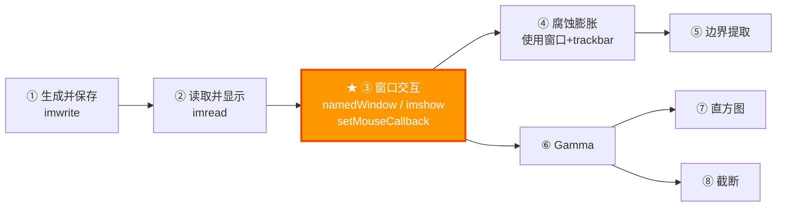

# 课程 03：窗口显示与鼠标交互（cv::namedWindow）

> 适合人群：零基础初学者 | 预计阅读时间：30 分钟

---

## 零、预备知识

### Qt 窗口 vs OpenCV 窗口

到目前为止，课程 01 和 02 都是在 Qt 的 `QLabel` 里显示图片。但 OpenCV 也有**自己的窗口系统**——`namedWindow` + `imshow`。

```
两种显示方式对比：

  Qt 方式（之前用的）：
  ┌─────────────────────────────┐
  │  Qt 主窗口                   │
  │  ┌───────────────────────┐  │
  │  │  QLabel（显示图片）     │  │
  │  │  ┌─────────────────┐  │  │
  │  │  │    🐱 图片      │  │  │
  │  │  └─────────────────┘  │  │
  │  └───────────────────────┘  │
  │  [按钮1] [按钮2]            │
  └─────────────────────────────┘
  图片嵌在 Qt 界面里

  OpenCV 方式（本课使用）：
  ┌──────────────┐    ┌──────────────┐
  │  Qt 主窗口    │    │ OpenCV 窗口   │
  │  [打开并显示] │    │ ┌──────────┐ │
  │              │    │ │  🐱 图片 │ │
  │              │    │ └──────────┘ │
  │              │    │ [Trackbar]   │
  └──────────────┘    └──────────────┘
  控制按钮在 Qt 里      图片在独立的 OpenCV 窗口显示
```

**为什么要用 OpenCV 窗口？**

| 特性 | Qt 显示 | OpenCV 窗口 |
|------|---------|------------|
| 需要的代码量 | 多（Mat→QImage→QPixmap→QLabel） | 少（`imshow` 一行搞定） |
| 拖拽缩放 | 需要自己实现 | 内建支持 |
| 内建滑动条 | 没有 | `createTrackbar` |
| 鼠标回调 | 需要重写 Qt 事件 | `setMouseCallback` |
| 实时更新 | 需要手动刷新 | `imshow` 自动刷新 |
| 适合场景 | 发布产品级 UI | 开发调试、快速实验 |

---

## 一、本课目标

本课你将学会：

1. **创建和管理 OpenCV 窗口**（`namedWindow`, `imshow`, `destroyWindow`）
2. **设置鼠标回调**在图片上画画（`setMouseCallback`）
3. 理解 **`waitKey` 的作用**（事件循环）
4. 在 Qt 应用中**集成 OpenCV 窗口**的注意事项

---

## 二、OpenCV 窗口系统详解

### 2.1 namedWindow

```cpp
cv::namedWindow(const std::string& winname, 
                int flags = cv::WINDOW_AUTOSIZE);
```

| 参数 | 含义 | 常用值 |
|------|------|--------|
| `winname` | 窗口名称（同时也是窗口的唯一标识） | `"My Window"` |
| `flags` | 窗口属性 | `WINDOW_AUTOSIZE`, `WINDOW_NORMAL` |

**窗口标志详解**：

| 标志 | 效果 | 适合场景 |
|------|------|---------|
| `WINDOW_AUTOSIZE` | 窗口大小固定 = 图片大小，不能手动缩放 | 图片不大时 |
| `WINDOW_NORMAL` | 可以自由缩放窗口大小 | 大图、需要缩放观察 |
| `WINDOW_FULLSCREEN` | 全屏显示 | 演示展示 |
| `WINDOW_GUI_EXPANDED` | 扩展 GUI（状态栏等） | 需要更多信息 |

```
WINDOW_AUTOSIZE vs WINDOW_NORMAL：

  WINDOW_AUTOSIZE:              WINDOW_NORMAL:
  ┌──────────────────┐          ┌───────────┐
  │                  │          │ 图片缩小   │
  │  图片多大        │          │ 适应窗口   │
  │  窗口就多大      │          │           │
  │                  │          └───────────┘
  │  不能拖边框缩放  │          可以拖边框缩放
  └──────────────────┘
```

### 2.2 imshow

```cpp
cv::imshow(const std::string& winname, const cv::Mat& mat);
```

```
imshow 的工作流程：

  1. 检查窗口 winname 是否存在
     └─ 不存在 → 自动创建一个（等效于先调 namedWindow）
     └─ 存在   → 更新显示内容
     
  2. 将 Mat 数据发送给 GUI 后端（如 GTK / Qt）
  
  3. 窗口更新画面
     └─ 但注意：画面不会立刻刷新！
        需要 waitKey() 才能处理 GUI 事件并刷新
```

### 2.3 waitKey —— 最容易误解的函数

```cpp
int key = cv::waitKey(int delay = 0);
```

| 参数 | 含义 |
|------|------|
| `delay = 0` | **无限等待**，直到用户按下任意键 |
| `delay > 0` | 等待 delay 毫秒，超时则返回 -1 |
| 返回值 | 按下的键的 ASCII 码，或 -1（超时） |

**为什么 imshow 后必须调 waitKey？**

```
没有 waitKey：              有 waitKey：
  imshow() → 数据送出       imshow() → 数据送出
  → 没人处理 GUI 事件        → waitKey() 处理 GUI 事件
  → 窗口不刷新！             → 窗口刷新 ✓
  → 画面停留在之前的         → 显示最新的图片 ✓
```

> `waitKey` 不只是"等待按键"——它更重要的作用是**处理 GUI 事件队列**（窗口重绘、鼠标移动等）。如果你不调用它，OpenCV 窗口就是一个"死"窗口。

**在 Qt 程序中的特殊处理**：由于 Qt 有自己的事件循环，我们用 `QTimer` 定期调用 `waitKey(1)`：

```cpp
waitKeyTimer = new QTimer(this);
waitKeyTimer->setInterval(30);  // 每 30ms 调用一次
connect(waitKeyTimer, &QTimer::timeout, this, []() {
    cv::waitKey(1);  // 处理 OpenCV 窗口事件
});
```

---

## 三、鼠标回调机制

### 3.1 setMouseCallback

```cpp
cv::setMouseCallback(const std::string& winname,       // 窗口名
                     cv::MouseCallback onMouse,         // 回调函数
                     void* userdata = nullptr);         // 用户数据
```

**什么是"回调函数"？**

```
普通函数调用：       你主动调用函数
  你 ──────▶ 函数()

回调函数：           你注册函数，系统在事件发生时调用
  你 ──▶ "嘿系统，鼠标一动就帮我调 myFunc"
  系统 ──▶ 等待...
  用户移动鼠标 ──▶ 系统 ──▶ myFunc(event, x, y, flags)
                                    ↑
                                  系统帮你调的
```

回调函数的签名必须是：

```cpp
void myCallback(int event, int x, int y, int flags, void* userdata);
```

| 参数 | 含义 | 示例 |
|------|------|------|
| `event` | 鼠标事件类型 | `EVENT_MOUSEMOVE`, `EVENT_LBUTTONDOWN` |
| `x, y` | 鼠标在图片中的坐标 | (100, 200) |
| `flags` | 附加标志（哪些键/按钮同时按下） | `EVENT_FLAG_CTRLKEY` |
| `userdata` | 你传入的自定义数据指针 | `this`（传入 widget 指针） |

### 3.2 鼠标事件类型

| 事件 | 常量 | 触发条件 |
|------|------|---------|
| 鼠标移动 | `EVENT_MOUSEMOVE` | 鼠标在窗口内移动 |
| 左键按下 | `EVENT_LBUTTONDOWN` | 按下左键的瞬间 |
| 左键抬起 | `EVENT_LBUTTONUP` | 松开左键的瞬间 |
| 左键双击 | `EVENT_LBUTTONDBLCLK` | 快速双击左键 |
| 右键按下 | `EVENT_RBUTTONDOWN` | 按下右键 |
| 右键抬起 | `EVENT_RBUTTONUP` | 松开右键 |
| 中键按下 | `EVENT_MBUTTONDOWN` | 按下中键（滚轮） |
| 滚轮滚动 | `EVENT_MOUSEWHEEL` | 滚动鼠标滚轮 |

**鼠标事件的典型触发序列**：

```
场景 1：单击
  LBUTTONDOWN → LBUTTONUP
  
场景 2：拖拽画线
  LBUTTONDOWN → MOUSEMOVE → MOUSEMOVE → ... → LBUTTONUP
  
场景 3：双击
  LBUTTONDOWN → LBUTTONUP → LBUTTONDBLCLK → LBUTTONUP
  
场景 4：右键菜单
  RBUTTONDOWN → RBUTTONUP
```

| flags 标志 | 含义 | 用途 |
|-----------|------|------|
| `EVENT_FLAG_LBUTTON` | 左键正被按住 | 判断拖拽状态 |
| `EVENT_FLAG_RBUTTON` | 右键正被按住 | 组合操作 |
| `EVENT_FLAG_CTRLKEY` | Ctrl 键被按住 | 修饰键+鼠标组合 |
| `EVENT_FLAG_SHIFTKEY` | Shift 键被按住 | 橡皮擦等功能 |
| `EVENT_FLAG_ALTKEY` | Alt 键被按住 | 其他组合 |

### 3.3 用鼠标在图片上画线

本课的核心功能——拖拽鼠标在图片上画线。原理是：

#### 鼠标绘画状态机

```mermaid
stateDiagram-v2
    [*] --> 等待按下
    等待按下 --> 正在画线 : 左键按下 / 记录起始点 P0
    正在画线 --> 正在画线 : 鼠标移动 / cv::line&#40;上一点, 当前点&#41;
    正在画线 --> 等待按下 : 左键抬起 / 停止画线
```

#### 绘画时序

```mermaid
sequenceDiagram
    participant 用户
    participant 回调函数
    participant OpenCV窗口

    用户->>回调函数: 左键按下 &#40;P0&#41;
    回调函数->>回调函数: drawing = true, lastPoint = P0

    用户->>回调函数: 鼠标移动 &#40;P1&#41;
    回调函数->>OpenCV窗口: cv::line&#40;P0, P1&#41;
    回调函数->>回调函数: lastPoint = P1

    用户->>回调函数: 鼠标移动 &#40;P2&#41;
    回调函数->>OpenCV窗口: cv::line&#40;P1, P2&#41;
    回调函数->>回调函数: lastPoint = P2

    用户->>回调函数: 鼠标移动 &#40;P3&#41;
    回调函数->>OpenCV窗口: cv::line&#40;P2, P3&#41;

    用户->>回调函数: 左键抬起
    回调函数->>回调函数: drawing = false

    Note right of OpenCV窗口: 多个小线段连起来<br/>= 流畅的手绘线条
```



文本版参考：

```
画线的状态机：

  [等待按下] ──── 左键按下 ────▶ [正在画线]
       ▲                           │
       │                           │ 鼠标移动：
       │                           │ cv::line(上一点, 当前点)
       │                           │
       └──── 左键抬起 ────────────┘

  时序图：
  
  时间 ─────────────────────────────────▶
  
  按下        移动    移动    移动    抬起
   ▼          ▼       ▼       ▼       ▼
   P0 ───── P1 ──── P2 ──── P3       停止
   │         │       │       │
   └─ line ──┘─ line─┘─ line─┘
   
  每次移动都画一小段线（P0→P1, P1→P2, P2→P3）
  多个小线段连起来 = 流畅的手绘线条
```

关键代码：

```cpp
void handleMouseEvent(int event, int x, int y, int flags)
{
    const cv::Point currentPoint(x, y);

    if (event == cv::EVENT_LBUTTONDOWN)
    {
        isDrawing = true;            // 开始画线
        lastPoint = currentPoint;     // 记录起点
        return;
    }

    if (event == cv::EVENT_MOUSEMOVE && isDrawing)
    {
        // 从上一个点画线到当前点
        cv::line(displayImage, lastPoint, currentPoint, 
                 brushColor, brushThickness, cv::LINE_AA);
        lastPoint = currentPoint;     // 更新起点
        cv::imshow(windowName, displayImage);  // 刷新显示
        return;
    }

    if (event == cv::EVENT_LBUTTONUP)
    {
        isDrawing = false;            // 停止画线
    }
}
```

### 3.4 cv::line 函数

```cpp
cv::line(cv::Mat& img,        // 要画线的图片
         cv::Point pt1,       // 起点
         cv::Point pt2,       // 终点
         const cv::Scalar& color,  // 颜色 (B, G, R)
         int thickness = 1,        // 线宽
         int lineType = LINE_8);   // 线型
```

线型对比：

```
LINE_8（8-连通，默认）：     LINE_AA（抗锯齿）：
  ██                          ██
    ██                        ░██
      ██                      ░░██
        ██                      ░██
          ██                      ██
  锯齿明显                    边缘平滑（推荐）
```

**OpenCV 常用绘图函数参考表**：

| 函数 | 功能 | 关键参数 | 示例 |
|------|------|---------|------|
| `cv::line` | 画直线 | pt1, pt2, color, thickness | `line(img, {0,0}, {100,100}, {0,0,255}, 2)` |
| `cv::circle` | 画圆 | center, radius | `circle(img, {50,50}, 30, {255,0,0}, 2)` |
| `cv::rectangle` | 画矩形 | pt1, pt2（对角） | `rectangle(img, {10,10}, {90,90}, {0,255,0})` |
| `cv::ellipse` | 画椭圆 | center, axes, angle | `ellipse(img, {50,50}, {40,20}, 0, ...)` |
| `cv::putText` | 写文字 | text, org, fontFace | `putText(img, "Hi", {10,30}, FONT_..., 1.0, ...)` |
| `cv::polylines` | 画多边形 | pts, isClosed | `polylines(img, pts, true, {0,0,255})` |
| `cv::fillPoly` | 填充多边形 | pts | `fillPoly(img, pts, {0,255,0})` |

> `thickness = -1` 表示填充（适用于 circle、rectangle）。
> `lineType = LINE_AA` 开启抗锯齿，推荐用于所有绘图。

**waitKey delay 值用法对照表**：

| delay 值 | 行为 | 典型场景 |
|----------|------|---------|
| `0` | 无限等待按键 | 静态图数调试，等用户确认 |
| `1` | 等待 1ms（几乎不等） | Qt 程序中配合 QTimer |
| `30~33` | ~30fps | 视频播放 (30fps) |
| `16~17` | ~60fps | 流畅动画 (60fps) |
| `100+` | 慢速播放 | 逐帧调试、慢放视频 |

---

## 四、OpenCV GUI 后端

### 4.1 什么是 GUI 后端？

OpenCV 的窗口系统不是自己从头实现的，而是依赖底层的 **GUI 库**：

```
OpenCV 窗口 API（你调用的接口）
       │
       ▼
  ┌─────────────┐
  │ GUI 后端选择 │
  │（编译时决定）│
  └─────────────┘
       │
  ┌────┼────────┐
  ▼    ▼        ▼
 GTK  Qt    Win32
(Linux) (跨平台) (Windows)
```

| 后端 | 平台 | 特点 |
|------|------|------|
| GTK 2/3 | Linux | 最常用，Ubuntu 默认 |
| Qt | 跨平台 | 功能最丰富（扩展 GUI） |
| Win32 | Windows | Windows 原生 |
| Cocoa | macOS | macOS 原生 |

你可以通过代码检查当前的 GUI 后端：

```cpp
std::string info = cv::getBuildInformation();
// 在输出中搜索 "GUI:" 行
```

### 4.2 在 Qt 应用中使用 OpenCV 窗口的注意事项

```
⚠️ 注意事项：

  1. Qt 和 OpenCV 都有事件循环，不能冲突
     → 用 QTimer + waitKey(1) 而不是 waitKey(0)
  
  2. OpenCV 鼠标回调可能在不同线程触发
     → 用 QMetaObject::invokeMethod 切回主线程
  
  3. 关闭 OpenCV 窗口不会自动清理
     → 适当时机调用 cv::destroyWindow()
```

---

## 五、完整代码结构

```mermaid
flowchart TD
    subgraph Qt["Qt 界面"]
        BTN_OPEN["打开并显示 按钮"]
        BTN_CLEAR["清空画布 按钮"]
        BTN_COLOR["颜色按钮\n红/绿/蓝"]
        SLIDER["粗细滑块"]
        TIMER["QTimer 30ms"]
    end

    subgraph OCV["OpenCV 窗口"]
        WIN["namedWindow&#40;&#41;"]
        SHOW["imshow&#40;image&#41;"]
        CB["setMouseCallback&#40;&#41;"]
        DRAW["cv::line&#40;&#41;"]
        WK["waitKey&#40;1&#41;"]
    end

    subgraph CALLBACK["鼠标回调"]
        MCB["onMouseCallback"]
    end

    BTN_OPEN --> WIN
    BTN_OPEN --> SHOW
    BTN_OPEN --> CB
    BTN_CLEAR --> SHOW
    BTN_COLOR -.->|"改变画笔颜色"| MCB
    SLIDER -.->|"改变线条粗细"| MCB
    TIMER -->|"每 30ms"| WK
    CB -->|"鼠标事件"| MCB
    MCB --> DRAW
    DRAW --> SHOW

    style Qt fill:#E3F2FD,stroke:#1565C0
    style OCV fill:#E8F5E9,stroke:#2E7D32
    style CALLBACK fill:#FFF3E0,stroke:#E65100
```



文本版参考：

```
NamedWindowLessonWidget 的完整交互流程：

  ┌─── Qt 界面 ───┐        ┌─── OpenCV 窗口 ───┐
  │               │        │                   │
  │ [打开并显示]──────────▶│ namedWindow()      │
  │               │        │ imshow(image)      │
  │               │        │ setMouseCallback() │
  │ [清空画布]────────────▶│ imshow(original)   │
  │               │        │                   │
  │ [红色][绿色]  │        │ 鼠标事件 ──────────┼──▶ onMouseCallback
  │ [蓝色]       │        │                   │        │
  │ 改变画笔颜色  │        │                   │        │
  │               │        │ cv::line() ◀──────┼────────┘
  │ 粗细滑块      │        │ imshow(updated)   │
  │               │        │                   │
  │ QTimer 30ms ─────────▶│ waitKey(1)         │
  │               │        │ 处理 GUI 事件      │
  └───────────────┘        └───────────────────┘
```

---

## 六、动手实验

### 实验 1：添加形状绘制

```cpp
// 在右键按下时画圆
if (event == cv::EVENT_RBUTTONDOWN) {
    cv::circle(displayImage, currentPoint, 20, brushColor, brushThickness, cv::LINE_AA);
    cv::imshow(windowName, displayImage);
}

// 在中键按下时画矩形
if (event == cv::EVENT_MBUTTONDOWN) {
    cv::rectangle(displayImage, 
                  cv::Point(x-30, y-20), cv::Point(x+30, y+20),
                  brushColor, brushThickness, cv::LINE_AA);
    cv::imshow(windowName, displayImage);
}
```

### 实验 2：橡皮擦功能

```cpp
// 按住 Shift + 拖拽 = 擦除（用原图颜色覆盖）
if (event == cv::EVENT_MOUSEMOVE && isDrawing) {
    if (flags & cv::EVENT_FLAG_SHIFTKEY) {
        // 橡皮擦：从原图复制一块区域
        cv::Rect roi(x-10, y-10, 20, 20);
        roi &= cv::Rect(0, 0, displayImage.cols, displayImage.rows); // 裁剪到边界内
        originalImage(roi).copyTo(displayImage(roi));
    } else {
        cv::line(displayImage, lastPoint, currentPoint, brushColor, brushThickness, cv::LINE_AA);
    }
    lastPoint = currentPoint;
    cv::imshow(windowName, displayImage);
}
```

---

## 七、常见问题

| 问题 | 原因 | 解决方法 |
|------|------|---------|
| 窗口弹不出来 | SSH 远程没开 X11 转发 | 用 `ssh -X` 或 `ssh -Y` 连接 |
| 窗口显示黑屏 | 没调用 waitKey | 确保 QTimer 在运行并调用 waitKey(1) |
| 画线有延迟/卡顿 | waitKey 间隔太大 | 减小 QTimer 间隔（如 16ms ≈ 60fps） |
| 回调函数崩溃 | 跨线程访问 Qt 对象 | 用 QMetaObject::invokeMethod(Qt::QueuedConnection) |
| 画布清空无效 | clone 了旧的 displayImage | 确保用 `originalImage.clone()` |

---

## 八、术语表

| 术语 | 英文 | 含义 |
|------|------|------|
| 命名窗口 | namedWindow | OpenCV 创建的独立显示窗口 |
| 回调函数 | Callback | 注册后由系统在事件触发时自动调用的函数 |
| 事件循环 | Event Loop | 不断监听和处理用户交互事件的循环 |
| 抗锯齿 | Anti-Aliasing | 使线条/边缘看起来平滑而非锯齿状 |
| GUI 后端 | GUI Backend | 负责实际创建窗口和处理输入的底层库 |
| 画布 | Canvas | 可以在上面绘制的图像 |

---

## 九、知识地图



- 本课引入的 `namedWindow` + `imshow` + `waitKey` 模式是后续所有课程（04~12）的标准显示方式。

---

## 十、记忆口诀

```
🧠 窗口三步曲：

  "开窗(named) → 贴图(imshow) → 等键(waitKey)"
  缺一不可，waitKey 不调窗口就白开

🧠 鼠标画线状态机：

  "按下记点，移动画线，抬起停笔"
  LBUTTONDOWN → 记录起点
  MOUSEMOVE   → line(上一点, 当前点)
  LBUTTONUP   → 停止

🧠 回调函数口诀：

  "你注册，系统调，五个参数跑不了"
  void callback(event, x, y, flags, userdata)
```

---

## 十一、新手雷区

```cpp
// ❌ 雷区 1：imshow 后不调 waitKey
cv::namedWindow("win");
cv::imshow("win", image);
// 窗口弹出但画面是黑的或不刷新！

// ✅ 正确
cv::imshow("win", image);
cv::waitKey(0);  // 或在 Qt 中用 QTimer + waitKey(1)
```

```cpp
// ❌ 雷区 2：鼠标回调中直接访问 widget 成员
void mouseCallback(int event, int x, int y, int flags, void* userdata) {
    myWidget->someField = x;  // 可能跨线程！

// ✅ 正确：通过 userdata 传递指针
void mouseCallback(int event, int x, int y, int flags, void* userdata) {
    auto* self = static_cast<MyWidget*>(userdata);
    self->handleMouse(event, x, y);
}
```

```cpp
// ❌ 雷区 3：窗口名字不一致
cv::namedWindow("MyWindow");
cv::imshow("mywindow", image);  // 大小写不同 → 创建了两个窗口！

// ✅ 正确：用常量保存窗口名
const std::string WIN = "MyWindow";
cv::namedWindow(WIN);
cv::imshow(WIN, image);
```

---

## 十二、思考题

1. **为什么 `waitKey(0)` 能让程序暂停，而 `waitKey(1)` 不会？**
   提示：参数 0 表示"无限等待"，正数表示"等待毫秒数后超时"。

2. **如果不调用 `cv::destroyWindow`，程序退出时会怎样？**
   提示：操作系统会回收资源，但好习惯是主动清理。

3. **LINE_8 和 LINE_AA 的线条有什么视觉区别？为什么 AA 更慢？**
   提示：AA = Anti-Aliasing，需要计算边缘像素的透明度混合。

---

## 十三、速查卡片

```
┌─────────────────── 课程 03 速查 ───────────────────┐
│                                                    │
│  创建窗口:                                          │
│    cv::namedWindow("name", WINDOW_NORMAL);         │
│                                                    │
│  显示图片:                                          │
│    cv::imshow("name", mat);                        │
│                                                    │
│  等待按键:                                          │
│    int key = cv::waitKey(0);  // 无限等待           │
│    int key = cv::waitKey(30); // 30ms 超时          │
│                                                    │
│  鼠标回调:                                          │
│    cv::setMouseCallback("name", callback, data);   │
│    void cb(int event, int x, int y,                │
│            int flags, void* userdata);             │
│                                                    │
│  画线:                                              │
│    cv::line(img, pt1, pt2, color, thick, LINE_AA); │
│                                                    │
│  关闭窗口:                                          │
│    cv::destroyWindow("name");                      │
│    cv::destroyAllWindows();                        │
│                                                    │
└────────────────────────────────────────────────────┘
```

---

## 十四、延伸阅读

- [cv::namedWindow 文档](https://docs.opencv.org/4.x/d7/dfc/group__highgui.html#ga5afdf8410934fd099df85c75b2e0888b) — 窗口标志详解
- [cv::setMouseCallback 文档](https://docs.opencv.org/4.x/d7/dfc/group__highgui.html#ga89e7806b0a616f6f1d502bd8c183ad3e) — 鼠标事件类型完整列表
- [OpenCV 绘图函数](https://docs.opencv.org/4.x/d6/d6e/group__imgproc__draw.html) — line, circle, rectangle, putText 等
