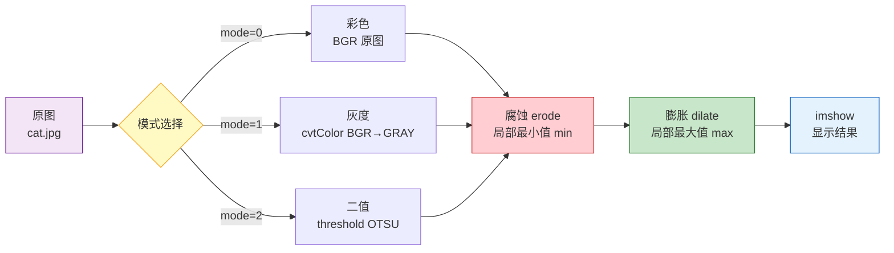
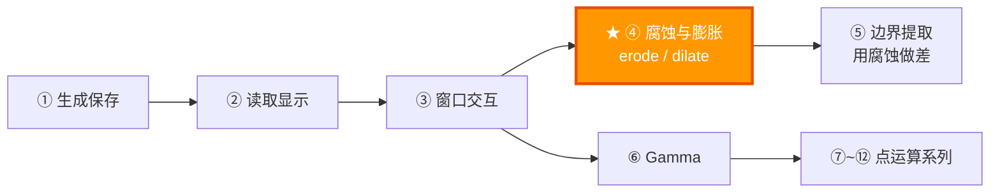

# 课程 04：形态学操作——腐蚀与膨胀

> 适合人群：零基础初学者 | 预计阅读时间：30 分钟

---

## 零、预备知识

### 什么是形态学？

**形态学（Morphology）** 这个词来自生物学，意思是"研究形状和结构"。在图像处理中，形态学操作是一系列**基于形状**的图像变换技术——用一个小形状（叫"结构元素"或"核"）在图片上滑动扫描，改变局部区域的像素。

```
形态学操作的核心思想：

  一个小形状（核）在图片上"扫描"
  ┌─────────────────────────┐
  │           ┌───┐          │
  │  图片     │核 │ ──扫描──▶│  扫描过程中，根据规则
  │           └───┘          │  修改中心像素的值
  │                          │
  └─────────────────────────┘
```

### 什么是"核"（Kernel / Structuring Element）？

核是一个小的矩形（或其他形状），用来定义"看周围多大范围"：

```
3×3 的矩形核：          5×5 的矩形核：          3×3 的十字核：

  ■ ■ ■                 ■ ■ ■ ■ ■              · ■ ·
  ■ ● ■                 ■ ■ ■ ■ ■              ■ ● ■
  ■ ■ ■                 ■ ■ ● ■ ■              · ■ ·
                         ■ ■ ■ ■ ■
  ● = 中心               ■ ■ ■ ■ ■             只看上下左右
  ■ = 参与计算的位置                              不看对角
```

核越大，操作的影响范围越广。

### 什么是“结构元素”而不只是“窗口”？

很多初学者会把结构元素简单理解成“一个滑动窗口”，这不算错，但还不够深。

更准确地说，结构元素是一种**局部几何探针**。

它不只是说“看周围哪几个像素”，而是在表达：

1. 你用什么几何形状去试探目标
2. 你允许什么方向的连接被视为“同一结构”
3. 你希望保留哪种尺度的形状，压掉哪种尺度的细节

所以同样是 5×5：

1. 矩形核更像“各方向一视同仁地强力检查”
2. 十字核更像“优先相信上下左右连通”
3. 椭圆核更像“用更圆滑的方式看待边界”

这也是为什么形态学和普通滤波最大的不同，不在于“都要滑动扫描”，而在于它研究的是**形状如何被局部规则保留、削弱、连接、断开**。

### 形态学和卷积/均值滤波有什么本质区别？

这一点非常重要。

很多图像操作都在邻域里滑动一个核，但它们背后的数学完全不同：

| 方法 | 核心运算 | 本质 | 典型效果 |
|------|---------|------|---------|
| 均值滤波 | 加权求和 / 平均 | 线性平滑 | 去噪但会模糊边缘 |
| 高斯滤波 | 加权求和 | 线性低通 | 更自然地平滑 |
| 中值滤波 | 排序取中位数 | 非线性统计滤波 | 去椒盐噪声 |
| 腐蚀 | 取最小值 | 非线性形态滤波 | 收缩亮区域 |
| 膨胀 | 取最大值 | 非线性形态滤波 | 扩张亮区域 |

关键差别在这里：

1. 线性滤波会把邻域里的像素“混合”起来
2. 形态学不会做加权平均，而是做极值选择
3. 所以形态学更像在问：“这个局部结构能不能通过几何检测？”

你可以把它理解成两套完全不同的问题：

1. 滤波问的是：邻域整体的平均趋势是什么？
2. 形态学问的是：邻域里最极端的几何约束是什么？

也正因为如此，形态学对边界、细线、孔洞、连通性特别敏感。

---

## 一、本课目标

本课你将学会：

1. **腐蚀（Erode）** 的原理和效果——让物体"缩小"
2. **膨胀（Dilate）** 的原理和效果——让物体"扩大"
3. 用 **Trackbar（滑动条）** 交互控制操作强度
4. 在**彩色 / 灰度 / 二值图**上观察不同效果

---

## 二、腐蚀（Erode）详解

### 2.1 腐蚀的直观理解

**腐蚀 = 让亮区域缩小、暗区域扩大**

想象一下"橡皮擦沿着白色物体的边缘擦"：

```
原图（白色物体在黑色背景上）：      腐蚀后：

  ░░░░░░░░░░░░░░                   ░░░░░░░░░░░░░░
  ░░░░████████░░                   ░░░░░░████░░░░
  ░░░█████████░░                   ░░░░░██████░░░
  ░░░█████████░░      ───▶         ░░░░░██████░░░
  ░░░█████████░░     腐蚀          ░░░░░██████░░░
  ░░░░████████░░                   ░░░░░░████░░░░
  ░░░░░░░░░░░░░░                   ░░░░░░░░░░░░░░

  白色区域变小了！
  像是被"腐蚀"掉一圈
```

### 2.2 腐蚀的数学定义

对于核覆盖的区域，取**最小值**作为中心像素的新值：

$$
\text{dst}(x,y) = \min_{(i,j) \in \text{kernel}} \text{src}(x+i, y+j)
$$

```
3×3 核的腐蚀过程（灰度图）：

  原图像素值：              腐蚀后中心值：
  ┌─────┬─────┬─────┐
  │ 200 │ 180 │ 190 │      min(200, 180, 190,
  ├─────┼─────┼─────┤           150, 170, 160,
  │ 150 │[170]│ 160 │           140, 130, 155)
  ├─────┼─────┼─────┤      = 130
  │ 140 │ 130 │ 155 │
  └─────┴─────┴─────┘      中心的 170 → 变成 130（变暗了）

  取最小值 → 暗像素会"赢"→ 亮区域缩小 → 暗区域扩大
```

```
不同像素值场景下的腐蚀效果：

  场景 1：全白区域                场景 2：边缘处
  ┌─────┬─────┬─────┐           ┌─────┬─────┬─────┐
  │ 255 │ 255 │ 255 │           │ 255 │ 255 │ 0   │
  ├─────┼─────┼─────┤           ├─────┼─────┼─────┤
  │ 255 │ 255 │ 255 │           │ 255 │[255]│ 0   │
  ├─────┼─────┼─────┤           ├─────┼─────┼─────┤
  │ 255 │ 255 │ 255 │           │ 255 │ 255 │ 0   │
  └─────┴─────┴─────┘           └─────┴─────┴─────┘
  min = 255（不变）              min = 0（白→黑！边缘被腐蚀）
```

### 2.2.1 从集合论角度理解腐蚀

上面的“取最小值”是灰度图视角。对**二值图**来说，腐蚀还有一个更本质的集合论定义。

把白色前景看成一个集合 $A$，把结构元素看成一个集合 $B$。那么腐蚀可写成：

$$
A \ominus B = \{x \mid B_x \subseteq A\}
$$

意思是：

1. 把核 $B$ 平移到位置 $x$
2. 只有当整个核都完全落在前景集合 $A$ 内部时
3. 才保留位置 $x$

这就是为什么腐蚀会让前景向内收缩。

```
把 3×3 核放到白色区域内部：      把 3×3 核压到边缘：

  █ █ █                            █ █ ·
  █ ● █   全部落在前景里            █ ● ·   有一部分掉到背景里
  █ █ █                            █ █ ·

  → 中心点保留                      → 中心点被删掉
```

所以“腐蚀 = 缩小”并不是一个经验描述，而是集合包含关系直接决定的结果。

### 2.2.2 灰度腐蚀为什么是“局部下确界”

在灰度图里，前景不再只是“有 / 无”，而是一个强度函数 $f(x,y)$。这时腐蚀可以理解成：

$$
(f \ominus b)(x,y) = \inf_{(s,t) \in b} f(x+s, y+t)
$$

如果结构元素是平坦核（flat structuring element），那它就退化成我们常见的“局部最小值”。

这里的深层意义是：

1. 腐蚀不是在“随便变暗”
2. 它是在计算局部邻域的**下包络**
3. 所以亮峰会被削掉，窄亮脊会变细，孤立亮点会消失

这也是为什么腐蚀特别适合：

1. 去除小白噪点
2. 分离轻微粘连的亮区域
3. 估计局部亮结构的“内核”

### 2.2.3 腐蚀为什么会偏向“最坏情况”？

从工程直觉上看，腐蚀像一种非常保守的判定。

它的逻辑是：

1. 只要邻域里出现一个足够暗的点
2. 中心点就不能继续保持很亮

这相当于在问：

> 如果我要求“这个中心点周围一整片都足够亮”，那它还能站得住吗？

所以腐蚀本质上是一个**全称量词**式的操作。

用更抽象的话说，腐蚀在检查：

$$
\forall (s,t) \in B,\quad f(x+s,y+t) \text{ 是否都足够高？}
$$

只要有一个位置不够高，这个点就会被拉低。

这就是腐蚀为什么：

1. 会优先抹掉细亮线
2. 会优先消灭尖锐小凸起
3. 会把窄桥、细脖子、孤立亮点看成“不够稳定的结构”

因此，腐蚀可以被理解为一种“保守保留、严格筛选”的形态学规则。

### 2.2.4 腐蚀对几何结构到底删除了什么？

如果你把图像里的亮目标看成真实几何物体，那么腐蚀删除的不是“随机的一圈像素”，而是所有**无法容纳当前结构元素**的区域。

这句话非常关键。

比如用半径为 3 的圆形核去腐蚀一个目标，那么最终保留下来的部分，就是所有“至少能塞进一个半径 3 小圆盘”的位置集合。

于是：

1. 比核还细的小凸起会消失
2. 比核还窄的连接桥会断掉
3. 锐角会被磨钝
4. 边界会向内退缩一个与核尺度相关的距离

所以腐蚀不是简单变小，而是一次**按尺度做的几何筛选**。

从这个角度看，结构元素的大小就是你允许保留的最小几何尺度。

### 2.3 OpenCV 函数

```cpp
cv::erode(src,          // 输入图片
          dst,          // 输出图片
          kernel);      // 结构元素（核）
```

创建核：

```cpp
// 方法 1：自动创建矩形核
int k = erodeSize * 2 + 1;  // k 必须是奇数（有中心点）
cv::Mat kernel = cv::getStructuringElement(cv::MORPH_RECT, cv::Size(k, k));

// k=1 → 1×1（无效果）  k=3 → 3×3  k=5 → 5×5  k=7 → 7×7
```

为什么核大小必须是**奇数**？

```
奇数核（3×3）：有明确的中心   偶数核（4×4）：中心在哪里？
  ■ ■ ■                        ■ ■ ■ ■
  ■ ● ■  ← 这个是中心          ■ ? ? ■  ← 没有明确中心
  ■ ■ ■                        ■ ? ? ■
                                ■ ■ ■ ■
```

---

## 三、膨胀（Dilate）详解

### 3.1 膨胀的直观理解

**膨胀 = 让亮区域扩大、暗区域缩小**

是腐蚀的反操作，想象"用白色油漆沿着白色物体的边缘多涂一圈"：

```
原图：                              膨胀后：

  ░░░░░░░░░░░░░░                   ░░░░░░░░░░░░░░
  ░░░░████████░░                   ░░░██████████░░
  ░░░█████████░░                   ░░████████████░
  ░░░█████████░░      ───▶         ░░████████████░
  ░░░█████████░░     膨胀          ░░████████████░
  ░░░░████████░░                   ░░░██████████░░
  ░░░░░░░░░░░░░░                   ░░░░░░░░░░░░░░

  白色区域变大了！
  像是往外"膨胀"了一圈
```

### 3.2 膨胀的数学定义

对于核覆盖的区域，取**最大值**作为中心像素的新值：

$$
\text{dst}(x,y) = \max_{(i,j) \in \text{kernel}} \text{src}(x+i, y+j)
$$

```
3×3 核的膨胀过程（灰度图）：

  原图像素值：              膨胀后中心值：
  ┌─────┬─────┬─────┐
  │ 50  │ 80  │ 60  │      max(50, 80, 60,
  ├─────┼─────┼─────┤           70, 90, 100,
  │ 70  │[ 90]│ 100 │           40, 85, 95)
  ├─────┼─────┼─────┤      = 100
  │ 40  │ 85  │ 95  │
  └─────┴─────┴─────┘      中心的 90 → 变成 100（变亮了）

  取最大值 → 亮像素会"赢"→ 亮区域扩大 → 暗区域缩小
```

### 3.2.1 从集合论角度理解膨胀

二值图中的膨胀可以写成：

$$
A \oplus B = \{x \mid (\hat{B})_x \cap A \neq \emptyset\}
$$

直觉解释是：

1. 把结构元素平移到位置 $x$
2. 只要核有任意一部分碰到前景
3. 这个位置就会被纳入结果

所以膨胀天然会让边界向外扩展。

它和腐蚀的判断条件正好相反：

1. 腐蚀要“全部满足”
2. 膨胀只要“至少一个满足”

这也是两者在逻辑上最深的差别。

### 3.2.2 灰度膨胀为什么是“局部上确界”

对应地，灰度膨胀可以理解成：

$$
(f \oplus b)(x,y) = \sup_{(s,t) \in b} f(x-s, y-t)
$$

如果核是平坦核，它就对应局部最大值。

因此膨胀的深层含义是：

1. 把局部亮值向外传播
2. 让窄暗缝被填平
3. 让断裂的亮结构更容易重新连通

所以膨胀常用于：

1. 填补小黑洞
2. 连接断裂边缘
3. 扩张前景掩膜

### 3.2.3 膨胀为什么会偏向“最好情况”？

如果说腐蚀是在看“最坏情况”，那么膨胀就是在看“最好情况”。

它的逻辑是：

1. 只要邻域里有一个足够亮的点
2. 中心点就有机会被抬高

这是一种**存在量词**式的规则：

$$
\exists (s,t) \in B,\quad f(x+s,y+t) \text{ 很高}
$$

那这个高值就会向邻域传播。

所以膨胀特别容易：

1. 把小亮点撑大
2. 把断裂亮线重新连起来
3. 把边界外推
4. 把局部极大值“外扩”成更大的高亮平台

从几何上看，膨胀是一种“宽松接纳”的规则，只要结构元素有一部分接触到前景，就能把结果往外扩展。

### 3.2.4 膨胀对几何结构到底添加了什么？

如果说腐蚀是在问“哪里还能完整塞进一个核”，那么膨胀就在问“哪里只要和核接触一下就算进来”。

因此它增加的并不是任意像素，而是：

1. 边界外侧一圈与核尺度相关的区域
2. 狭窄缝隙之间的连接区域
3. 小孔洞周围向内侵入的亮值

如果用集合论术语，膨胀相当于对目标做一次带核形状的外扩包络。

这也是为什么同样半径下：

1. 矩形核会让边界更“方”
2. 十字核更强调正交方向扩展
3. 椭圆核会得到更圆滑的外轮廓

### 3.3 OpenCV 函数

```cpp
cv::dilate(src, dst, kernel);
```

用法和 `erode` 完全一样，只是效果相反。

**核大小对腐蚀/膨胀效果的影响参考表**：

| erodeSize | 核大小 k | 影响范围 | 腐蚀效果 | 膨胀效果 | 适用场景 |
|----------|---------|---------|---------|---------|---------|
| 0 | 1×1 | 0 像素 | 无变化 | 无变化 | — |
| 1 | 3×3 | 1 像素 | 轻微缩小 | 轻微扩大 | 微调、去单像素噪点 |
| 2 | 5×5 | 2 像素 | 明显缩小 | 明显扩大 | 一般用途（推荐起点） |
| 3 | 7×7 | 3 像素 | 较强缩小 | 较强扩大 | 粗线条、大噪点 |
| 5 | 11×11 | 5 像素 | 强烈缩小 | 强烈扩大 | 大面积形态学操作 |
| 10 | 21×21 | 10 像素 | 极端缩小 | 极端扩大 | 特殊场景 |

> **规律**：`k = erodeSize × 2 + 1`，影响范围 = `erodeSize` 像素。  
> 小核多次迭代 ≈ 大核一次操作，但边界细节略有差异。

---

## 四、腐蚀 vs 膨胀对比

### 4.1 对偶性：为什么腐蚀和膨胀总是成对出现？

腐蚀和膨胀不是两个互不相干的操作，而是一对**对偶操作**。

在集合形态学里有一个核心关系：

$$
(A \ominus B)^c = A^c \oplus \hat{B}
$$

意思是：

1. 先对前景做腐蚀，再取补集
2. 等价于先对补集做膨胀

直觉上很好理解：

1. 腐蚀让白区域缩小，本质上等价于让黑区域扩大
2. 膨胀让白区域扩大，本质上等价于让黑区域缩小

所以从“前景视角”看是腐蚀，从“背景视角”看就像膨胀。

这也是为什么教材里总会把这两个操作并列讲。

### 4.2 结构元素形状为什么重要？

很多初学者只关心核大小，忽略了**核形状**。实际上，核形状决定了“什么样的局部结构更容易被保留 / 删除”。

假设核半径相同：

| 核形状 | 它更偏向什么几何结构 | 典型影响 |
|------|--------------------|---------|
| 矩形核 | 各方向都参与，最强硬 | 腐蚀/膨胀最明显 |
| 十字核 | 更强调上下左右连通 | 对对角结构影响较弱 |
| 椭圆核 | 边界更平滑 | 更接近自然圆润收缩/扩张 |

例如：

1. 十字核更像 4 邻域
2. 矩形核更像 8 邻域
3. 椭圆核更适合观察“圆润边界”的变化

这也是为什么代码里新增了三种核形状按钮，让你可以直接比较不同结构元素对同一张图的作用。

### 4.3 多次迭代和大核一次到底是不是一回事？

这是一个非常值得深入理解的问题。

表面看：

1. 用 `3×3` 腐蚀很多次
2. 和用一个大核腐蚀一次

效果常常接近，但**并不总是完全一样**。

原因有三层：

1. **离散网格效应**：图像是像素格，不是连续平面
2. **核形状叠加效应**：多次 `3×3` 矩形核，相当于做 Minkowski 叠加，其结果不一定与一次更大核完全一致
3. **边界处理差异**：每一步都要和边界条件交互

所以实践中可以记住：

1. 小核多次迭代通常更细腻
2. 大核一次通常更直接
3. 在教学里两者可以近似理解
4. 在严格几何效果上它们不完全等价

### 4.4 边界条件为什么会影响结果？

当核扫到图像边缘时，有一部分核会落到图像外面。编码器必须决定“外面的像素值算什么”。

OpenCV 内部会根据默认 border 策略处理边界，这意味着：

1. 边缘像素不是一个纯数学真空问题
2. 实际结果会受边界填充值影响
3. 核越大，边界影响越明显

所以在做严肃实验时，要知道：

1. 形态学不仅仅是 `min/max`
2. 还和核形状、边界策略、迭代方式共同决定结果

### 4.5 用 Minkowski 和 / 差理解“扩一圈”和“缩一圈”

如果你以后继续深入形态学，几乎一定会遇到 Minkowski 和（Minkowski sum）这个概念。

在连续几何里，膨胀可以看成：

$$
A \oplus B = \{a+b \mid a \in A, b \in B\}
$$

它的直觉是：

1. 取目标里的每个点
2. 在这个点上都“盖”一个结构元素
3. 把所有盖出来的区域并起来

于是目标就向外鼓了一圈。

而腐蚀则可以理解为“哪些点在减去结构元素后仍然留在集合内部”。

这带来一个非常有用的几何认识：

1. 膨胀是外扩包络
2. 腐蚀是内缩骨架筛选
3. 结构元素的半径决定了扩张 / 收缩的大致空间尺度

所以在连续平面里，人们常把“半径为 $r$ 的圆盘膨胀”理解成“边界沿法向大致外推 $r$ 个单位”。

在离散像素网格里这不是严格欧氏距离，但直觉上仍然成立。

### 4.6 代数性质：为什么形态学不是随便拼出来的技巧？

腐蚀和膨胀之所以重要，是因为它们满足一组很漂亮的代数性质。

#### 4.6.1 单调性

如果一幅图像处处不比另一幅亮：

$$
f \le g
$$

那么做腐蚀或膨胀以后，这个顺序不会被打乱：

$$
f \ominus b \le g \ominus b, \qquad f \oplus b \le g \oplus b
$$

这叫**单调性**。

直觉上很好理解：

1. 如果原图 A 在每个位置都不比 B 更亮
2. 那么 A 的局部最小值也不会比 B 的局部最小值更高
3. A 的局部最大值也不会比 B 的局部最大值更高

#### 4.6.2 平移不变性

如果整张图平移一下，再做形态学操作，结果等于先做形态学操作再平移。

这意味着腐蚀和膨胀不会因为目标出现在左上角还是右下角，就采用不同规则。

#### 4.6.3 反扩张性与扩张性

对亮前景来说：

1. 腐蚀通常满足“结果不大于原图”
2. 膨胀通常满足“结果不小于原图”

记成：

$$
f \ominus b \le f \le f \oplus b
$$

这是最核心的一条性质。

它说明：

1. 腐蚀不会凭空制造更亮的结构
2. 膨胀不会凭空制造更暗的结果

#### 4.6.4 对偶性不是巧合，而是伴随关系

更进一步看，腐蚀和膨胀是一对伴随算子（adjunction）。

可以把它理解成：

1. 一个负责“往里严格收”
2. 一个负责“往外宽松放”
3. 它们之间有精确的配对关系

而开运算、闭运算正是从这对基本算子出发构造出来的。

### 4.7 为什么开运算能“去小白点但保主体”，闭运算能“填小黑洞但保主体”？

这不是经验规律，而是由腐蚀和膨胀的顺序决定的。

#### 4.7.1 开运算的本质

开运算：

$$
f \circ b = (f \ominus b) \oplus b
$$

先腐蚀，再膨胀。

第一步腐蚀会删除那些太小、太细、无法容纳核的亮结构。
第二步膨胀只会把“第一步幸存下来的主体”再适度恢复回来。

关键在于：

1. 被第一步彻底删掉的小亮噪点
2. 第二步已经没有东西可恢复

所以它们回不来。

这就是开运算能去小白点的根本原因。

#### 4.7.2 闭运算的本质

闭运算：

$$
f \bullet b = (f \oplus b) \ominus b
$$

先膨胀，再腐蚀。

第一步膨胀会把小黑洞、小裂缝先填平或桥接。
第二步腐蚀再把整体边界往回收，但已经被填平的小洞常常不会重新出现。

所以闭运算适合：

1. 填小孔
2. 补细缝
3. 连通近距离断裂

#### 4.7.3 为什么它们都“保形”且“幂等”？

“保形”不是说结果和原图完全一样，而是说：

1. 大主体通常会保留
2. 只删除或填补比核尺度更小的细节

更深一层，它们还满足**幂等性**：

$$
(f \circ b) \circ b = f \circ b
$$

$$
(f \bullet b) \bullet b = f \bullet b
$$

意思是：

1. 同一个核做一次开运算后
2. 再做第二次
3. 结果不会继续发生本质变化

原因是第一遍已经把“所有比这个核小的非法细节”处理掉了。

这是一条非常强的结构性质，也说明开闭运算不是随便串起来的技巧，而是完整形态学体系中的标准算子。

### 4.8 最大值滤波 / 最小值滤波和形态学到底是什么关系？

在平坦结构元素下：

1. 灰度膨胀本质上就是局部最大值滤波
2. 灰度腐蚀本质上就是局部最小值滤波

这让很多人产生一个误解：

> 那形态学不就是 max/min filter 吗？

只说一半是对的。

更完整的说法是：

1. 在计算层面，平坦核的灰度形态学确实退化成局部 max/min
2. 但在理论层面，它来自集合形态学与结构元素几何
3. 因此它不是“统计滤波的小变种”，而是一整套关于形状的数学语言

形态学真正厉害的地方不在单个腐蚀或膨胀，而在于：

1. 结构元素可以编码几何偏好
2. 算子之间可以组合成开、闭、梯度、顶帽、黑帽
3. 这些组合具有明确的代数性质

所以 max/min 只是它的表面计算形式，不是它的全部本质。

### 4.9 为什么“尺度”是形态学里最重要的隐含变量？

很多初学者觉得自己只是在调一个滑块，其实你调的是**尺度参数**。

核半径变大，等价于：

1. 允许更大范围的局部几何参与判定
2. 只保留更粗、更稳定的结构
3. 把更细的噪点、裂缝、毛刺视为“不重要细节”

所以形态学非常适合做“多尺度观察”：

1. 小核看微小结构
2. 中核看主体边界
3. 大核看整体连通趋势

你甚至可以把不同半径下的结果序列理解成一种粗到细的形状谱分析。

这也是很多高级视觉算法会把形态学用于：

1. 尺度筛选
2. 颗粒分析（granulometry）
3. 掩膜修正
4. 目标预分割

```
腐蚀 (Erode)                    膨胀 (Dilate)
─────────────                   ─────────────
取最小值 min                    取最大值 max
亮区域缩小                      亮区域扩大
暗区域扩大                      暗区域缩小
消除小白点（噪声）              填充小黑洞
使细线变细甚至断裂              使细线变粗
边界向内收缩                    边界向外扩展
```

| 操作 | 效果 | 数学 | 应用场景 |
|------|------|------|---------|
| 腐蚀 | 缩小亮区 | min | 去噪点、分离粘连物体 |
| 膨胀 | 扩大亮区 | max | 填空洞、连接断裂 |
| 先腐后膨（开运算） | 去除小噪点但保持大小不变 | erode → dilate | 去噪声 |
| 先膨后腐（闭运算） | 填充小空洞但保持大小不变 | dilate → erode | 填空洞 |

**形态学操作全家福**：

| 操作 | 公式 | 对亮区域 | 对暗区域 | 边界 | 主要用途 |
|------|------|---------|---------|------|---------|
| 腐蚀 | min | 缩小 ↓ | 扩大 ↑ | 内缩 | 去白噪点、分离粘连 |
| 膨胀 | max | 扩大 ↑ | 缩小 ↓ | 外扩 | 填黑洞、连接断裂 |
| 开运算 | erode→dilate | ≈不变 | ≈不变 | 平滑 | 去白噪点保形状 |
| 闭运算 | dilate→erode | ≈不变 | ≈不变 | 平滑 | 填黑洞保形状 |
| 梯度 | dilate−erode | — | — | 提取 | 边缘检测（下节课） |
| 顶帽 | src−open | 提取小亮点 | — | — | 不均匀光照补偿 |
| 黑帽 | close−src | — | 提取小暗点 | — | 暗细节增强 |

> 所有操作都通过 `cv::morphologyEx(src, dst, op, kernel)` 一个函数调用。

```
操作对比示意：

  腐蚀                        膨胀                        开运算                      闭运算
  ┌──────────┐              ┌──────────┐              ┌──────────┐              ┌──────────┐
  │ ░░████░░ │              │ ░░████░░ │              │ ░░████░░ │              │ ░░████░░ │
  │ ░░████░░ │ → 腐蚀 →     │ ░░████░░ │ → 膨胀 →     │ ░██████░ │ → 开运算 →   │ ░██░███░ │ → 闭运算 →
  │ ░░████░░ │              │ ░░████░░ │              │ ░░████░░ │              │ ░░████░░ │
  └──────────┘              └──────────┘              └──────────┘              └──────────┘
  ┌──────────┐              ┌──────────┐              ┌──────────┐              ┌──────────┐
  │ ░░░██░░░ │              │ ░██████░ │              │ ░░████░░ │              │ ░████████ │
  │ ░░░██░░░ │              │ ██████░░ │              │ ░░████░░ │              │ ░░████░░ │
  │ ░░░██░░░ │              │ ░██████░ │              │ ░░████░░ │              │ ░░████░░ │
  └──────────┘              └──────────┘              └──────────┘              └──────────┘
  物体缩小                    物体扩大                   去掉噪点保持大小            填上空洞保持大小
```

```
开运算 vs 闭运算示意：

原图（有噪点和空洞）：
  ░░░░░██░░░░░░░░
  ░░░████████░░░░
  ░░░████░███░░░░   ← 中间有空洞
  ░░░████████░░░░
  ░░░░░░░░░░░░░░░
  ░░██░░░░░░░░░░░   ← 孤立噪点

开运算（去噪点）：          闭运算（填空洞）：
  ░░░░░░░░░░░░░░░          ░░░░░██░░░░░░░░
  ░░░████████░░░░          ░░░████████░░░░
  ░░░████░███░░░░          ░░░█████████░░░  ← 空洞填上了
  ░░░████████░░░░          ░░░████████░░░░
  ░░░░░░░░░░░░░░░          ░░░░░░░░░░░░░░░
  ░░░░░░░░░░░░░░░ ←噪点没了 ░░██░░░░░░░░░░░
```

---

## 五、Trackbar（滑动条）

### 5.1 createTrackbar

```cpp
cv::createTrackbar(const std::string& trackbarName,   // 滑动条名称
                   const std::string& windowName,      // 所在窗口
                   int* value,                         // 绑定的变量
                   int count,                          // 最大值
                   cv::TrackbarCallback onChange,       // 值变化时的回调
                   void* userdata);                    // 用户数据
```

```
Trackbar 的工作原理：

                      ┌── Trackbar ──────────────────────┐
  OpenCV 窗口         │  Erode ═══●════════════════  3    │
  ┌───────────────────┤  Dilate ════════●══════════  5    │
  │                   └──────────────────────────────────┘
  │  🐱 图片                      │
  │                                │ 用户拖动滑块
  │                                ▼
  │                        onChange(3, userdata)
  │                        → state->erodeSize = 3
  │                        → applyMorphology(state)
  │                        → erode + imshow
  └───────────────────────────────────────────────────────
```

### 5.2 本课中的使用

```cpp
// 创建两个滑动条
cv::createTrackbar("Erode", windowName, &state.erodeSize, 10, onErodeTrackbar, &state);
cv::createTrackbar("Dilate", windowName, &state.dilateSize, 10, onDilateTrackbar, &state);

// 回调函数
void onErodeTrackbar(int value, void *userdata)
{
    auto *state = static_cast<MorphologyState *>(userdata);
    state->erodeSize = value;
    applyMorphology(state);  // 重新应用并显示
}
```

### 5.3 当前代码已经补充了哪些更深入的演示按钮？

现在第 04 课代码除了原来的：

1. `打开并显示`
2. `彩色图`
3. `灰度图`
4. `二值图`

还新增了两组深入教学按钮：

1. `矩形核 / 十字核 / 椭圆核`
2. `基础腐蚀/膨胀 / 开运算 / 闭运算 / 形态学梯度`

这让你可以直接验证下面这些理论：

1. 不同核形状对结构保留方式不同
2. 开运算适合去小白噪点
3. 闭运算适合填小黑洞
4. 梯度本质上是在看“外边界减内边界”

---

## 六、三种图像模式

本课支持在三种不同的图像模式下观察腐蚀/膨胀的效果：

```cpp
// 模式 0：彩色图
state->display = state->original.clone();

// 模式 1：灰度图
cv::cvtColor(state->original, state->display, cv::COLOR_BGR2GRAY);

// 模式 2：二值图（黑白分明，最能展示形态学效果）
cv::Mat gray;
cv::cvtColor(state->original, gray, cv::COLOR_BGR2GRAY);
cv::threshold(gray, state->display, 0, 255, cv::THRESH_BINARY | cv::THRESH_OTSU);
```

**为什么二值图最能展示效果？**

```
灰度图上腐蚀/膨胀：             二值图上腐蚀/膨胀：

  渐变过渡，效果不明显            黑白分明，效果一目了然
  ┌────────────────┐            ┌────────────────┐
  │ ░░▒▒▓▓██▓▓▒▒░░│            │ ░░░░████████░░░│
  │ 连续灰度值     │            │ 只有 0 和 255   │
  │ 看不太出变化   │            │ 边界清晰可见    │
  └────────────────┘            └────────────────┘
```

> **THRESH_OTSU**：Otsu（大津）算法，自动找到最佳的阈值来将灰度图分为黑白两部分。不需要手动指定阈值，算法会根据图片内容自动计算。

**三种图像模式下的形态学操作效果对比**：

| 特性 | 彩色图 (mode=0) | 灰度图 (mode=1) | 二值图 (mode=2) |
|------|----------------|----------------|----------------|
| 通道数 | 3 (BGR) | 1 | 1 |
| 像素值 | 0~255 × 3 | 0~255 | 只有 0 和 255 |
| 腐蚀效果 | 颜色变暗变混 | 变暗 | 白色区域缩小 |
| 膨胀效果 | 颜色变亮变混 | 变亮 | 白色区域扩大 |
| 边界清晰度 | ⭐⭐ 一般 | ⭐⭐⭐ 较好 | ⭐⭐⭐⭐⭐ 最清晰 |
| 推荐观察 | 了解彩色影响 | 灰度过渡 | **最佳学习模式** |

---

## 七、完整处理流程

```cpp
void applyMorphology(MorphologyState *state)
{
    // 1. 根据模式选择图像
    if (state->mode == 1)
        cv::cvtColor(state->original, state->display, cv::COLOR_BGR2GRAY);
    else if (state->mode == 2) {
        cv::Mat gray;
        cv::cvtColor(state->original, gray, cv::COLOR_BGR2GRAY);
        cv::threshold(gray, state->display, 0, 255, THRESH_BINARY | THRESH_OTSU);
    } else
        state->display = state->original.clone();

    // 2. 应用腐蚀
    if (state->erodeSize > 0) {
        int k = state->erodeSize * 2 + 1;
        cv::Mat kernel = cv::getStructuringElement(MORPH_RECT, Size(k, k));
        cv::erode(state->display, state->display, kernel);
    }

    // 3. 应用膨胀
    if (state->dilateSize > 0) {
        int k = state->dilateSize * 2 + 1;
        cv::Mat kernel = cv::getStructuringElement(MORPH_RECT, Size(k, k));
        cv::dilate(state->display, state->display, kernel);
    }

    // 4. 显示结果
    cv::imshow(state->windowName, state->display);
}
```

数据流：



### 7.1 代码补充：核形状和操作模式是怎样接进当前程序的？

当前代码里新增了两个关键状态：

```cpp
int kernelShape = cv::MORPH_RECT;
int operation = 0; // 0: 基础模式 1: open 2: close 3: gradient
```

这两个变量分别控制：

1. 结构元素几何形状
2. 形态学组合操作类型

构造核时现在不是写死矩形，而是：

```cpp
cv::Mat buildKernel(const MorphologyState *state, int radius)
{
    const int k = radius * 2 + 1;
    return cv::getStructuringElement(state->kernelShape, cv::Size(k, k));
}
```

这意味着你在界面上切换核形状时，背后真正改变的是 `getStructuringElement` 的第一个参数。

### 7.2 代码补充：基础模式和开闭运算是如何分流的？

当前程序里，`applyMorphology` 已经不是只做“腐蚀 + 膨胀”了，而是按 `operation` 分成四类：

```cpp
if (state->operation == 0) {
    cv::erode(...);
    cv::dilate(...);
} else if (state->operation == 1) {
    cv::morphologyEx(..., cv::MORPH_OPEN, ...);
} else if (state->operation == 2) {
    cv::morphologyEx(..., cv::MORPH_CLOSE, ...);
} else if (state->operation == 3) {
    cv::morphologyEx(..., cv::MORPH_GRADIENT, ...);
}
```

这样做的教学意义是：

1. 你可以先看基础腐蚀/膨胀
2. 再切到开运算，观察噪点是否被去掉
3. 再切到闭运算，观察孔洞是否被填上
4. 最后切到梯度，观察边缘是否被单独提取出来

### 7.3 代码补充：为什么状态栏现在更有教学价值？

代码里新增了动态状态文本，会实时显示：

1. 当前图像模式
2. 当前核形状
3. 当前操作类型
4. 腐蚀/膨胀半径与实际核大小

这样学生在拖动滑块时，不只是“看到效果变了”，还能把：

1. 参数
2. 形状
3. 操作
4. 结果

这四件事建立起一一对应关系。

---

## 八、动手实验

### 实验 1：不同核形状

```cpp
// 矩形核
cv::Mat rect = cv::getStructuringElement(cv::MORPH_RECT, cv::Size(5, 5));

// 十字核
cv::Mat cross = cv::getStructuringElement(cv::MORPH_CROSS, cv::Size(5, 5));

// 椭圆核
cv::Mat ellipse = cv::getStructuringElement(cv::MORPH_ELLIPSE, cv::Size(5, 5));

// 对比三种核的腐蚀效果
```

### 实验 2：实现开运算和闭运算

```cpp
// 开运算 = 先腐蚀后膨胀（去噪点）
cv::morphologyEx(src, dst, cv::MORPH_OPEN, kernel);

// 闭运算 = 先膨胀后腐蚀（填空洞）
cv::morphologyEx(src, dst, cv::MORPH_CLOSE, kernel);

// 梯度 = 膨胀 - 腐蚀（提取边缘，下节课内容！）
cv::morphologyEx(src, dst, cv::MORPH_GRADIENT, kernel);
```

### 实验 3：比较三种核形状对同一目标的影响

建议你在程序里切到二值模式，然后分别点击：

1. `矩形核`
2. `十字核`
3. `椭圆核`

然后把半径调到同一个值，观察：

1. 哪种核最容易让细线断开
2. 哪种核对对角结构更“宽容”
3. 哪种核得到的边界更圆润

这会让你对“结构元素不是可有可无的细节”这个事实有非常直接的认识。

### 实验 4：验证对偶性

尝试做下面这个思想实验：

1. 把白色前景看作目标
2. 做一次腐蚀
3. 再反过来把黑色区域当成目标
4. 观察从“背景扩张”的角度看，是否和前景收缩是同一件事

这个实验会帮助你真正理解：

1. 腐蚀和膨胀是对偶的
2. 前景和背景只是观察视角不同

---

## 九、常见问题

| 问题 | 原因 | 解决方法 |
|------|------|---------|
| 腐蚀后图片全黑了 | 核太大 | 减小 erodeSize |
| 膨胀后图片全白了 | 核太大或图片本来就亮 | 减小 dilateSize |
| 效果不明显 | 在灰度图上看不清 | 切换到二值模式 |
| 滑动条没反应 | 没调用 waitKey | 确保 QTimer 在运行 |
| 想恢复原图 | 需要保留原始图片 | 始终从 original 重新处理 |

---

## 十、术语表

| 术语 | 英文 | 含义 |
|------|------|------|
| 腐蚀 | Erosion / Erode | 取局部最小值，缩小亮区域 |
| 膨胀 | Dilation / Dilate | 取局部最大值，扩大亮区域 |
| 结构元素 | Structuring Element | 定义操作范围的小核 |
| 开运算 | Opening | 先腐蚀后膨胀 |
| 闭运算 | Closing | 先膨胀后腐蚀 |
| 形态学 | Morphology | 基于形状的图像变换操作 |
| 滑动条 | Trackbar | OpenCV 窗口中的交互控件 |
| 二值图 | Binary Image | 只有黑（0）和白（255）的图像 |
| Otsu | 大津法 | 自动求最佳二值化阈值的算法 |

---

## 十一、知识地图



- 本课是“邻域运算”的入门，也是形态学操作的基础。
- 后续课程 05 会用本课学的腐蚀来提取边界。
- 课程 06~12 转向“点运算”（每个像素独立处理）。

---

## 十二、记忆口诀

```
🧠 腐蚀膨胀核心：

  "腐小膨大，最值说了算"
  ─────────────────────
  腐蚀 = 取最小值 → 亮区变小 → 像被"腐蚀"
  膨胀 = 取最大值 → 亮区变大 → 像在"膨胀"

🧠 开运算闭运算：

  "先腐后膨开（开门去灰尘），先膨后腐闭（关门填空洞）"
  ───────────────────────────────────────────────
  开运算 MORPH_OPEN  = erode → dilate  → 去小白点
  闭运算 MORPH_CLOSE = dilate → erode  → 填小黑洞

🧠 核大小口诀：

  "核要奇数有中心，越大效果越明显"
  k = size * 2 + 1  →  保证是奇数
```

---

## 十三、新手雷区

```cpp
// ❌ 雷区 1：核大小用了偶数
cv::Mat kernel = cv::getStructuringElement(cv::MORPH_RECT, cv::Size(4, 4));
// 偶数核没有明确的中心点，结果可能偏移！

// ✅ 正确：始终用奇数
cv::Mat kernel = cv::getStructuringElement(cv::MORPH_RECT, cv::Size(5, 5));
```

```cpp
// ❌ 雷区 2：在原图上反复操作（迭代腐蚀）
cv::erode(image, image, kernel);  // 第一次
cv::erode(image, image, kernel);  // 在上一次结果上再腐蚀
// 效果等同于用更大的核腐蚀一次，但没法恢复了！

// ✅ 正确：保留原图
cv::Mat original = image.clone();
cv::erode(original, result, kernel);  // 不破坏原始数据
```

```cpp
// ❌ 雷区 3：把开运算的顺序搞反
// 想去噪点，却先膨胀再腐蚀（这是闭运算，填空洞用的！）
cv::dilate(src, temp, kernel);
cv::erode(temp, dst, kernel);    // ← 这是闭运算

// ✅ 正确：用 morphologyEx 避免搞混
cv::morphologyEx(src, dst, cv::MORPH_OPEN, kernel);   // 开运算
cv::morphologyEx(src, dst, cv::MORPH_CLOSE, kernel);  // 闭运算
```

---

## 十四、思考题

1. **如果对一张全白图（所有像素=255）做腐蚀，结果是什么？**
   提示：min(255, 255, ..., 255) = ?

2. **开运算可以消除小白点，那如何消除小黑点呢？**
   提示：小黑点是"暗区域的小噪声"……

3. **腐蚀 10 次（3×3 核）和腐蚀 1 次（21×21 核）的效果一样吗？**
   提示：理论上近似，但边界效果有微妙差异。

---

## 十五、速查卡片

```
┌─────────────────── 课程 04 速查 ───────────────────┐
│                                                    │
│  创建核:                                            │
│    cv::getStructuringElement(shape, Size(k,k))     │
│    shape: MORPH_RECT / MORPH_CROSS / MORPH_ELLIPSE │
│                                                    │
│  腐蚀:  cv::erode(src, dst, kernel);               │
│  膨胀:  cv::dilate(src, dst, kernel);              │
│                                                    │
│  组合操作:                                          │
│    cv::morphologyEx(src, dst, op, kernel);          │
│    MORPH_OPEN   = 先腐后膨（去噪点）                │
│    MORPH_CLOSE  = 先膨后腐（填空洞）                │
│    MORPH_GRADIENT = 膨胀 - 腐蚀（边缘）             │
│                                                    │
│  滑动条:                                            │
│    cv::createTrackbar(name, win, &val, max, cb);   │
│                                                    │
└────────────────────────────────────────────────────┘
```

---

## 十六、延伸阅读

- [cv::erode 文档](https://docs.opencv.org/4.x/d4/d86/group__imgproc__filter.html#gaeb1e0c1033e3f6b891a25d0511362aeb) — 腐蚀函数参数详解
- [cv::morphologyEx 文档](https://docs.opencv.org/4.x/d4/d86/group__imgproc__filter.html#ga67493776e3ad1a3df63883829375201f) — 所有形态学操作
- [形态学变换教程](https://docs.opencv.org/4.x/d9/d61/tutorial_py_morphological_ops.html) — OpenCV 官方形态学教程
