# 点运算：灰度变换 —— Gamma 校正详解

> **适合人群**：零基础初学者。本文从"什么是像素"讲起，逐步过渡到 Gamma 变换的原理和代码实现。

---

## 零、预备知识：图像的本质

在学习任何图像处理之前，我们需要先理解：**计算机眼中的图像到底是什么？**

### 0.1 数字图像 = 数字矩阵

一张数字图像本质上就是一个**二维数字表格**（矩阵）。表格中的每一个格子叫做一个**像素（Pixel）**，每个像素存储一个或多个数字，代表这个点的颜色或亮度。

```
一张 4×4 的灰度图像在计算机中的存储方式：

  列 0   列 1   列 2   列 3
┌──────┬──────┬──────┬──────┐
│  20  │  45  │ 180  │ 230  │  ← 行 0
├──────┼──────┼──────┼──────┤
│  30  │  60  │ 170  │ 210  │  ← 行 1
├──────┼──────┼──────┼──────┤
│  10  │  50  │ 160  │ 200  │  ← 行 2
├──────┼──────┼──────┼──────┤
│  25  │  55  │ 175  │ 220  │  ← 行 3
└──────┴──────┴──────┴──────┘

每个数字 = 一个像素的亮度值
数字越小 → 越暗（0 = 纯黑）
数字越大 → 越亮（255 = 纯白）
```

**常见图像尺寸**：

| 描述 | 宽 × 高 | 像素总数 |
|------|---------|---------|
| 手机照片 | 4000 × 3000 | 1200 万 |
| 1080p 视频帧 | 1920 × 1080 | 约 207 万 |
| 小缩略图 | 100 × 100 | 1 万 |
| 本课程示例图 | 640 × 480 | 约 30 万 |

### 0.2 灰度图 vs 彩色图

**灰度图（Grayscale）**：每个像素只有 **1 个数字**，表示亮度。

```
灰度图像素示意：

   0 = ██ 纯黑
  64 = ▓▓ 深灰
 128 = ▒▒ 中灰
 192 = ░░ 浅灰
 255 = □□ 纯白

     0        64       128      192      255
     ██████   ▓▓▓▓▓▓   ▒▒▒▒▒▒   ░░░░░░   □□□□□□
     纯黑      深灰      中灰      浅灰      纯白
```

**彩色图（Color / RGB）**：每个像素有 **3 个数字**，分别表示红（R）、绿（G）、蓝（B）三种颜色的强度。

```
彩色图像素示意：

  一个像素 = (R, G, B)

  (255,   0,   0) = 纯红
  (  0, 255,   0) = 纯绿
  (  0,   0, 255) = 纯蓝
  (255, 255,   0) = 黄色（红+绿）
  (255, 255, 255) = 白色（全开）
  (  0,   0,   0) = 黑色（全关）
  (128, 128, 128) = 灰色（三色等量）
```

> **本课程聚焦灰度图**，因为 Gamma 变换的核心原理在灰度上最清晰。彩色图处理时通常先转换到灰度或亮度通道再操作。

### 0.3 什么是 8-bit？为什么是 0~255？

**bit（比特）** 是计算机最小的信息单位，只能是 0 或 1。

```
1 bit  → 2 种可能：  0  或  1
2 bit  → 4 种可能：  00, 01, 10, 11
3 bit  → 8 种可能：  000, 001, 010, 011, 100, 101, 110, 111
...
8 bit  → 256 种可能：00000000 ~ 11111111  =  十进制 0 ~ 255
```

所以 **8-bit 灰度图**意味着每个像素用 8 个 bit 存储，可以表示 $2^8 = 256$ 个不同的亮度等级（0 到 255）。

```
为什么不用更多 bit？

  8-bit  =  256 级灰度  → 人眼基本够用，文件小
 10-bit  = 1024 级灰度  → 专业视频/医学影像
 12-bit  = 4096 级灰度  → RAW 相机原始数据
 16-bit  = 65536 级灰度 → 科学计算、HDR

  日常照片（JPEG/PNG）几乎都是 8-bit。
```

### 0.4 什么是"通道"？

通道（Channel）是构成像素的**一个维度**。

```
灰度图 = 1 个通道（亮度）
      每个像素：1 个数字

RGB 彩色图 = 3 个通道（红、绿、蓝）
      每个像素：3 个数字

RGBA 图 = 4 个通道（红、绿、蓝 + 透明度 Alpha）
      每个像素：4 个数字
```

在 OpenCV 中，这些信息用 **类型码** 表示：

| 类型码 | 含义 | 每像素字节数 |
|--------|------|-------------|
| `CV_8UC1` | 8-bit, 无符号, 1 通道 (灰度) | 1 |
| `CV_8UC3` | 8-bit, 无符号, 3 通道 (BGR彩色) | 3 |
| `CV_8UC4` | 8-bit, 无符号, 4 通道 (BGRA) | 4 |

> **注意**：OpenCV 中彩色图的通道顺序是 **BGR**（蓝绿红），不是 RGB，这是历史遗留问题。

### 0.5 坐标系：像素的位置

```
  图像坐标系：

  (0,0)───────────────────▶ x 轴（列方向）
    │
    │   ┌───┬───┬───┬───┐
    │   │0,0│1,0│2,0│3,0│
    │   ├───┼───┼───┼───┤
    │   │0,1│1,1│2,1│3,1│
    │   ├───┼───┼───┼───┤
    │   │0,2│1,2│2,2│3,2│
    │   └───┴───┴───┴───┘
    ▼
  y 轴（行方向）

  所以 I(x, y) 或 I(2, 1) 表示第 2 列、第 1 行的像素值
  （注意：在代码中通常是 行, 列 的顺序，即 mat.at<uchar>(y, x)）
```

---

## 一、什么是灰度变换？

灰度变换是图像处理中最基础的**点运算**（Point Operation）。  
所谓"点运算"，是指输出像素的值**仅取决于输入像素自身的值**，与邻域无关。

### 1.1 点运算 vs 邻域运算

```
点运算（Point Operation）：           邻域运算（Neighborhood Operation）：

  输入图像              输出图像        输入图像              输出图像
  ┌───┬───┬───┐                       ┌───┬───┬───┐
  │   │   │   │                       │ ○ │ ○ │ ○ │
  ├───┼───┼───┤                       ├───┼───┼───┤
  │   │ ● │   │  ──▶  只看 ● 自己     │ ○ │ ● │ ○ │  ──▶  看 ● 和周围 ○
  ├───┼───┼───┤                       ├───┼───┼───┤
  │   │   │   │                       │ ○ │ ○ │ ○ │
  └───┴───┴───┘                       └───┴───┴───┘

  新值 = f(旧值)                       新值 = f(● 和周围所有 ○)
  例：I' = 255 - I                     例：模糊（取平均值）
```

**点运算的优势**：
- 简单，速度快（每个像素独立计算）
- 不需要考虑边界问题
- 适合并行处理

### 1.2 数学表示

$$
I'(x, y) = T\big[I(x, y)\big]
$$

用人话说：**新的像素值 = 某个函数（旧的像素值）**

```
举个最简单的例子：反相（底片效果）

  T(x) = 255 - x

  输入像素值     输出像素值    效果
  ──────────────────────────────
      0    →    255          黑变白
     64    →    191          深灰变浅灰
    128    →    127          中灰几乎不变
    200    →     55          浅灰变深灰
    255    →      0          白变黑
  ──────────────────────────────
```

### 1.3 常见的灰度变换一览

| 变换类型 | 公式 | 作用 | 通俗理解 |
|---------|------|------|---------|
| 线性变换 | $I' = \alpha I + \beta$ | 调整对比度和亮度 | 像调节电视的亮度和对比度旋钮 |
| 反相 | $I' = 255 - I$ | 底片效果 | 黑白颠倒，做 X 光底片 |
| 对数变换 | $I' = c \cdot \log(1 + I)$ | 压缩高亮、增强暗部 | 让太亮的地方变柔和 |
| 指数变换 | $I' = c \cdot (e^{I/c} - 1)$ | 增强高亮、压缩暗部 | 让暗的更暗、亮的更亮 |
| **伽马变换** | $I' = 255 \cdot (I/255)^\gamma$ | 非线性亮度调整 | **本课重点** |

本课程重点讲解**伽马（Gamma）变换**。

---

## 二、为什么需要 Gamma 校正？

### 2.1 人眼的非线性感知

人眼对亮度的感知是**非线性**的——对暗部的变化更敏感，对亮部的变化相对迟钝。这一现象由 **韦伯-费希纳定律（Weber-Fechner Law）** 描述。

#### 2.1.1 韦伯-费希纳定律

19 世纪，心理物理学家 Ernst Weber 和 Gustav Fechner 发现：人类感知到的**感觉强度**与**刺激的物理强度的对数**成正比。

$$
S = k \cdot \ln(I)
$$

其中 $S$ 是感知强度，$I$ 是物理刺激强度，$k$ 是常数。

这不仅适用于视觉，也适用于听觉（分贝刻度就是对数的）、触觉等。

**直观含义**：在暗室里点亮 1 根蜡烛，你会觉得亮了很多；在已有 100 根蜡烛的房间再加 1 根，你几乎感觉不到变化。

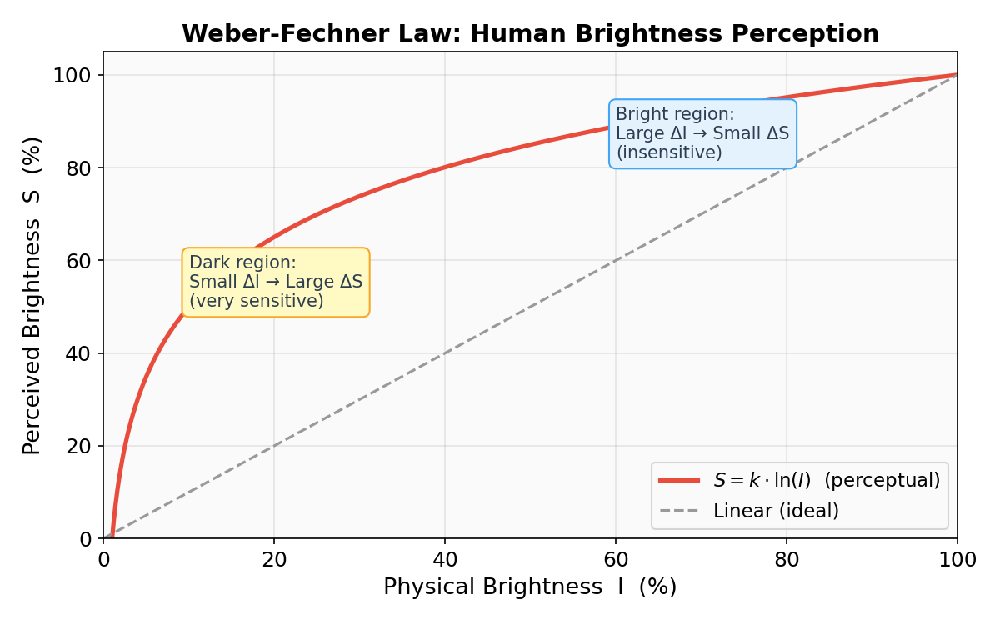

```
韦伯-费希纳定律示意：

  感知亮度 S                          S = k·ln(I)
  100% ┤                          ╭──────────────
       │                       ╱
       │                    ╱
   75% ┤                 ╱
       │              ╱
       │           ╱
   50% ┤        ╱
       │      ╱
       │    ╱
   25% ┤  ╱
       │╱
       │
    0% ┼──────────────────────────────────────── 物理亮度 I
       0%        25%        50%        75%      100%
```

#### 2.1.2 用灰度条直观感受

下面用 Unicode 块字符模拟灰度条。**上方**是物理亮度均匀分布（线性），**下方**是人眼感知的效果：

```
物理亮度均匀递增（线性，每格 +10%）：

  0%   10%   20%   30%   40%   50%   60%   70%   80%   90%  100%
  ░░░  ░░░  ▒▒▒  ▒▒▒  ▓▓▓  ▓▓▓  ███  ███  ███  ███  ███

人眼实际感知到的"亮度差异"：

     ┌───────────────────────────┐  ┌───────────────────────────┐
     │ 0% → 10%：感知变化很大！   │  │ 90% → 100%：几乎看不出来  │
     │ "从全黑突然变亮了"          │  │ "好像一样亮"               │
     └───────────────────────────┘  └───────────────────────────┘

  感知变化量（Δ感知）：

  0→10%  10→20%  20→30%  30→40%  40→50%  50→60%  60→70%  70→80%  80→90% 90→100%
  ██████ █████  ████   ███    ███    ██     ██     █      █      ▏
  巨大    大      中     中      小     小     小     很小    微小   几乎无

  └──── 暗部：一点点物理变化 ────┘    └──── 亮部：很大的物理变化 ────┘
         人眼感知强烈                        人眼感知微弱
```

#### 2.1.3 数值实验：人眼能分辨多少级灰度？

一个经典实验：在黑暗背景下显示两块灰色，逐步减小它们的亮度差异，直到人眼分辨不出。结果：

```
暗区（约 10% 亮度附近）：
  ┌──────────┐  ┌──────────┐
  │ 亮度 10% │  │ 亮度 11% │   ← 差 1%，人眼能轻松分辨 ✓
  │   ░░░░   │  │   ░░░░   │
  └──────────┘  └──────────┘

亮区（约 90% 亮度附近）：
  ┌──────────┐  ┌──────────┐
  │ 亮度 90% │  │ 亮度 91% │   ← 差 1%，人眼几乎分辨不出 ✗
  │   ████   │  │   ████   │
  └──────────┘  └──────────┘

  ┌──────────┐  ┌──────────┐
  │ 亮度 90% │  │ 亮度 95% │   ← 差 5%，才勉强能分辨 ✓
  │   ████   │  │   ████   │
  └──────────┘  └──────────┘
```

这意味着：**暗部每 1 级灰度差异都重要，亮部可以"粗糙"一些**。

下图是实际灰度色块对比，你可以亲眼验证——暗区的微小差异比亮区更容易被察觉：

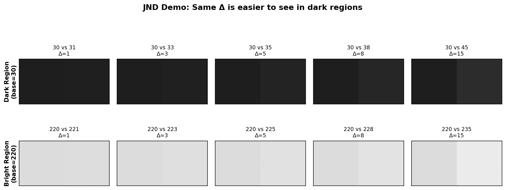

#### 2.1.4 韦伯比——定量描述敏感度

韦伯定律更精确的表述是：人能感知到的**最小可觉差（JND, Just Noticeable Difference）** 与当前刺激强度成正比：

$$
\frac{\Delta I}{I} = \text{const} \approx 1\% \sim 2\%
$$

其中 $\Delta I$ 是刚好能被察觉的亮度变化量，$I$ 是当前亮度。

```
当前亮度 I    韦伯比 ΔI/I ≈ 2%    最小可觉差 ΔI     含义
──────────────────────────────────────────────────────────
      5          2%                 0.1         亮度变化 0.1 就能察觉
     50          2%                 1.0         亮度变化 1.0 才能察觉
    200          2%                 4.0         亮度变化 4.0 才能察觉
    255          2%                 5.1         亮度变化 5.1 才能察觉
──────────────────────────────────────────────────────────
                                  ↑
                          暗部只需很小变化就能被感知
                          亮部需要大得多的变化才能被感知
```

#### 2.1.5 这对图像编码意味着什么？

8-bit 灰度只有 256 个值。如果用**线性编码**平均分配：

```
线性编码分配方式：

  物理亮度  0───────────────128──────────────255
  灰度级    均匀分配 256 个值

  问题：
  ┌─────────────────────────────────┐
  │ 暗部 (0~50)：                    │
  │   分配 50 个灰度级               │
  │   但人眼在此区间能分辨 ~200 级！  │
  │   → 严重不足 → 出现色带/色阶断裂  │
  ├─────────────────────────────────┤
  │ 亮部 (200~255)：                 │
  │   分配 55 个灰度级               │
  │   但人眼在此区间只能分辨 ~20 级   │
  │   → 严重浪费                     │
  └─────────────────────────────────┘
```

**解决方案**：用 Gamma 编码（$\gamma < 1$），把更多灰度级分配给暗部：

```
Gamma 编码分配方式（γ = 1/2.2 ≈ 0.45）：

  物理亮度   0──────50────100───150───200──255
  编码值     0────128────170───196───218──255
             └──┘                      └──┘
        暗部 0~50 占了一半编码空间    亮部被压缩
        → 暗部过渡平滑，无色带       → 人眼不敏感，损失可接受
```

下图直观展示了线性编码与 Gamma 编码在灰度级分配上的区别：

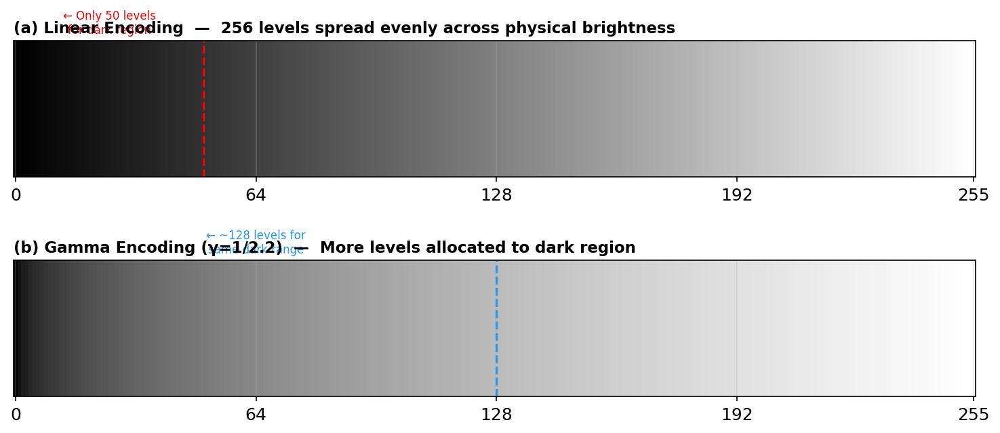

#### 2.1.6 生活中的类比

| 感官 | 线性量 | 感知量（对数） | 例子 |
|------|--------|--------------|------|
| 视觉 | 物理亮度（cd/m²） | 感知亮度 | 暗室加 1 根蜡烛 vs 明亮房间加 1 根 |
| 听觉 | 声压（Pa） | 响度（分贝 dB） | 耳语 30dB → 谈话 60dB → 演唱会 110dB |
| 触觉 | 重量（kg） | 感知重量 | 手持 1kg 再加 0.5kg 有感觉；背 50kg 再加 0.5kg 无感觉 |
| 味觉 | 糖浓度 | 甜味感知 | 白水加一勺糖很甜；已经很甜的奶茶再加一勺几乎不变 |

> **核心结论**：人眼的亮度感知遵循对数规律，对暗部变化极其敏感，对亮部变化不敏感。这一生理特性是理解 Gamma 校正（以及为什么要用 Gamma 而不是线性变换）的基础。

### 2.2 显示器的非线性响应

> 上一节讲了"人眼看世界的方式不是线性的"；这一节要讲"显示器显示图像的方式也不是线性的"。两个非线性叠在一起，才催生了 Gamma 校正。

在开始之前，先建立一个直觉：所谓**线性响应**，就是"给多少就显示多少"——你发送一个 50% 亮度的信号，屏幕就亮 50%。然而现实中几乎没有显示器是完美线性的，下面我们来看看为什么。

---

#### 2.2.1 什么是 CRT？（从"大屁股电视"说起）

如果你年龄不大，可能没见过 CRT 显示器。它就是那种又大又重、屁股鼓出来一大块的老式电视和电脑显示器。

```
CRT 显示器的外观（侧面截面示意）：

        ┌───── 荧光屏（你看到画面的那面）
        │
        ▼
   ╔═══════════════╗
   ║    ·  ·  ·    ║ ← 荧光粉涂在屏幕内侧
   ║               ║
   ║               ╚═══╗
   ║                    ║ ← 锥形玻璃管（真空）
   ║                ╔═══╝
   ║               ║
   ║    ·  ·  ·    ║
   ╚═══════════════╝
          │
          ▼
     电子枪在这里
    （显示器最后面，
      就是"大屁股"的部分）
```

**CRT 的全称**：Cathode Ray Tube，阴极射线管。

**简单理解**：它就是一个大玻璃灯泡。后面有一把"电子枪"，向前面的屏幕射出电子。电子打到屏幕上涂着的荧光粉，荧光粉就发光——你就看到了画面。

**为什么要了解 CRT？** 因为 Gamma = 2.2 这个数字，来源于 CRT 的**物理特性**。虽然 CRT 已经被淘汰，但这个数字作为行业标准延续至今，影响着你手机、电脑、电视上显示的每一张图片。

---

#### 2.2.2 CRT 的物理原理（详解）

##### （1）电子枪是怎么工作的？

用一个生活类比：

```
水枪类比：

  水龙头 ──▶ 水压 ──▶ 水枪 ──▶ 水柱 ──▶ 打到靶子
  （电源）  （电压）  （电子枪）（电子束）（荧光粉发光）

  水压大 → 水柱强 → 打到靶子的力量大 → 靶子振动大（亮度高）
  水压小 → 水柱弱 → 打到靶子的力量小 → 靶子振动小（亮度低）
```

但关键问题在于：**水压翻倍，打到靶子的力量并不会翻倍**——中间有损耗、有非线性因素。电子枪也是一样。

##### （2）为什么不是线性的？三个物理因素

```
阴极 ──▶ 电子枪 ──▶ 电子束 ──▶ 偏转系统 ──▶ 荧光粉 ──▶ 发光
  │          │           │                       │
  │    因素①  │     因素②  │                 因素③  │
  │  加速电压  │  空间电荷  │              荧光粉  │
  │  与动能    │   效应     │              发光效率 │
  └──────────┴───────────┴───────────────────────┘
                    三者叠加 → L ∝ V^γ
```

**因素 ① — 电子的动能**

电子在电场中被加速，获得动能：$E_k = eV$

这部分是线性的：电压 $V$ 加倍，动能 $E_k$ 也加倍（$e$ 是电子电荷，物理常数）。

**因素 ② — 空间电荷效应（这是非线性的主要来源！）**

> 空间电荷效应是 CRT Gamma 的核心物理原因。

当大量电子从阴极出发时，它们自身带有负电荷。这些负电荷会形成一个"电子云"，**反过来排斥后面的电子**——就好比：

```
生活类比——地铁门口挤人：

  地铁门 │ ← 想进去的人
  ───────┤
         │ 已经挤在门口的人（相当于"空间电荷"）
         │ 会阻挡后面的人进入
  ───────┤
         │ ← 更多想进去的人
         │
  门开得越大（电压越高），能挤进去的人就多，
  但增长速度不是线性的！门从 1m 开到 2m，
  进入的人数可能从 100 变成 280（而不是 200）。
```

物理学家用 **Child-Langmuir 定律**（也叫"三二次幂定律"）描述这个过程：

$$
J \propto V^{3/2}
$$

其中 $J$ 是电子束的电流密度，$V$ 是加速电压。指数是 $3/2 = 1.5$，已经不是线性了！

**因素 ③ — 荧光粉的发光效率**

电子打到荧光粉上，荧光粉发光。但发光量和电子能量之间也不是简单的正比关系：

- 电子能量太低 → 不足以激发荧光粉，不发光（有个**阈值**）
- 电子能量适中 → 发光效率最高
- 电子能量太高 → 部分能量变成热量浪费（效率下降）

不同颜色的荧光粉（红/绿/蓝）的激发特性还略有不同。

##### （3）三个因素叠加的结果

三个因素的非线性叠加后，最终的**亮度 vs 电压**关系近似为一个整洁的幂律函数：

$$
L_{display} = k \cdot V^{\gamma}, \quad \gamma \approx 2.2
$$

| 符号 | 含义 | 典型值 |
|------|------|--------|
| $L_{display}$ | 屏幕实际亮度（归一化到 0~1） | — |
| $V$ | 输入电压信号（归一化到 0~1） | — |
| $k$ | 比例常数（取决于显示器最大亮度） | 通常归一化为 1 |
| $\gamma$ | 幂律指数，"Gamma 值" | CRT 约 2.2~2.5 |

> **重要**：$\gamma = 2.2$ **不是人为设计的**，而是 CRT 电子枪的物理特性自然产生的。这是一个实验测量值，不同 CRT 之间会略有不同（范围大约在 2.0~2.5），但 **2.2** 是大多数 CRT 的典型值，后来被标准化采用。

---

#### 2.2.3 幂律关系的直观理解

$V^{2.2}$ 到底是什么样的？我们用一张表直观感受：

```
电压 V（归一化 0~1）  →  亮度 L = V^2.2

  V      V^2.2 (亮度)    亮度百分比    现象
──────────────────────────────────────────────────────────
 0.0      0.000            0%         全黑
 0.1      0.006            0.6%       几乎全黑 ← 输入 10% 电压，只有 0.6% 亮度！
 0.2      0.029            2.9%       依然很暗
 0.3      0.072            7.2%       勉强可见
 0.4      0.133           13.3%       偏暗
 0.5      0.218           21.8%       ← 输入 50% 电压，只有 22% 亮度！
 0.6      0.326           32.6%       ← 60% 电压才刚过 1/3 亮度
 0.7      0.457           45.7%       
 0.8      0.612           61.2%       ← 80% 电压 → 61% 亮度，仍然偏暗
 0.9      0.789           78.9%       
 1.0      1.000          100.0%       最亮
```

**读表技巧**：找"50%"那一行——你给了屏幕一半的电压，但屏幕只亮了 22%。这就是"非线性"的直接体现。

用一个生活类比帮助理解：

```
类比——调节台灯的旋钮：

假设你的台灯旋钮能转 10 格：

  旋钮位置    你期望的亮度    实际亮度
  ─────────────────────────────────
   1 格        10%            0.6%     ← 几乎看不到变化！
   3 格        30%            7.2%     ← 拧了 3 格才勉强亮
   5 格        50%           21.8%     ← 拧到一半，灯只有 1/5 亮
   8 格        80%           61.2%     ← 拧到 8 格才到 6 成亮
  10 格       100%          100.0%     ← 拧满才全亮

  感受：前半段几乎没反应，后半段变化很快。
  这就是 γ = 2.2 的幂律带来的"前慢后快"效果。
```

下面是曲线图的 ASCII 近似和实际生成的图片：

```
亮度 L
1.0 ┤                                    ╱
    │                                  ╱
    │                               ╱
0.8 ┤                             ╱
    │                          ╱
    │                        ╱
0.6 ┤                     ╱
    │                  ╱         L = V^2.2
    │               ╱            (CRT 实际响应)
0.4 ┤            ╱
    │         ╱            ╱ ╱ ╱  L = V
    │       ╱        ╱ ╱ ╱        (理想线性)
0.2 ┤     ╱    ╱ ╱ ╱
    │   ╱╱ ╱
    │ ╱╱
0.0 ┼╱───────────────────────────────── 电压 V
    0   0.1  0.2  0.3  0.4  ...  1.0
```


**如何看这张图？**

- **灰色虚线对角线** $L = V$：理想的线性响应——给 50% 就亮 50%
- **红色曲线** $L = V^{2.2}$：CRT 实际响应——弯在对角线**下方**，暗部被严重压缩
- **蓝色曲线** $L = V^{1/2.2}$：Gamma 编码曲线——弯在对角线**上方**
- 红蓝两条曲线**互相抵消** → 最终恢复线性 → 这就是 Gamma 校正的核心思想

---

#### 2.2.4 如果不做 Gamma 校正会怎样？

**场景**：你拍了一张照片，相机线性记录了从暗到亮的均匀渐变，直接把数据送给 CRT 显示。

```
步骤 1：相机拍到的数据（线性均匀渐变）
  0    32    64    96   128   160   192   224   255
  ░░░  ▒▒▒  ▒▒▒  ▓▓▓  ███  ███  ███  ███  ███
  每档差值相同 (Δ=32)，物理亮度均匀递增

步骤 2：这些数据直接变成 CRT 的驱动电压
  电压:  0   32   64   96  128  160  192  224  255
  归一: 0.0 0.13 0.25 0.38 0.50 0.63 0.75 0.88 1.00

步骤 3：CRT 按 V^2.2 输出实际亮度
  亮度:  0  0.01 0.05 0.11 0.22 0.36 0.53 0.75 1.00
  百分:  0%  1%   5%  11%  22%  36%  53%  75% 100%

步骤 4：你看到了什么？
  0    32    64    96   128   160   192   224   255
  ░░░  ░░░  ░░░  ░░░  ▒▒▒  ▒▓▓  ▓██  ███  ███
  └────────────────┘   └──────────────────────┘
   0~96 全挤在 0~11%     128~255 快速从 22% 跳到 100%
   → 暗部细节全丢失      → 中间调偏暗 + 亮部过渡粗糙
```

**用生活场景想象**：你拍了一张夜晚的城市照片，路灯、霓虹灯、暗巷、人影都有。不做 Gamma 校正直接显示的话：
- 暗巷里的人影 → 完全看不见，一片漆黑
- 路灯和霓虹灯 → 勉强能看到，但层次感丢失
- 整个画面 → 灰蒙蒙、暗沉沉，像蒙了一层灰

**用数据量化损失**：

| 输入范围 | 占信号范围 | 实际亮度范围 | 感知 |
|----------|-----------|-------------|------|
| 0~64（暗部） | 25% | 0%~5% | 几乎全黑 |
| 64~128（中暗） | 25% | 5%~22% | 勉强可见 |
| 128~192（中亮） | 25% | 22%~53% | 正常 |
| 192~255（亮部） | 25% | 53%~100% | 急剧变亮 |

前 50% 的信号范围（0~128）只产生 0~22% 的亮度，**一半的数据只覆盖了五分之一的亮度范围**！

下图直观展示了三种灰度渐变条的区别：

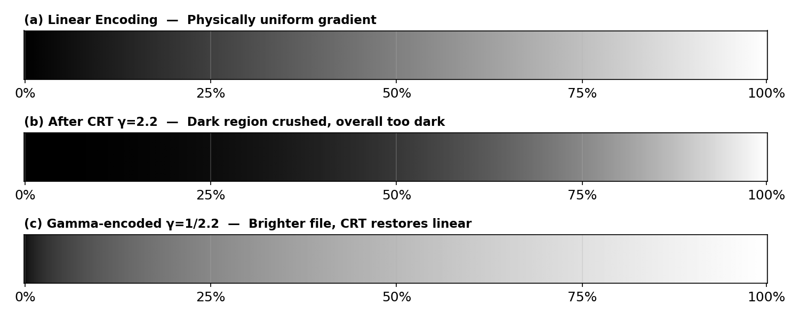

- **(a)** 线性编码的渐变条——物理亮度均匀分布
- **(b)** 线性数据直接送 CRT 后的效果——暗部被严重压缩，整体偏暗
- **(c)** Gamma 编码（$\gamma = 1/2.2$）后的存储数据——看起来偏亮，但送到 CRT 后刚好还原为均匀渐变

> **一句话总结**：不做 Gamma 校正 = 暗部细节全丢 + 整体偏暗 + 亮度分配严重不均匀。

---

#### 2.2.5 LCD 显示器的工作原理（与 CRT 的本质区别）

##### （1）LCD 是怎么发光的？

LCD（Liquid Crystal Display，液晶显示器）和 CRT 的发光原理完全不同：

```
CRT：主动发光
  电子枪 → 打荧光粉 → 发光     （自己产生光）

LCD：被动控光
  背光灯 → 液晶层  → 偏光片 → 你看到的光
          （液晶只是"开关"，控制背光能通过多少）
```

**液晶就像百叶窗**：

```
百叶窗类比：

  ☀️ 阳光（= 背光灯）
    │
    ▼
  ═══════  百叶窗（= 液晶层）
    │
    ▼
  你的眼睛

  百叶窗全开 → 阳光全部通过 → 最亮
  百叶窗半开 → 一半阳光通过 → 中等
  百叶窗关闭 → 阳光被挡住   → 最暗（但不是全黑，总有漏光）
```

##### （2）LCD 的物理特性

LCD 控制亮度的原理是：改变液晶分子的**偏转角度**，从而改变光的**偏振方向**，再通过偏光片来筛选。

```
电压 → 液晶偏转角 → 光透过率 → 你看到的亮度

  电压与液晶偏转角的关系：近似线性
  光透过率与偏转角的关系：近似线性（对于 IPS 面板）
  
  → 整体上：电压 与 亮度 近似线性！
```

这与 CRT 有本质区别：

| 特性 | CRT | LCD |
|------|-----|-----|
| 发光方式 | 主动发光（电子轰击荧光粉） | 被动控光（液晶调节背光透过率） |
| 原生响应 | 非线性，$\gamma \approx 2.2$ | 近似线性，$\gamma \approx 1.0$ |
| 非线性来源 | 物理本征（空间电荷效应） | 人为添加（Gamma IC 芯片） |
| 黑色表现 | 真正的黑（电子束关闭） | 不完美黑（背光仍在，液晶漏光） |

##### （3）常见 LCD 面板类型

| 类型 | 全称 | 特点 | Gamma 特性 |
|------|------|------|-----------|
| TN | Twisted Nematic | 响应快、便宜、可视角小 | 原生稍偏，Gamma IC 校正 |
| IPS | In-Plane Switching | 色彩准、可视角大 | 原生较线性，Gamma IC 校正 |
| VA | Vertical Alignment | 对比度高、黑色纯 | 原生稍非线性，Gamma IC 校正 |

> 无论哪种 LCD 面板，**都需要 Gamma IC** 来将原生响应调整到 $\gamma = 2.2$ 的标准曲线。

下图左侧展示了不同显示技术的原生 Gamma 响应曲线对比，右侧是各技术原生 Gamma 值的横向对比：

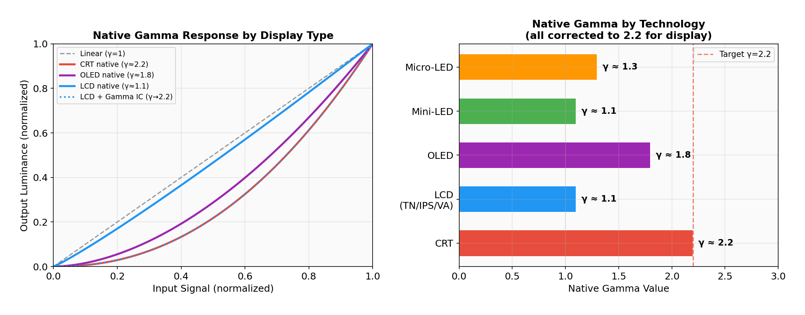

---

#### 2.2.6 现代 LCD 为什么还要 Gamma 2.2？

LCD 原生是近似线性的，为什么不直接用线性响应呢？原因有 **四个层面**：

##### 原因 1：历史兼容——几十年的内容生态

```
时间线：

  1950s~1990s    CRT 统治时代
     │           所有图片/视频 → 按 γ = 1/2.2 编码存储
     │           CRT 显示时自动做 γ = 2.2 → 恢复正确亮度
     │
  2000s~至今     LCD 逐步取代 CRT
     │           但已有数十亿张图片、百万小时视频
     │           全部按 γ = 1/2.2 编码
     │
     ▼
  如果 LCD 做成线性响应（γ = 1）：
     γ = 1/2.2 编码 × γ = 1 显示 = γ = 1/2.2 最终效果
     → 所有图片偏亮、发白、颜色失真！
     → 几十年的内容全部显示错误！

  所以 LCD 必须模拟 γ = 2.2：
     γ = 1/2.2 编码 × γ = 2.2 显示 = γ = 1.0 → 正确 ✓
```

##### 原因 2：感知优化——8-bit 灰度的最佳分配

> 这是最深层的原因，即使从零开始设计全新的显示系统，$\gamma \approx 2.2$ 仍然是最优选择。

还记得 2.1 节的结论吗？人眼对暗部敏感，对亮部不敏感。如果用线性编码存储 8-bit 灰度（0~255）：

```
线性编码 —— 给每个亮度区间分配相同的灰度级数：

  亮度 0%~10%  （暗部）：分配  26 个灰度级 → 人眼需要很多级（敏感区）→ 不够用！
  亮度 10%~20%（中暗）：分配  26 个灰度级 → 还行
  亮度 80%~90%（亮部）：分配  26 个灰度级 → 人眼不敏感 → 浪费了！
  亮度 90%~100%（高光）：分配 26 个灰度级 → 更浪费！

Gamma 编码 —— 自动给暗部分配更多灰度级：

  亮度 0%~10%  （暗部）：分配  ~80 个灰度级 → 足够细腻 ✓
  亮度 10%~20%（中暗）：分配  ~40 个灰度级 → 合适 ✓
  亮度 80%~90%（亮部）：分配  ~15 个灰度级 → 人眼不敏感，够了 ✓
  亮度 90%~100%（高光）：分配 ~10 个灰度级 → 人眼不敏感，够了 ✓
```

**结论**：$\gamma = 2.2$ 的编码-解码链天然将更多的数字级分配给人眼敏感的暗部，使 8-bit 的 256 级灰度达到**感知均匀**的最佳利用效率。


##### 原因 3：标准化——全行业统一的约定

| 标准 | 制定组织 | 应用领域 | Gamma 值 |
|------|---------|---------|----------|
| sRGB | HP + Microsoft（1996） | 网页、办公、消费电子 | $\approx 2.2$（分段函数） |
| Rec.709 | ITU（1990） | 高清电视 HDTV | $\approx 2.2$（简化） |
| Rec.2020 | ITU（2012） | 4K/8K 超高清 | $\approx 2.2$（简化） |
| DCI-P3 | DCI（2005） | 数字电影院 | $\gamma = 2.6$ |
| Display P3 | Apple（2015） | iPhone / Mac 屏幕 | $\approx 2.2$（sRGB 传输函数） |

> **注意**：sRGB 的传输函数严格来说不是纯粹的 $V^{1/2.2}$，而是一个分段函数——在极暗部（$V < 0.0031308$）用线性段，其余用幂函数。但整体效果非常接近 $\gamma = 2.2$，实际使用中通常直接用幂函数近似。

下图展示了不同标准的编码曲线对比，注意 sRGB 的暗部线性段和 DCI-P3 的更陡曲线：

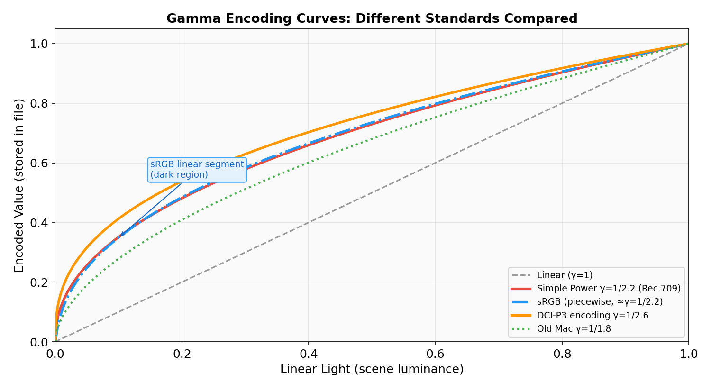

##### 原因 4：Gamma IC——LCD 如何主动模拟 $\gamma = 2.2$

LCD 面板出厂时，内部集成了一颗 **Gamma IC**（也叫 Gamma 校正芯片），它是一个硬件查找表（LUT）：

```
LCD 内部 Gamma 实现的完整流程：

  GPU 输出信号 ──▶  TCON（时序控制器）──▶  Gamma IC  ──▶  Source Driver  ──▶  液晶像素
    [0, 255]        解析信号               查表映射        驱动电压输出         控制透过率
                                           │
                                           ▼
                                     ┌──────────────┐
                                     │ 输入  │ 输出  │
                                     ├───────┼───────┤
                                     │  0    │  0V   │   ← 全黑
                                     │  32   │  0.8V │   ← 不是 32/255 × 5V = 0.63V！
                                     │  64   │  1.3V │   ← 比线性时更低
                                     │  128  │  2.7V │
                                     │  255  │  5.0V │   ← 全亮
                                     └───────┴───────┘
                                     这张表让线性面板模拟出
                                     V^2.2 的响应曲线
```

**面板校准**：每块 LCD 面板出厂时，工厂都会用光度计测量实际响应，然后将校准数据写入 Gamma IC。这就是为什么同型号显示器的显示效果一致——是出厂校准过的。

```
工厂校准流程（简化）：

  1. 面板组装完成
  2. 光度计 📷 测量"输入信号 vs 实际亮度"的原生曲线
  3. 计算"需要多少补偿才能达到 γ = 2.2"的目标曲线
  4. 把补偿表写入 Gamma IC（烧录到芯片 ROM）
  5. 验收：重新测量，确认误差在容许范围内
  6. 出厂 ✅
```

---

#### 2.2.7 OLED 与其他新型显示技术

##### （1）OLED（有机发光二极管）

OLED 和 CRT 有一个共同点：都是**自发光**的，不需要背光。

```
OLED 发光原理：

  电流 → 有机发光材料 → 发光
  
  每个像素独立发光，不需要背光灯
  → 可以做到"真正的黑"（关掉像素就完全不发光）
  → 对比度极高（理论上无穷大）
```

**OLED 的原生 Gamma 特性**：

| 亮度范围 | OLED 原生响应 | 备注 |
|---------|-------------|------|
| 低亮度 | 接近线性 | 电流小时效率较高 |
| 中亮度 | 略微非线性 | 有机材料的发光效率有最佳区间 |
| 高亮度 | 效率下降 | 高电流导致热量增加、效率饱和 |

OLED 的原生曲线跟 CRT 完全不同（大约 $\gamma \approx 1.8$~$2.0$），但**同样通过软件/硬件校正模拟 $\gamma = 2.2$**，原因和 LCD 一样——兼容和感知优化。

##### （2）Mini-LED 和 Micro-LED

| 技术 | 本质 | Gamma 处理方式 |
|------|------|---------------|
| Mini-LED | LCD + 精细分区背光 | 同 LCD，Gamma IC 校正 |
| Micro-LED | 每个像素是独立 LED（自发光） | 驱动 IC 内置 Gamma 映射 |

##### （3）电子墨水屏（E-Ink）

电子书阅读器（如 Kindle）使用的电子墨水屏比较特殊：

- 通常只有 **16 级灰度**（4-bit），不需要精细的 Gamma 管理
- 反射式显示，不发光，在阳光下看更清楚
- 刷新率极低，主要用于静态文字
- Gamma 概念在 E-Ink 上不太适用

---

#### 2.2.8 如何验证你的显示器 Gamma？

你可以用一个简单的视觉测试来粗略判断你的显示器 Gamma 是否正确：

##### 方法 1：条纹融合测试

```
┌─────────────────────────────────────────────┐
│  ████████████████████████████████████████    │ ← 纯灰色块（像素值 = 186）
│                                             │
│  ██  ██  ██  ██  ██  ██  ██  ██  ██  ██    │ ← 黑白相间条纹
│  ██  ██  ██  ██  ██  ██  ██  ██  ██  ██    │   （黑 0 + 白 255 交替）
└─────────────────────────────────────────────┘

  如果你的显示器 Gamma 正确（≈ 2.2）：
    上面的纯灰色块 和 下面的条纹 看起来亮度应该差不多

  为什么？
    条纹的平均像素值 = (0 + 255) / 2 = 127.5 （线性平均）
    但经过 γ = 2.2 后的感知亮度 ≈ 186/255 的灰色
    所以用 186 灰来匹配
```

##### 方法 2：在线测试工具

```
推荐网站（可以搜索）：
  • Lagom LCD Monitor Test  → 有专门的 Gamma 测试页
  • DisplayCAL              → 专业色彩管理软件（免费）
  • Photo Friday            → 在线 Gamma 测试图

使用方法：
  1. 打开测试页面
  2. 调整显示器到默认设置
  3. 在正常观看距离下判断测试图案
  4. 如果中灰色块与条纹的亮度匹配 → Gamma ≈ 2.2 ✓
```

##### 方法 3：用代码测量（适合本课程学习者）

```cpp
// 生成一个 Gamma 测试图：左半边纯灰，右半边黑白条纹交替
cv::Mat test(200, 400, CV_8UC1);
// 左半边：纯灰 186（对应 γ=2.2 时 50% 感知亮度）
test(cv::Rect(0, 0, 200, 200)).setTo(186);
// 右半边：黑白相间条纹
for (int y = 0; y < 200; ++y)
    for (int x = 200; x < 400; ++x)
        test.at<uchar>(y, x) = (x % 2 == 0) ? 0 : 255;

cv::imshow("Gamma Test", test);
cv::waitKey(0);
```

正常观看距离下，如果左右两半的亮度看起来一样 → 你的显示器 Gamma ≈ 2.2。

---

#### 2.2.9 HDR 与 PQ 曲线——Gamma 的未来

传统的 Gamma 2.2 是为 **SDR**（Standard Dynamic Range，标准动态范围）设计的，最大亮度约 100 nit。但现代 HDR 显示器可以达到 1000~10000 nit，Gamma 2.2 已经不够用了。

##### SDR vs HDR

```
SDR（传统）：                    HDR（新一代）：
  最大亮度：~100 nit              最大亮度：1000~10000 nit
  传输函数：γ = 2.2              传输函数：PQ（Perceptual Quantizer）
  灰度深度：8-bit (256 级)        灰度深度：10-bit (1024 级) 或 12-bit
  标准：sRGB / Rec.709            标准：HDR10 / Dolby Vision / HLG
```

##### PQ 曲线（ST 2084）

PQ 曲线由杜比实验室设计，基于人眼的**绝对亮度感知**，而不是简单的幂函数：

```
传统 Gamma：          PQ 曲线：
  L = V^2.2            L = f(V)  ← 复杂的分段函数
  简单、优雅             精确匹配人眼对每个亮度级的 JND
  适合 0~100 nit         覆盖 0~10000 nit
  8-bit 足够             需要 10-bit 以上
```

> **你现在需要了解 HDR 吗？** 对于图像处理入门来说，不需要。你只需要知道：Gamma 2.2 是 SDR 时代的标准，HDR 时代正在过渡到更先进的 PQ 曲线，但 Gamma 的核心思想（用非线性编码匹配人眼感知）没有变。

---

#### 2.2.10 小结：为什么是 2.2？

| 角度 | 解释 | 详细程度 |
|------|------|---------|
| 物理原因 | CRT 电子枪的空间电荷效应（Child-Langmuir 定律 $J \propto V^{3/2}$）+ 荧光粉激发特性 → 固有 $\gamma \approx 2.2$ | 这是历史起源 |
| 感知原因 | $\gamma = 2.2$ 的编码-解码链将更多灰度级分配给人眼敏感的暗部，实现感知均匀 | 这是保留至今的根本理由 |
| 标准化 | sRGB / Rec.709 / Rec.2020 / Display P3 均以 2.2 为基准（或非常接近） | 这是工业现实 |
| LCD/OLED | 原生不是 2.2，但通过 Gamma IC/软件校正主动模拟 → 保持兼容和优化 | 现代实现方式 |
| HDR 未来 | PQ 曲线更精确但思想相同——用非线性编码匹配人眼感知 | 发展方向 |

```
Gamma 2.2 的完整故事线：

  1950s   CRT 发明 → 物理上恰好 γ ≈ 2.2 → 巧合？
    │
  1960s   发现 2.2 近似匹配人眼感知 → 不是巧合，是幸运！
    │
  1990s   sRGB 标准制定 → 将 2.2 固化为行业标准
    │
  2000s   LCD 取代 CRT → 用 Gamma IC 主动模拟 2.2
    │
  2010s   OLED 兴起 → 同样模拟 2.2
    │
  2020s   HDR 出现 → PQ 曲线逐步替代 → 但 SDR 内容仍用 2.2
    │
  未来？   SDR 和 Gamma 2.2 短期内不会消失 → 可能共存很久
```

> **一句话总结**：$\gamma = 2.2$ 起源于 CRT 的物理特性，恰好匹配人眼感知（幸运巧合），被标准化后成为全行业的基石。即使显示技术已经更新换代，这个数字仍被刻意保留——因为它在 SDR 场景下**既高效又兼容**。

下面这张时间线图帮你把整个故事串起来：

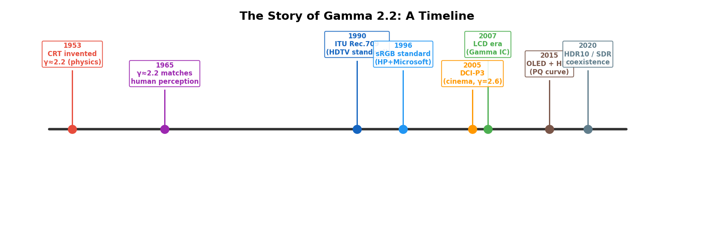

### 2.3 整体流程

```
┌──────────┐    ┌────────────────┐    ┌──────────┐    ┌──────────┐
│ 真实场景  │───▶│ 相机（线性采集）│───▶│ Gamma    │───▶│ 显示器   │
│ 线性光照  │    │ 线性数据       │    │ 编码校正  │    │ 幂律响应  │
└──────────┘    └────────────────┘    │ γ = 1/2.2│    │ γ = 2.2  │
                                      └──────────┘    └──────────┘
                                            │               │
                                            ▼               ▼
                                      I' = I^(1/2.2)   L = I'^2.2
                                                        = I^1.0
                                                        恢复线性 ✓
```

编码时做 $\gamma = 1/2.2 \approx 0.45$ 的校正，显示器再做 $\gamma = 2.2$ 的响应，两者**互相抵消**，最终还原线性亮度。

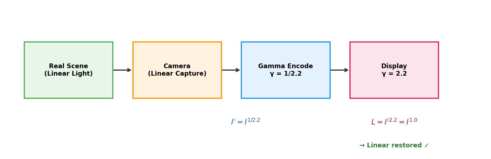

---

## 三、Gamma 变换的数学原理

### 3.1 什么是幂函数？（数学基础补充）

如果你不熟悉幂函数，先看这里。**幂函数**就是 $y = x^n$ 的形式，其中 $n$ 叫做**指数**（或**幂**）。

```
几个例子：

  x^1   = x         （1次方 = 本身，什么都没变）
  x^2   = x × x     （2次方 = 平方）
  x^0.5 = √x        （0.5次方 = 开平方根）
  x^0   = 1         （任何数的0次方 = 1，特殊情况）

  具体数值：

  底数 x    x^0.5(开根)    x^1(原值)    x^2(平方)
  ────────────────────────────────────────────
   0.00      0.00          0.00         0.00
   0.25      0.50          0.25         0.06    ← 注意：0.5 > 0.25 > 0.06
   0.50      0.71          0.50         0.25
   0.75      0.87          0.75         0.56
   1.00      1.00          1.00         1.00    ← 三者在 0 和 1 处相等
  ────────────────────────────────────────────

  规律（当 x 在 0~1 之间时）：
  • 指数 < 1  →  结果 > 原值  →  数值被"抬高"
  • 指数 = 1  →  结果 = 原值  →  不变
  • 指数 > 1  →  结果 < 原值  →  数值被"压低"
```

这个规律就是 Gamma 变换的数学基础。

### 3.2 公式

$$
I'(x,y) = 255 \cdot \left(\frac{I(x,y)}{255}\right)^{\gamma}
$$

这个公式看起来复杂，其实只有 **3 步**：

```
第 1 步：归一化                把像素值从 [0, 255] 缩放到 [0.0, 1.0]
         I / 255               为什么？因为幂函数在 0~1 范围内性质最清楚

第 2 步：做幂运算              (I/255)^γ
         结果还在 [0.0, 1.0]   这一步是核心，γ 值决定了亮度如何改变

第 3 步：反归一化              × 255，从 [0.0, 1.0] 缩放回 [0, 255]
         结果就是新的像素值
```

**手动算一个例子**：输入像素值 = 100，γ = 0.6

```
第 1 步：归一化       100 / 255 = 0.392
第 2 步：幂运算       0.392^0.6 = 0.551    （用计算器或 Python: 0.392**0.6）
第 3 步：反归一化     0.551 × 255 = 140

结果：像素值 100 → 140（变亮了 40！）
```

**再算一个**：输入像素值 = 220，γ = 0.6

```
第 1 步：归一化       220 / 255 = 0.863
第 2 步：幂运算       0.863^0.6 = 0.915
第 3 步：反归一化     0.915 × 255 = 233

结果：像素值 220 → 233（只变亮了 13，变化很小）
```

> **结论**：对于 γ < 1，暗的像素提亮幅度大，亮的像素几乎不变——这就是 Gamma 变换"选择性提亮暗部"的核心！

### 3.3 不同 Gamma 值的效果

```
输出 I'
255 ┤
    │  γ=0.4          γ=1.0（恒等）
    │   ╱ ╱ ╱ ╱ ╱ ╱ ╱     ╱
    │  ╱            ╱    ╱
    │ ╱           ╱    ╱
200 ┤╱          ╱    ╱
    │         ╱    ╱
    │       ╱    ╱
    │      ╱   ╱          γ=2.5
150 ┤    ╱   ╱          ╱
    │   ╱  ╱         ╱
    │  ╱ ╱        ╱
    │ ╱╱       ╱
100 ┤╱      ╱
    │    ╱
    │  ╱
    │╱
 50 ┤
    │
    │
  0 ┼──────────────────────── 输入 I
    0    50   100  150  200  255
```

| Gamma 值 | 曲线位置 | 效果 | 应用场景 | 通俗理解 |
|----------|---------|------|---------|---------|
| $\gamma < 1$ | 曲线在对角线**上方** | 整体**提亮**，暗部细节增强 | 曝光不足的照片、暗部增强 | "把暗的地方照亮" |
| $\gamma = 1$ | 对角线（恒等变换） | 无变化 | 基准 | "什么都不做" |
| $\gamma > 1$ | 曲线在对角线**下方** | 整体**变暗**，亮部细节增强 | 过曝照片、高光压缩 | "把亮的地方压暗" |

下图是不同 Gamma 值的变换曲线一览：

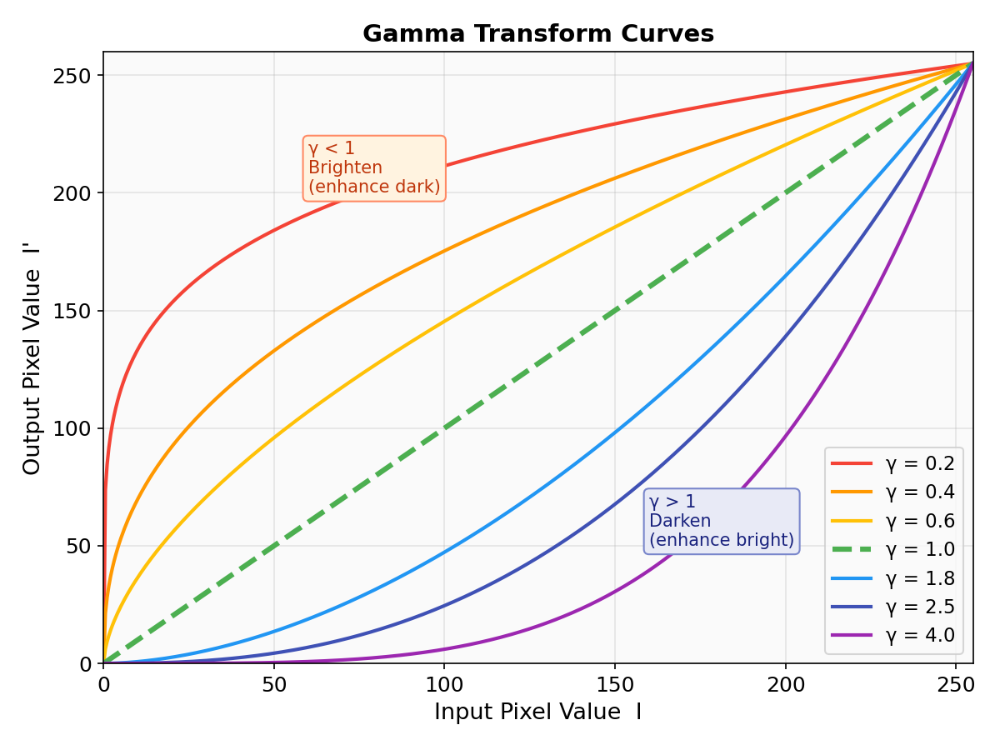

### 3.4 具体数值示例

以 $\gamma = 0.6$（代码中默认值）为例：

```
输入 I   归一化 I/255   (I/255)^0.6   输出 I' = 255×...   变化
─────────────────────────────────────────────────────────────
  0       0.000          0.000            0               0
 30       0.118          0.253           64              +34  ← 暗部大幅提亮
 60       0.235          0.393          100              +40
 90       0.353          0.507          129              +39
120       0.471          0.607          155              +35
150       0.588          0.698          178              +28
180       0.706          0.782          199              +19
210       0.824          0.862          220              +10  ← 亮部变化小
240       0.941          0.937          239               -1
255       1.000          1.000          255                0
```

可以看到：**暗部像素被大幅提亮**，而**亮部几乎不变**，这就是 $\gamma < 1$ 的核心效果。

### 3.5 图形化理解像素变化

```
Gamma = 0.6 时的像素亮度变化：

原图:     ██░░░░░░░░░░░░░░  (像素值 = 30，很暗)
变换后:   ██████████░░░░░░  (像素值 = 64，明显变亮)

原图:     ████████████████  (像素值 = 240，很亮)
变换后:   ████████████████  (像素值 = 239，几乎不变)
```

---

## 四、LUT（查找表）加速原理

### 4.1 先用生活例子理解 LUT

想象你是一个快递分拣员，需要把包裹按省份分到不同的箱子里。

```
方法一：每个包裹都上网查

  包裹地址: "北京市朝阳区..."  →  上网查  →  "北京"  →  放入北京箱
  包裹地址: "上海市浦东..."    →  上网查  →  "上海"  →  放入上海箱
  包裹地址: "北京市海淀区..."  →  上网查  →  "北京"  →  放入北京箱  ← 又查了一次！
  ...
  每个包裹都要上网查一次，很慢！

方法二：先打印一张对照表，贴在墙上

  ┌──────────┬────────┐
  │ 区号前缀 │ 省份    │    ← 只查一次就打印好了
  ├──────────┼────────┤
  │  010     │ 北京   │
  │  021     │ 上海   │
  │  020     │ 广东   │
  │  ...     │ ...    │
  └──────────┴────────┘

  然后每个包裹只需要"看一眼表" → 瞬间知道放哪里！
```

这张"对照表"就是 **LUT（Look-Up Table，查找表）**。

### 4.2 为什么 Gamma 变换需要 LUT？

一张 640×480 的灰度图有 307200 个像素。如果对每个像素都计算 `pow()`（幂函数），就要做 307200 次浮点幂运算，效率很低。

但灰度值只有 **256 种可能**（0~255），所以我们可以：

1. **预先**计算 0~255 每个值的映射结果，存入一张 256 项的表（只做 256 次 pow）
2. 处理时只需**查表**，不再做浮点运算（30 万次数组索引，超快）

```
类比：

  30 万个包裹，但只有 256 个不同的目的地
  → 不需要查 30 万次地图
  → 只需要打印 1 张 256 行的对照表，然后看表就行

  这就是为什么 LUT 能把速度提升一个量级！
```

### 4.3 LUT 的工作流程

```
┌─────────────────────────────────────────────────┐
│                  预计算阶段                       │
│                                                  │
│  for i = 0 to 255:                               │
│      lut[i] = 255 × (i/255)^γ                   │
│                                                  │
│  LUT 表内容 (γ=0.6):                             │
│  ┌───┬───┬───┬───┬───┬─────┬─────┬─────┬─────┐  │
│  │ 0 │ 1 │ 2 │ 3 │...│ 128 │ 200 │ 240 │ 255 │  │
│  ├───┼───┼───┼───┼───┼─────┼─────┼─────┼─────┤  │
│  │ 0 │ 8 │13 │17 │...│ 169 │ 219 │ 243 │ 255 │  │
│  └───┴───┴───┴───┴───┴─────┴─────┴─────┴─────┘  │
│    ↑输入                ↑输出                     │
└─────────────────────────────────────────────────┘


┌─────────────────────────────────────────────────┐
│                  查表阶段                         │
│                                                  │
│  原图像素:  [...  30  128  200  45  ...]         │
│                    │    │    │    │               │
│                    ▼    ▼    ▼    ▼               │
│  查 LUT:       lut[30] lut[128] lut[200] lut[45] │
│                    │    │    │    │               │
│                    ▼    ▼    ▼    ▼               │
│  输出像素:  [...  64  169  219  82  ...]         │
└─────────────────────────────────────────────────┘
```

### 4.4 性能对比

| 方法 | 运算次数 (640×480 图像) | 时间复杂度 |
|------|------------------------|-----------|
| 逐像素 pow() | 307200 次浮点幂运算 | $O(W \times H)$ 次 pow |
| LUT 查表 | 256 次预计算 + 307200 次数组索引 | $O(256 + W \times H)$ 次查表 |

查表操作是**整数数组索引**，比浮点 `pow()` 快一个量级。

下图直观展示了 $\gamma = 0.6$ 时的 LUT 映射关系，高亮了 3 个典型输入值的查表结果：

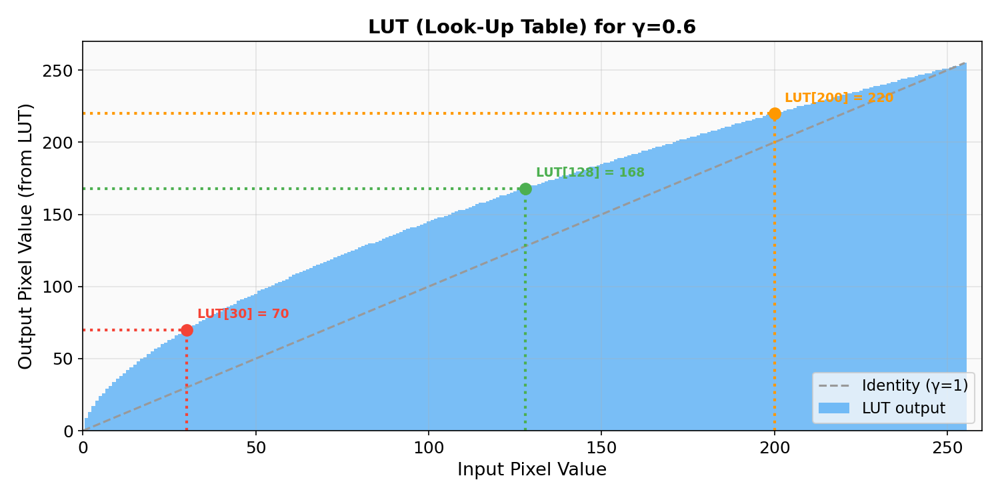

---

## 五、代码逐行解析

> **前置知识**：如果你不熟悉 C++，这里先解释一些基本概念。

### 5.0 C++ / OpenCV 基础术语速查

| 术语 | 含义 | 类比 |
|------|------|------|
| `cv::Mat` | OpenCV 的图像/矩阵类型，存储像素数据 | 就像一张 Excel 表格 |
| `uchar` | unsigned char，无符号 8-bit 整数 (0~255) | 一个像素值的数据类型 |
| `const` | 常量，表示这个变量不会被修改 | "只读" |
| `&` (引用) | 传引用，避免复制整张图像 | 给你一张照片看，不是复印一份 |
| `static_cast<double>(x)` | 把 x 从整数转换为小数 | 确保 30/255 = 0.118 而不是 0 |
| `std::pow(x, y)` | 计算 x 的 y 次方 | 就是数学里的 $x^y$ |
| `cv::saturate_cast<uchar>(v)` | 安全截断：负数变 0，超过 255 变 255 | 这项考试满分 100，不能写 105 |
| `mat.at<uchar>(i)` | 访问 Mat 中第 i 个元素 | 查 Excel 表第 i 行 |
| `cv::LUT(src, lut, dst)` | 用查找表批量转换像素 | 把整张图的每个像素都查一遍表 |

### 5.1 applyGamma 函数

下面是代码的逐行解读，每一行都配有详细解释：

```cpp
// 函数声明：
// - 输入：gray（灰度图）和 gamma（伽马系数）
// - 输出：新的 cv::Mat（处理后的图像）
// - const & 表示"借来看看，不修改原图"
cv::Mat applyGamma(const cv::Mat &gray, double gamma)
{
    // 第 1 步：创建一张空的查找表
    // 1 行 256 列，每个格子存 1 个 uchar (0~255)
    // 类比：打印一张 256 行的空白对照表
    cv::Mat lut(1, 256, CV_8U);

    // 第 2 步：填写查找表（预计算每个输入值的输出结果）
    for (int i = 0; i < 256; ++i)       // i 从 0 到 255，遍历每个可能的像素值
    {
        // 2a. 归一化：把 [0, 255] 缩放到 [0.0, 1.0]
        //     例如：i=100 → 100/255 = 0.392
        const double normalized = static_cast<double>(i) / 255.0;

        // 2b. 做幂运算，再乘回 255
        //     例如：0.392^0.6 = 0.551 → 0.551×255 = 140.5
        const double corrected = std::pow(normalized, gamma) * 255.0;

        // 2c. 安全截断 + 写入表
        //     140.5 → 四舍五入为 141，存入 lut[100] = 141
        //     如果计算结果是 -3 → 变成 0；结果是 300 → 变成 255
        lut.at<uchar>(i) = cv::saturate_cast<uchar>(corrected);
    }

    // 第 3 步：用查找表批量处理整张图像
    // OpenCV 内部会对每个像素 p 做：output[p] = lut[gray[p]]
    // 这一行就完成了 30 万次查表！
    cv::Mat output;
    cv::LUT(gray, lut, output);
    return output;     // 返回处理后的图像
}
```

### 5.2 交互式 Gamma 滑块

程序中使用 `QSlider` 实现实时调节 Gamma 值：

```
滑块范围：1 ~ 50（整数），映射到 gamma = 0.1 ~ 5.0（÷10）

  0.1          0.6(默认)    1.0          2.5          5.0
   ├────────────┼────────────┼────────────┼────────────┤
   ◀── 提亮（暗部增强）      恒等      变暗（亮部增强）──▶
```

- 每次滑块值改变时触发 `updateGamma()`
- `updateGamma()` 用新的 gamma 值调用 `applyGamma()` 重新生成处理图
- 状态栏同步显示当前 gamma 值和效果说明

```
交互流程：

  用户拖动滑块
       │
       ▼
  sliderValue 变化 (1~50)
       │
       ▼
  gamma = sliderValue / 10.0
       │
       ▼
  applyGamma(grayImage, gamma)
       │
       ▼
  更新右侧处理图 + 状态栏文字
```

### 5.3 关键函数说明

| 函数/方法 | 作用 | 新手解读 |
|-----------|------|----------|
| `cv::Mat(1, 256, CV_8U)` | 创建 1×256 的矩阵 | 就是一个有 256 个格子的一维数组 |
| `std::pow(x, γ)` | 计算 $x^\gamma$ | 标准库函数，pow(2, 3) = 8 |
| `cv::saturate_cast<uchar>(v)` | 安全截断到 0~255 | 负数变0，超过255变255，中间四舍五入 |
| `cv::LUT(src, lut, dst)` | 用查找表批量处理 | 对每个像素 p，输出 = lut[p] |
| `QSlider::valueChanged` | 滑块值改变时发信号 | Qt 的事件机制，类似"监听器" |

### 5.4 代码执行流程图

```
程序启动
   │
   ▼
显示窗口 + “打开并显示”按钮 + Gamma 滑块
   │
   │  用户点击按钮
   ▼
读取图片 cat.jpg
   │
   ├── 读取失败？→ 显示错误信息，结束
   │
   ├── 读取成功：
   │      │
   │      ▼
   │   转为灰度图 (cvtColor BGR→GRAY)
   │      │
   │      ▼
   │   applyGamma(灰度图, 当前 gamma 值)
   │      │
   │      ├── 建 LUT (256 次 pow 计算)
   │      ├── 查表处理整张图 (~30万次数组查找)
   │      └── 返回处理后的图像
   │      │
   │      ▼
   │   显示原图 + 处理图 (两个 namedWindow)
   │
   │  用户拖动滑块
   ▼
重新调用 applyGamma(灰度图, 新 gamma 值)
   │
   ▼
更新显示的处理图 + 状态栏文字
```

---

## 六、不同 Gamma 值的视觉效果对比

```
γ = 0.2（极度提亮）
┌────────────────────────────────┐
│ ░░░▒▒▒▓▓▓███████████████████  │  暗部几乎全部拉到中高亮度
│ 对比度低，画面发灰偏白          │
└────────────────────────────────┘

γ = 0.6（适度提亮）← 代码默认值
┌────────────────────────────────┐
│ ░░▒▒▓▓██████████████████████  │  暗部适度提亮，亮部保持
│ 暗部细节清晰，整体自然          │
└────────────────────────────────┘

γ = 1.0（原图，无变化）
┌────────────────────────────────┐
│ ░░░░▒▒▒▒▓▓▓▓████████████████  │  恒等变换
│ 输入 = 输出                    │
└────────────────────────────────┘

γ = 1.8（适度变暗）
┌────────────────────────────────┐
│ ░░░░░░░░▒▒▒▒▓▓▓▓████████████  │  整体变暗
│ 亮部细节增强，暗部细节丢失      │
└────────────────────────────────┘

γ = 3.0（极度变暗）
┌────────────────────────────────┐
│ ░░░░░░░░░░░░░░▒▒▒▒▓▓████████  │  大幅变暗
│ 只剩高光区域，暗部全黑          │
└────────────────────────────────┘
```

---

## 七、Gamma 变换 vs 线性变换

### 7.1 线性变换（亮度/对比度）

$$I' = \alpha \cdot I + \beta$$

```
I' = 1.5 × I + 20（线性提亮）

输出
255 ┤            ╱─────── 超过255被截断
    │          ╱
    │        ╱
    │      ╱
    │    ╱
    │  ╱
 20 ┤╱  ← β=20 的偏移
    │
  0 ┼─────────────────── 输入
    0                 255
```

**问题**：亮部容易溢出（被截断为 255），丢失高光细节。

### 7.2 Gamma 变换（非线性）

```
I' = 255 × (I/255)^0.6（Gamma 提亮）

输出
255 ┤─────────────────╱
    │              ╱
    │           ╱
    │        ╱
    │     ╱
    │  ╱       ← 曲线平滑过渡，不会截断
    │╱
  0 ┼─────────────────── 输入
    0                 255
```

**优势**：曲线平滑地从 (0,0) 到 (255,255)，**永远不会溢出**，保留了全局细节。

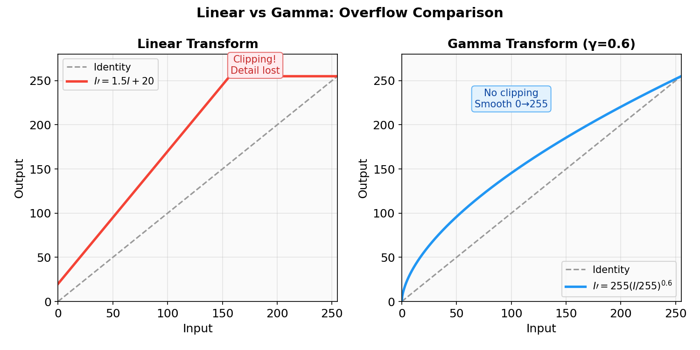

### 7.3 对比总结

| 特性 | 线性变换 | Gamma 变换 |
|------|---------|-----------|
| 暗部提亮 | 均匀提亮 | **选择性**提亮暗部 |
| 亮部处理 | 容易溢出截断 | 自然保持，不溢出 |
| 对比度 | 全局均匀改变 | 非线性，暗部拉伸、亮部压缩 |
| 参数 | α（对比度）β（亮度） | γ（一个参数控制曲线形状） |
| 适用场景 | 简单亮度微调 | 曝光校正、显示器校准、HDR |

---

## 八、实际应用场景

### 8.1 曝光不足照片校正

```
拍摄时曝光不足           Gamma γ=0.5 校正后
┌──────────────┐        ┌──────────────┐
│ ░░░░░░░░░░░░ │  ───▶  │ ▒▒▓▓████████ │
│ ░░░▒░░░░░░░░ │        │ ▒▓▓█████████ │
│ ░░░░░░░░░░░░ │        │ ▒▒▓▓████████ │
│  几乎全黑     │        │  暗部细节恢复  │
└──────────────┘        └──────────────┘
```

### 8.2 医学影像增强

X 光、CT 图像通常暗部包含关键病灶信息，Gamma 校正可以：
- $\gamma < 1$：增强暗区组织细节
- $\gamma > 1$：突出高密度结构（骨骼等）

### 8.3 游戏/视频中的 HDR Tone Mapping

HDR 场景的亮度范围极大，Gamma 曲线是 Tone Mapping 管线的核心步骤之一，将高动态范围压缩到显示器可显示的 [0, 255] 范围。

### 8.4 sRGB 标准

几乎所有消费级图像（JPEG、PNG 等）都遵循 **sRGB** 标准，其编码伽马约为 $\gamma \approx 1/2.2 \approx 0.4545$。解码（显示）时再做 $\gamma = 2.2$ 还原线性光。

```
线性光 ──▶ sRGB 编码 (γ≈0.45) ──▶ 存储/传输 ──▶ 显示器 (γ=2.2) ──▶ 线性光
         压缩暗部精度损失              8-bit          硬件解码
         让暗部分配更多 bit                           还原真实亮度
```

---

## 九、扩展：为什么 sRGB 用 γ≈0.45 编码？

8-bit 灰度只有 256 个值。如果用**线性编码**：

```
线性编码的问题：

  亮度 0~10（暗部）只能分配约 10 个灰度级 → 暗部色阶断裂、出现色带
  亮度 200~255（亮部）分配约 55 个灰度级 → 人眼看不出差别，浪费

Gamma 编码的优势：

  亮度 0~10（暗部）被拉伸分配约 80 个灰度级 → 暗部过渡平滑
  亮度 200~255（亮部）被压缩分配约 15 个灰度级 → 匹配人眼感知

  结论：γ<1 编码让有限的 256 个值更"聪明"地分配给人眼敏感的暗部区间
```

---

## 十、总结

```
                    Gamma 变换核心流程
                    ==================

 ┌─────────┐     ┌──────────────┐     ┌──────────────┐     ┌─────────┐
 │ 输入图像 │────▶│ 归一化 I/255 │────▶│ 幂运算 x^γ   │────▶│ ×255    │
 │ [0,255] │     │   [0, 1]     │     │   [0, 1]     │     │ [0,255] │
 └─────────┘     └──────────────┘     └──────────────┘     └─────────┘
                                                                │
                                           实际通过 LUT 加速 ◀──┘

 γ < 1 → 提亮（暗部增强）
 γ = 1 → 不变
 γ > 1 → 变暗（亮部增强）
```

**关键要点：**

1. Gamma 变换是一种**非线性**灰度映射，用一个参数 $\gamma$ 控制亮度曲线
2. $\gamma < 1$ 提亮暗部，$\gamma > 1$ 压暗画面
3. 使用 **LUT 查找表**加速，避免逐像素浮点运算
4. 广泛应用于**显示器校准、sRGB 编码、曝光校正、医学影像**等领域
5. 相比线性变换，Gamma 变换**不会溢出截断**，能更好地保留全局细节

---

## 附录 A：常见问题 FAQ

### Q1：Gamma 变换只能用于灰度图吗？

**不是**。对于彩色图，有两种常见做法：

```
方法一：对每个通道分别做 Gamma 变换
    R' = 255 × (R/255)^γ
    G' = 255 × (G/255)^γ
    B' = 255 × (B/255)^γ
    优点：简单
    缺点：可能改变颜色色调

方法二：只对亮度通道做变换（推荐）
    BGR → 转换到 HSV / YCrCb 等颜色空间
    → 只对 V（亮度）通道做 Gamma
    → 转换回 BGR
    优点：只调亮度，不影响颜色
```

### Q2：γ 值怎么选？有没有经验值？

| 场景 | 推荐 γ 值 | 原因 |
|------|----------|------|
| 照片稍微偏暗 | 0.6 ~ 0.8 | 适度提亮，自然 |
| 严重曝光不足 | 0.3 ~ 0.5 | 大幅提亮暗部 |
| sRGB 编码标准 | 1/2.2 ≈ 0.45 | 行业标准 |
| 照片稍微过亮 | 1.2 ~ 1.5 | 适度压暗 |
| 严重过曝 | 2.0 ~ 3.0 | 大幅压暗亮部 |

> **建议**：用程序中的滑块实时预览效果，比死记参数更实用。

### Q3：Gamma 变换和 Photoshop 的"曲线"工具是什么关系？

Photoshop 的**曲线（Curves）** 工具是 Gamma 变换的**超集**：

```
Gamma 变换：曲线形状固定（幂函数），只有 1 个参数 γ 控制
  输出
  255 ┤     ╱        ← 只能是这种形状的曲线
      │   ╱
      │ ╱
    0 ┼──────── 输入

Photoshop 曲线：可以自由拖拽任意控制点，曲线形状完全自定义
  输出
  255 ┤  ╱  ╲  ╱     ← 可以是任意形状
      │╱      ╲╱
      │
    0 ┼──────── 输入

  关系：Gamma 变换 ⊂ Photoshop 曲线
```

### Q4：代码中为什么要先除以 255 再乘回来？不能直接对像素值做幂运算吗？

**不能**，因为幂函数在不同范围的行为不同：

```
如果直接对 [0, 255] 做幂运算：

  100^0.6 = 15.85    → 太小了！（期望 ~140）
  200^0.6 = 27.32    → 也太小了！

如果先归一化到 [0, 1]：

  (100/255)^0.6 = 0.392^0.6 = 0.551
  0.551 × 255 = 140  → 正确！

原因：幂函数 x^γ 的 "抬高/压低" 效果只在 x ∈ [0, 1] 时成立。
      当 x > 1 时，x^0.6 反而变小（比如 2^0.6 = 1.52 < 2）
```

### Q5：什么是"色带"（Banding）？为什么线性编码会出现色带？

```
色带就是这种效果——本该平滑过渡的区域出现了明显的"阶梯"：

  应该是这样（平滑渐变）：
  ░░░▒▒▒▓▓▓███

  实际看到的（色带）：
  ░░░│▒▒▒│▓▓▓│███
      ↑    ↑    ↑
   明显的分界线，像楼梯台阶

原因：灰度级不够细。如果暗部只有 10 个灰度级来表示 0~50 的物理亮度范围，
      每一级的跨度 = 5，跨度太大就能被人眼看出"阶梯"。

Gamma 编码通过给暗部分配更多灰度级（比如 80 级）来解决这个问题。
```

### Q6：这和手机/相机的"亮度调节"有什么区别？

```
手机亮度调节（硬件）：          Gamma 变换（软件）：
  改变背光灯的电流               改变图像数据中每个像素的值
  整个屏幕均匀变亮/暗             可以"选择性"地提亮暗部
  不改变图像数据                 改变图像数据本身
  关掉屏幕后恢复                 保存后永久生效
```

### Q7：我完全没有编程基础，怎么把这个代码跑起来？

最简单的方式：

```
1. 确保已安装 Qt 6 和 OpenCV（参见项目根目录 README 的安装说明）

2. 在终端进入项目根目录：
   cd /home/zhangyuanhao/src/cv/OpenCV

3. 编译：
   cmake --build build

4. 运行：
   ./build/QtOpenCVWebpViewer

5. 在左侧列表中点击"点运算-灰度变换"

6. 点击"打开并显示"按钮

7. 拖动 Gamma 滑块，观察右侧处理图的变化
```

---

## 附录 B：术语表

| 术语 | 英文 | 含义 |
|------|------|------|
| 像素 | Pixel | 图像的最小单元，一个"点" |
| 灰度 | Grayscale | 只有黑白明暗的图像，无颜色 |
| 通道 | Channel | 构成像素颜色的一个维度（如 R/G/B） |
| 点运算 | Point Operation | 输出仅取决于输入像素自身的变换 |
| 归一化 | Normalization | 把数值缩放到 [0, 1] 范围 |
| 幂函数 | Power Function | $y = x^n$ 形式的函数 |
| 查找表 | LUT (Look-Up Table) | 预计算的映射表，用空间换时间 |
| 色带 | Banding | 渐变区域出现的阶梯状伪影 |
| 最小可觉差 | JND (Just Noticeable Difference) | 人能察觉到的最小刺激变化量 |
| sRGB | Standard RGB | 最通用的颜色标准，γ ≈ 2.2 |
| HDR | High Dynamic Range | 高动态范围，亮度范围远超普通图像 |
| 饱和截断 | Saturate / Clamp | 超出范围的值被截断到边界值 |
