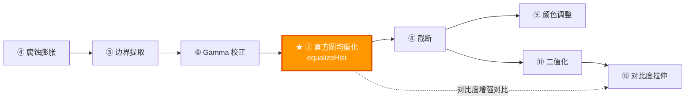

# 课程 07：点运算——直方图均衡化

> 适合人群：零基础初学者 | 预计阅读时间：30 分钟

---

## 零、什么是"点运算"？

从课程 06 开始，我们进入了**点运算**的系列。点运算是指：**每个像素的新值只取决于它自己的旧值**，与周围的像素无关。

```
点运算 vs 邻域运算：

  点运算（课程 06~12）：            邻域运算（课程 04~05）：
  output[x,y] = f(input[x,y])     output[x,y] = f(input[x±1, y±1])
  只看自己                          要看周围邻居

  例子：                            例子：
  亮度 ×2                           腐蚀（取周围最小值）
  Gamma 校正                        膨胀（取周围最大值）
  反相                              高斯模糊
  二值化                            边缘检测
```

---

## 一、本课目标

本课你将学会：

1. 理解**直方图（Histogram）** 的概念
2. 理解**直方图均衡化（Histogram Equalization）** 的原理
3. 在 **YCrCb 色彩空间**中做均衡化（保护颜色信息）

---

## 二、什么是直方图？

### 2.1 直方图的定义

**直方图**就是统计图片中每个灰度级各有多少个像素，然后画成柱状图。

```
一张灰度图（4×4 = 16 个像素）：

  ┌────┬────┬────┬────┐
  │ 0  │ 50 │ 50 │ 100│
  ├────┼────┼────┼────┤
  │ 50 │ 100│ 100│ 150│
  ├────┼────┼────┼────┤
  │ 100│ 150│ 150│ 200│
  ├────┼────┼────┼────┤
  │ 150│ 200│ 200│ 255│
  └────┴────┴────┴────┘

  统计每个灰度值出现了几次：
  
  灰度值   出现次数
  ──────────────────
    0        1 次
   50        3 次
  100        4 次
  150        4 次
  200        3 次
  255        1 次

  画成直方图：
  
  出现次数
  4 │      ████  ████
  3 │ ████ ████  ████ ████
  2 │ ████ ████  ████ ████
  1 │████  ████  ████ ████ ████
  0 └────┬────┬────┬────┬────┬────▶ 灰度值
        0   50  100  150  200  255
```

### 2.2 从直方图看图片特征

```
暗图（曝光不足）：             亮图（曝光过度）：
出现次数                      出现次数
  │████                         │         ████
  │████████                     │      ████████
  │████████████                 │   ████████████
  └──────────────▶              └──────────────▶
  0            255              0            255
  像素集中在左边（暗部）        像素集中在右边（亮部）

低对比度图：                   高对比度图：
出现次数                      出现次数
  │     ████████                │███            ███
  │     ████████                │███  ████████  ███
  │     ████████                │███  ████████  ███
  └──────────────▶              └──────────────▶
  0            255              0            255
  像素集中在中间（灰蒙蒙）      像素分散在两端（黑白分明）
```

### 2.3 直方图的数学表示

对于一张灰度图，直方图 $H$ 是一个长度为 256 的数组：

$$
H[k] = \text{像素值等于 } k \text{ 的像素个数}, \quad k = 0, 1, ..., 255
$$

**归一化直方图**（也叫概率分布）：

$$
p[k] = \frac{H[k]}{N}, \quad N = \text{总像素数}
$$

$p[k]$ 表示"随机挑一个像素，它的值是 $k$ 的概率"。

---

## 三、直方图均衡化

### 3.1 为什么需要均衡化？

```
问题：很多照片的直方图分布不均匀

  低对比度照片的直方图：         理想的直方图：
  出现次数                      出现次数
  █│   ████                     │ ██ ██ ██ ██ ██ ██
  █│   ██████                   │ ██ ██ ██ ██ ██ ██
  █│   ████████                 │ ██ ██ ██ ██ ██ ██
  █└──────────────▶             └──────────────▶
   0            255              0            255
   像素挤在一小段范围            每个灰度级的像素差不多
   → 看起来灰蒙蒙               → 对比度最大化
```

**均衡化的目标**：把挤在一起的直方图"拉开"，让像素尽可能均匀地分布在 0~255 整个范围。

### 3.2 均衡化的直观理解

```
类比——排身高：

  原来的队伍（挤在一起）：
  身高(cm): 165 166 167 167 168 168 168 169 170 170
  位置:      1   2   3   4   5   6   7   8   9  10
             └──────── 大家挤在 165~170 之间 ────────┘
             差距太小，站远了看不出谁高谁矮

  均衡化后（拉开距离）：
  身高(cm): 140 148 155 155 170 170 170 185 200 200
  位置:      1   2   3   4   5   6   7   8   9  10
             └──────── 范围从 140 到 200 ────────────┘
             差距拉大了，一眼就能分清高矮

  注意：顺序不变（原来谁高还是谁高），只是差距拉大了
```

### 3.3 均衡化的数学推导

```
步骤 1：计算归一化直方图（概率密度）
  p[k] = H[k] / N

步骤 2：计算累积分布函数（CDF）
  CDF[k] = p[0] + p[1] + ... + p[k] = Σ p[i], i=0..k

步骤 3：用 CDF 做映射
  new_value[k] = round( CDF[k] × 255 )
```

$$
T(k) = \text{round}\left( 255 \times \sum_{i=0}^{k} p[i] \right)
$$

**用实例走一遍**：

```
原始图片（8 个像素，灰度范围 0~7）：
  像素值: [1, 1, 2, 2, 3, 3, 3, 4]

步骤 1：直方图和概率
  值   H[k]   p[k]
  0     0     0/8 = 0.000
  1     2     2/8 = 0.250
  2     2     2/8 = 0.250
  3     3     3/8 = 0.375
  4     1     1/8 = 0.125
  5     0     0/8 = 0.000
  6     0     0/8 = 0.000
  7     0     0/8 = 0.000

步骤 2：CDF（累加概率）
  值   CDF[k]
  0    0.000
  1    0.000 + 0.250 = 0.250
  2    0.250 + 0.250 = 0.500
  3    0.500 + 0.375 = 0.875
  4    0.875 + 0.125 = 1.000

步骤 3：映射 T(k) = round(CDF[k] × 7)
  值   CDF    T(k) = round(CDF × 7)
  0    0.000   0
  1    0.250   round(1.75) = 2
  2    0.500   round(3.50) = 4   ← 注意：原来 1→2→3（差1），现在 2→4→6（差2）
  3    0.875   round(6.125) = 6
  4    1.000   7

均衡化结果：
  原始: [1, 1, 2, 2, 3, 3, 3, 4]
  映射: [2, 2, 4, 4, 6, 6, 6, 7]
         └─── 范围从 1~4 扩展到 2~7 ───┘ → 对比度增强！
```

**均衡化前后对比总结表**：

| 对比项 | 均衡化前 | 均衡化后 |
|--------|---------|---------|
| 灰度范围 | 窄（如 50~180） | 宽（接近 0~255） |
| 直方图 | 集中在一小段 | 尽可能均匀分散 |
| 视觉效果 | 灰蒙蒙/偏暗/偏亮 | 对比度增强，细节更清晰 |
| 像素顺序 | 原始顺序 | **不变**（谁大还是谁大） |
| 像素间距 | 可能很小 | 被拉大 |

### 3.4 CDF 深入理解

#### 3.4.1 CDF 是什么？

CDF 全称 **Cumulative Distribution Function（累积分布函数）**。

简单来说：**CDF[k] = "灰度值 ≤ k 的像素占全部像素的比例"**。

```
直方图（PDF）：               CDF（累积分布）：
出现次数                      累积概率
 3│      ███                 1.0│          ╱──
 2│ ████ ███                 0.8│        ╱
 1│ ████ ███ ██              0.6│      ╱
 0└────┬────┬────▶           0.4│    ╱
      1  2  3  4  值         0.2│  ╱
                             0.0│╱─────────▶ 值
                                 0 1 2 3 4
```

CDF 就是把直方图从左到右 **逐个累加** 得到的曲线。

$$
\text{CDF}[k] = \sum_{i=0}^{k} p[i] = p[0] + p[1] + \cdots + p[k]
$$

#### 3.4.2 CDF 的三个关键性质

| 性质 | 说明 |
|------|------|
| **单调递增** | CDF 永远从左到右递增（或持平），不可能下降 |
| **起点 ≥ 0** | CDF[0] = p[0]（第一个灰度值的概率） |
| **终点 = 1** | CDF[255] = 1.0（所有像素加起来肯定是 100%） |

```
为什么 CDF 永远递增？

  CDF[k] = CDF[k-1] + p[k]

  因为 p[k] ≥ 0（像素数量不可能为负），
  所以每加一项，CDF 要么不变（p[k]=0），要么变大。
  → 永远不会往下走！
```

#### 3.4.3 CDF 做映射的直觉 —— "排名百分比"

**核心直觉：CDF[k] 就是灰度值 k 的"排名百分位"。**

```
类比——全班考试排名：

  假设全班 100 人，你考了 70 分：
  - 比你分数低的有 60 人 → 你的百分位 = 60%
  - CDF[70] = 0.60

  均衡化映射：new_value = round(0.60 × 255) = 153
  → 你的新"成绩"被映射到 153（灰度范围的 60% 位置）
```

用一个完整的例子来感受：

```
假设 16 个像素，灰度范围 0~255，灰度值分布如下：

  灰度值:  50, 50, 50, 80, 80, 80, 80, 80, 120, 120, 120, 120, 200, 200, 200, 200
  总数 N = 16

  步骤 1：概率
  灰度值   H[k]   p[k]
    50      3     3/16 = 0.1875
    80      5     5/16 = 0.3125
   120      4     4/16 = 0.2500
   200      4     4/16 = 0.2500

  步骤 2：CDF（逐步累加）
  灰度值   p[k]     CDF[k]          含义
    50    0.1875   0.1875          "≤50的像素占 18.75%"
    80    0.3125   0.1875+0.3125   "≤80的像素占 50.00%"
                   = 0.5000
   120    0.2500   0.5000+0.2500   "≤120的像素占 75.00%"
                   = 0.7500
   200    0.2500   0.7500+0.2500   "≤200的像素占 100.00%"
                   = 1.0000

  步骤 3：映射 T(k) = round(CDF[k] × 255)
  灰度值   CDF      T(k) = round(CDF × 255)   新灰度值
    50    0.1875   round(47.8)  =  48          50 → 48
    80    0.5000   round(127.5) = 128          80 → 128
   120    0.7500   round(191.3) = 191         120 → 191
   200    1.0000   round(255.0) = 255         200 → 255

  原始: [50, 50, 50, 80, 80,  80,  80,  80, 120, 120, 120, 120, 200, 200, 200, 200]
  映射: [48, 48, 48, 128,128, 128, 128, 128, 191, 191, 191, 191, 255, 255, 255, 255]

  对比：
  原始范围: 50 ~ 200（跨度 150）
  新的范围: 48 ~ 255（跨度 207）→ 范围拉大了！

  原始间距: 50→80=30, 80→120=40, 120→200=80（间距不均匀）
  新的间距: 48→128=80, 128→191=63, 191→255=64（间距更均匀！）
```

#### 3.4.4 为什么 CDF 能让直方图变均匀？

这是数学上最巧妙的部分。直觉上可以从两个角度理解：

**角度 1：像素多的灰度级"占据更宽的地盘"**

```
想象一条 0~255 的数轴是一条走廊，每个灰度级要分一段走廊：

  灰度值 80 有 5 个像素（占比 31.25%）
  → 它在走廊上占据 31.25% 的宽度
  → CDF 在这里跳了一大步（从 0.1875 跳到 0.5000）

  灰度值 50 有 3 个像素（占比 18.75%）
  → 它在走廊上只占 18.75% 的宽度
  → CDF 在这里跳了一小步（从 0 跳到 0.1875）

  结果：像素多的灰度级被映射到更宽的范围 → 拉开了
        像素少的灰度级被映射到更窄的范围 → 压缩了
        最终每段范围里的像素数趋于相等 → 均匀！
```

**角度 2：CDF 做映射 = 把离散分布"拉直"**

```
如果 CDF 变化快（斜率大）→ 说明这里像素密集
→ 映射后这些像素被"拉开到"更宽的灰度范围

如果 CDF 变化慢（斜率小）→ 说明这里像素稀疏
→ 映射后这些像素被"压缩到"更窄的灰度范围

完美均匀分布的 CDF 是一条 45° 的直线：
累积概率
1.0 │          ╱
    │        ╱
    │      ╱         ← 理想的均匀分布：CDF 是直线
    │    ╱
    │  ╱
0.0 │╱───────────▶ 灰度值
    0           255

用 CDF 做映射，就是把实际的弯曲 CDF 曲线"掰直"，
让映射后的 CDF 尽可能接近 45° 直线 = 均匀分布。
```

**角度 3（数学）：连续情况下完美均匀**

在连续（非离散）的情况下，可以严格证明：

$$
\text{如果 } Y = F_X(X) \text{（用 CDF 做映射），则 } Y \sim \text{Uniform}(0, 1)
$$

即：对任何连续随机变量 $X$，用它自己的 CDF 做变换后，结果一定是均匀分布。

离散情况（像素只能取整数 0~255）下无法做到完全均匀，但 CDF 映射是最接近均匀的方案。

#### 3.4.5 CDF 映射的完整图解

```
整个均衡化过程的可视化：

  ① 原始直方图（不均匀）  ② 计算 CDF（累加曲线）  ③ 用 CDF 查表映射

  出现次数                 累积概率                  新灰度值
   5│  ██                 1.0│      ╱──             255│      ╱──
   4│  ████               0.8│    ╱                 200│    ╱
   3│  ██████             0.6│   ╱                  150│   ╱
   2│  ████████           0.4│  ╱                   100│  ╱
   1│  ████████           0.2│╱                      50│╱
   0└───────────▶         0.0└───────────▶            0└───────────▶
    50  80 120 200            50  80 120 200             50  80 120 200
    原始灰度值               原始灰度值                  原始灰度值

  读图方法（以灰度值 80 为例）：
  ① 在直方图中找到 80 → 有 5 个像素
  ② 在 CDF 中找到 80 → CDF = 0.50
  ③ 新灰度值 = round(0.50 × 255) = 128

  所以原来值为 80 的像素 → 新值 128
```

#### 3.4.6 常见误解澄清

| 误解 | 真相 |
|------|------|
| "均衡化后直方图一定完全均匀" | ❌ 离散情况下不可能完全均匀，只是尽可能接近 |
| "均衡化会改变像素的明暗顺序" | ❌ CDF 单调递增，原来谁亮还是谁亮 |
| "CDF 曲线可能下降" | ❌ 不可能，因为每一步都在加非负数 |
| "均衡化只能增强对比度" | ❌ 如果原图已经很均匀，均衡化几乎无效果 |
| "均衡化后灰度范围一定是 0~255" | ❌ 取决于原图的 CDF[min] 和 CDF[max]，但通常接近 |

---

## 四、为什么在 YCrCb 空间做均衡化？

### 4.1 直接在 BGR 上做均衡化的问题

```
如果分别对 B、G、R 三个通道做均衡化：

  原图：  B=100, G=150, R=50  → 某种颜色
  均衡化：B→180, G→200, R→120 → 颜色完全变了！

  三个通道各自拉伸，互相之间的比例被打破
  → 颜色严重失真！
```

### 4.2 YCrCb 色彩空间

#### 4.2.1 YCrCb 各通道含义

```
BGR（混合模式）：               YCrCb（分离模式）：
  B ──── 蓝色+亮度混在一起         Y  ──── 纯亮度信息
  G ──── 绿色+亮度混在一起         Cr ──── 红色色度（R 相对于亮度的偏移）
  R ──── 红色+亮度混在一起         Cb ──── 蓝色色度（B 相对于亮度的偏移）

  亮度和颜色不分家                  亮度和颜色分开了！
  改一个通道 → 颜色也变             只改 Y → 只改亮度，颜色不变
```

| 通道 | 全称 | 含义 | 取值范围（8-bit） |
|------|------|------|------------------|
| **Y** | Luminance（亮度） | 像素的明暗程度 | 0（纯黑）~ 255（纯白） |
| **Cr** | Chrominance Red（红色色度） | 红色分量与亮度的差值 | 0 ~ 255（128 为中性） |
| **Cb** | Chrominance Blue（蓝色色度） | 蓝色分量与亮度的差值 | 0 ~ 255（128 为中性） |

#### 4.2.2 转换公式

BGR → YCrCb 的数学公式：

$$
Y = 0.299 \times R + 0.587 \times G + 0.114 \times B
$$

$$
Cr = (R - Y) \times 0.713 + 128
$$

$$
Cb = (B - Y) \times 0.564 + 128
$$

反向（YCrCb → BGR）：

$$
R = Y + 1.403 \times (Cr - 128)
$$

$$
G = Y - 0.714 \times (Cr - 128) - 0.344 \times (Cb - 128)
$$

$$
B = Y + 1.773 \times (Cb - 128)
$$

注意看反向公式中的 **G 的表达式**：G 完全可以由 Y、Cr、Cb 三个值算出来！

#### 4.2.3 核心疑问：为什么只有红和蓝，没有绿？

这是初学者最常见的困惑。答案分三个层次：

**层次 1：绿色信息已经藏在 Y 里了**

```
Y = 0.299R + 0.587G + 0.114B
              ^^^^^
              绿色的权重最大！占了 58.7%！

在 Y（亮度）中：
  - 红色贡献了 29.9%
  - 绿色贡献了 58.7%  ← 绿色是大头！
  - 蓝色贡献了 11.4%

所以 Y 通道里，绿色的信息是最多的。
说 YCrCb "没有绿色" 是不对的 —— 绿色是亮度的主力。
```

**层次 2：三个方程可以解三个未知数**

```
已知：Y、Cr、Cb（3 个值）
求解：R、G、B  （3 个未知数）

方程组：
  Y  = 0.299R + 0.587G + 0.114B    ← 第 1 个方程
  Cr = (R - Y) × 0.713 + 128       ← 第 2 个方程（含 R）
  Cb = (B - Y) × 0.564 + 128       ← 第 3 个方程（含 B）

3 个方程 3 个未知数 → 完全可解！

从 Cr 可以反推出 R：  R = Y + (Cr - 128) / 0.713
从 Cb 可以反推出 B：  B = Y + (Cb - 128) / 0.564
从 Y 可以反推出 G：   G = (Y - 0.299R - 0.114B) / 0.587

三原色全部找回来了，信息零丢失！

如果再加一个 Cg（绿色色度），就变成 4 个分量表示 3 个自由度，
多出一个维度是 *** 冗余 *** 的，白白浪费存储空间。
```

**层次 3：为什么偏偏选红和蓝做差值，而不是红和绿或蓝和绿？**

```
原因 1：人眼特性
  人眼有三种锥细胞：L（长波/红）、M（中波/绿）、S（短波/蓝）
  其中 M 锥细胞（绿色）对亮度的贡献最大（~58.7%）

  → 绿色信息已经被 Y 充分编码了
  → 把"和 Y 差异最大"的两个颜色（红、蓝）单独提出来更有效率
  → Cr 和 Cb 携带的是"与亮度不同的颜色偏差"信息

原因 2：信息论效率
  如果选 Cr 和 Cg（红和绿），因为 Y ≈ 0.587G，
  Cg = G - Y 中的 G 和 Y 高度相关 → Cg 信息量很小 → 浪费
  选红和蓝，因为它们在 Y 中权重较小，Cr 和 Cb 携带更多"新"信息

原因 3：历史 —— 电视广播标准
  YCrCb 来源于 1950s 年代的电视标准（NTSC/PAL）
  当时黑白电视只能接收 Y（亮度）信号
  彩色电视额外传输 Cr 和 Cb 信号
  选择红蓝差值是因为和亮度的相关性最小 → 压缩效率最高
```

#### 4.2.4 用实际数字感受 YCrCb

```
例子：某像素 R=200, G=150, B=100

  Y  = 0.299×200 + 0.587×150 + 0.114×100
     = 59.8 + 88.05 + 11.4
     = 159.25 ≈ 159
                  ↑ 绿色贡献了 88，是三者中最大的！

  Cr = (200 - 159) × 0.713 + 128
     = 41 × 0.713 + 128
     = 29.2 + 128 = 157.2 ≈ 157
     （>128 说明偏红）

  Cb = (100 - 159) × 0.564 + 128
     = -59 × 0.564 + 128
     = -33.3 + 128 = 94.7 ≈ 95
     （<128 说明偏不蓝，即偏黄/暖色）

反推验证 G：
  G = (Y - 0.299R - 0.114B) / 0.587
    = (159.25 - 59.8 - 11.4) / 0.587
    = 88.05 / 0.587
    = 150.0  ✓  完美还原！

再看几种典型颜色在 YCrCb 中的表示：

  颜色        R    G    B    →    Y     Cr    Cb
  ─────────────────────────────────────────────────
  纯红       255   0    0   →    76    255    91
  纯绿        0   255   0   →   150     44    21
  纯蓝        0    0   255  →    29     107   255
  纯白       255  255  255  →   255    128   128
  纯黑        0    0    0   →    0     128   128
  黄色       255  255   0   →   226    172    19
  青色        0   255  255  →   179     44   165
  品红       255   0   255  →   105    212   235

  注意：
  - 纯白和纯黑的 Cr、Cb 都是 128（没有色偏）→ 只有亮度区别
  - 纯绿的 Y=150 非常高（绿色对亮度贡献大）
  - 纯蓝的 Y=29 非常低（蓝色对亮度贡献小）
```

#### 4.2.5 YCrCb 通道的视觉效果

```
如果把 YCrCb 三个通道分别显示为灰度图：

  Y 通道（亮度）：              Cr 通道（红色度）：          Cb 通道（蓝色度）：
  ┌──────────────┐            ┌──────────────┐            ┌──────────────┐
  │ 看起来就像    │            │ 红色区域偏亮  │            │ 蓝色区域偏亮  │
  │ 一张灰度照片  │            │ 蓝/绿区域偏暗 │            │ 红/绿区域偏暗 │
  │ 细节丰富      │            │ 细节不明显    │            │ 细节不明显    │
  └──────────────┘            └──────────────┘            └──────────────┘

  Y 通道：包含了图像大部分的结构和细节信息
  Cr/Cb 通道：主要是平滑的色彩过渡，空间细节很少

  → 这也是 JPEG 压缩的原理基础：
    Y 通道保留高分辨率（人眼对亮度敏感）
    Cr/Cb 通道降采样到一半分辨率（人眼对色彩分辨率不敏感）
    → 节省大约 50% 的数据量，肉眼几乎看不出区别！
```

#### 4.2.6 YCrCb 与其他色彩空间的对比

| 色彩空间 | 通道含义 | 均衡化效果 |
|---------|---------|-----------|
| BGR | 蓝/绿/红（全混合） | 颜色严重失真 |
| YCrCb | 亮度/红色度/蓝色度 | 只改亮度，颜色保持 |
| HSV | 色相/饱和度/明度 | 类似效果，但 H 通道是环形的 |

**常用色彩空间完整对比表**：

| 色彩空间 | 通道含义 | 亮度通道 | 颜色通道 | 均衡化方式 | 保色效果 |
|---------|---------|---------|---------|-----------|---------|
| BGR | 蓝/绿/红 | 无（混合） | 无（混合） | 三通道分别均衡 | ❌ 严重失真 |
| YCrCb | 亮度/红色度/蓝色度 | Y | Cr, Cb | **只均衡 Y** | ✅ 推荐 |
| HSV | 色相/饱和度/明度 | V | H, S | 只均衡 V | ✅ 可用 |
| Lab | 亮度/绿红/蓝黄 | L | a, b | 只均衡 L | ✅ 最佳感知均匀 |

> **推荐**：日常使用 YCrCb（OpenCV 转换最快）；追求感知均匀用 Lab。

#### 4.2.7 一句话总结

```
YCrCb 不是「红 + 蓝 = 所有颜色」
而是 「亮度（含大量绿色信息）+ 红偏差 + 蓝偏差 = 所有颜色」

三原色 RGB 是一种表示方式，
YCrCb 是另一种等价的表示方式（只是换了坐标系），
信息完全相同，一个不少。

就像同一个点可以用直角坐标 (x, y) 表示，
也可以用极坐标 (r, θ) 表示 —— 同一个点，两种写法。
```

### 4.3 实际操作步骤


文本版参考：


  ┌─────┐    ┌──────────┐    ┌──────────┐    ┌──────────┐    ┌─────┐
  │ BGR │───▶│ cvtColor │───▶│ 分离通道  │───▶│ 均衡化Y  │───▶│ ... │
  │     │    │ BGR2YCrCb│    │ split    │    │equalizeH │    │     │
  └─────┘    └──────────┘    └──────────┘    └──────────┘    │     │
                                                              │     │
  ┌─────┐    ┌──────────┐    ┌──────────┐                    │     │
  │ BGR │◀───│ cvtColor │◀───│ 合并通道  │◀───────────────────┘     │
  │结果 │    │ YCrCb2BGR│    │ merge    │                           │
  └─────┘    └──────────┘    └──────────┘                           │
```

---

## 五、代码逐行详解

```cpp
void PointHistogramLessonWidget::openAndShow()
{
    // 1. 读取彩色图片
    const cv::Mat color = cv::imread("cat.jpg", cv::IMREAD_COLOR);

    // 2. BGR → YCrCb
    cv::Mat ycrcb;
    cv::cvtColor(color, ycrcb, cv::COLOR_BGR2YCrCb);

    // 3. 分离三个通道：channels[0]=Y, channels[1]=Cr, channels[2]=Cb
    std::vector<cv::Mat> channels;
    cv::split(ycrcb, channels);

    // 4. 只对 Y 通道做均衡化（保护颜色）
    cv::equalizeHist(channels[0], channels[0]);

    // 5. 合并回三通道
    cv::merge(channels, ycrcb);

    // 6. YCrCb → BGR
    cv::Mat equalized;
    cv::cvtColor(ycrcb, equalized, cv::COLOR_YCrCb2BGR);

    // 7. 显示原图和处理后的图
    cv::imshow("Original", color);
    cv::imshow("Histogram Equalized", equalized);
}
```

### cv::equalizeHist

```cpp
cv::equalizeHist(src, dst);  // src 和 dst 必须是单通道 8-bit
```

内部实现等价于：

```
1. 计算直方图 H[0..255]
2. 计算 CDF[k] = Σ H[i] / N, i=0..k
3. 映射 dst[pixel] = round(CDF[src[pixel]] × 255)
```

### cv::split 和 cv::merge

```cpp
// split：一张多通道图 → 多张单通道图
std::vector<cv::Mat> channels;
cv::split(multiChannelMat, channels);
// channels[0], channels[1], channels[2] 分别是各通道

// merge：多张单通道图 → 一张多通道图
cv::Mat result;
cv::merge(channels, result);
```

```
split 过程：

  YCrCb 图（3通道）          分离后
  ┌──────┐                 ┌──┐ ┌──┐ ┌──┐
  │Y Cr Cb│      split     │Y │ │Cr│ │Cb│
  │Y Cr Cb│  ──────────▶  │Y │ │Cr│ │Cb│
  │Y Cr Cb│                │Y │ │Cr│ │Cb│
  └──────┘                 └──┘ └──┘ └──┘
                           [0]  [1]  [2]
```

---

## 六、均衡化的局限性

### 6.1 全局均衡化的问题

```
如果图片一半很暗一半很亮：

  原图：
  ┌────────────────────────┐
  │ ██████████ ░░░░░░░░░░  │
  │ 暗部细节    亮部细节    │
  └────────────────────────┘

  全局均衡化后：
  ┌────────────────────────┐
  │ ▓▓▓▓▓▓▓▓▓▓ ░░░░░░░░░░  │
  │ 暗部拉亮了   亮部没变   │
  │ 但可能过曝   细节可能丢 │
  └────────────────────────┘

  问题：全局统一处理，不能同时照顾暗部和亮部
```

### 6.2 自适应直方图均衡化（CLAHE）

```cpp
// 进阶方法：把图片分成小块，每块各自均衡化
cv::Ptr<cv::CLAHE> clahe = cv::createCLAHE(2.0, cv::Size(8, 8));
clahe->apply(grayChannel, equalizedChannel);
```

```
CLAHE 的做法：

  ┌──┬──┬──┬──┐
  │①│②│③│④│   把图片分成 8×8 的小块
  ├──┼──┼──┼──┤   每个块独立做均衡化
  │⑤│⑥│⑦│⑧│   然后在块的边界做插值
  ├──┼──┼──┼──┤   避免出现明显的分块痕迹
  │⑨│⑩│⑪│⑫│
  └──┴──┴──┴──┘

  clipLimit = 2.0 → 限制对比度放大倍数，防止噪声被过度放大
```

**CLAHE 参数调节参考表**：

| 参数 | 含义 | 推荐范围 | 效果 |
|------|------|---------|------|
| `clipLimit` | 对比度限制 | 1.0 ~ 4.0 | 越大增强越强，噪声也越明显 |
| `tileSize` | 分块大小 | 4×4 ~ 16×16 | 越小越"局部"，越大越"全局" |

| clipLimit | 效果描述 |
|-----------|---------|
| 1.0 | 极轻微增强，几乎无变化 |
| 2.0 | **默认值**，适度增强（推荐） |
| 4.0 | 较强增强，暗部细节明显变亮 |
| 10.0 | 过强，噪声被显著放大 |
| 40.0+ | ≈普通均衡化，完全没有限制 |

| tileSize | 效果描述 |
|----------|---------|
| 4×4 | 非常局部，块边界可能可见 |
| 8×8 | **默认值**，平衡（推荐） |
| 16×16 | 较大区域，接近全局均衡化 |

> CLAHE = Contrast Limited Adaptive Histogram Equalization（对比度限制自适应直方图均衡化）

---

## 七、动手实验

### 实验 1：可视化直方图

```cpp
// 计算直方图
int histSize = 256;
float range[] = {0, 256};
const float *histRange = {range};
cv::Mat hist;
cv::calcHist(&gray, 1, 0, cv::Mat(), hist, 1, &histSize, &histRange);

// 画出直方图
int histW = 512, histH = 400;
cv::Mat histImage(histH, histW, CV_8UC3, cv::Scalar(255, 255, 255));
cv::normalize(hist, hist, 0, histImage.rows, cv::NORM_MINMAX);
for (int i = 1; i < histSize; i++) {
    cv::line(histImage,
             cv::Point((i-1)*2, histH - cvRound(hist.at<float>(i-1))),
             cv::Point(i*2, histH - cvRound(hist.at<float>(i))),
             cv::Scalar(255, 0, 0), 2);
}
cv::imshow("Histogram", histImage);
```

### 实验 2：对比全局均衡化和 CLAHE

```cpp
cv::Mat gray;
cv::cvtColor(color, gray, cv::COLOR_BGR2GRAY);

cv::Mat globalEq;
cv::equalizeHist(gray, globalEq);

cv::Mat claheEq;
cv::Ptr<cv::CLAHE> clahe = cv::createCLAHE(2.0, cv::Size(8, 8));
clahe->apply(gray, claheEq);

cv::imshow("Original", gray);
cv::imshow("Global Eq", globalEq);
cv::imshow("CLAHE", claheEq);
```

---

## 八、常见问题

| 问题 | 原因 | 解决方法 |
|------|------|---------|
| 均衡化后颜色变了 | 直接在 BGR 通道上做 | 转 YCrCb，只均衡化 Y |
| 均衡化后噪声变多 | 低亮度区域的噪声被放大 | 先降噪再均衡化，或用 CLAHE |
| 效果不明显 | 原图直方图本来就比较均匀 | 说明不需要均衡化 |
| equalizeHist 报错 | 输入不是单通道 8-bit | 用 split 分离后再处理 |

---

## 九、术语表

| 术语 | 英文 | 含义 |
|------|------|------|
| 直方图 | Histogram | 统计每个灰度级的像素数量 |
| 均衡化 | Equalization | 让直方图尽可能均匀分布 |
| CDF | Cumulative Distribution Function | 累积分布函数 |
| YCrCb | — | 亮度+色度的色彩空间 |
| CLAHE | Contrast Limited Adaptive Histogram Equalization | 自适应均衡化 |
| 点运算 | Point Operation | 每个像素独立变换 |
| 色彩空间 | Color Space | 描述颜色的坐标系统 |

---

## 十、知识地图



- 本课的 YCrCb + split/merge 模式在课程 09（颜色调整）中也会用到。
- 均衡化和课程 12（对比度拉伸）都是增强对比度，方法不同。

---

## 十一、记忆口诀

```
🧠 直方图均衡化三步：

  "统频率，算累积，查表映射新灰度"
  ──────────────────────────────
  ① H[k] = 统计每个灰度值出现几次
  ② CDF[k] = 从左往右累加概率
  ③ new = round(CDF[old] × 255)

🧠 为什么在 YCrCb 空间做：

  "亮度分离再均衡，颜色通道不要动"
  BGR → YCrCb → 只均衡 Y → YCrCb → BGR

🧠 CLAHE 口诀：

  "分块均衡加限制，局部增强不过头"
  clipLimit 控制增强上限
  tileSize 控制分块大小
```

---

## 十二、新手雷区

```cpp
// ❌ 雷区 1：直接在 BGR 三通道上做均衡化
std::vector<cv::Mat> bgr;
cv::split(color, bgr);
cv::equalizeHist(bgr[0], bgr[0]);  // B 通道均衡
cv::equalizeHist(bgr[1], bgr[1]);  // G 通道均衡
cv::equalizeHist(bgr[2], bgr[2]);  // R 通道均衡
cv::merge(bgr, result);
// 三通道各自拉伸，颜色严重失真！

// ✅ 正确：转 YCrCb，只均衡 Y 通道
cv::cvtColor(color, ycrcb, cv::COLOR_BGR2YCrCb);
cv::split(ycrcb, channels);
cv::equalizeHist(channels[0], channels[0]);  // 只动 Y
cv::merge(channels, ycrcb);
cv::cvtColor(ycrcb, result, cv::COLOR_YCrCb2BGR);
```

```cpp
// ❌ 雷区 2：对彩色 Mat 直接调 equalizeHist
cv::equalizeHist(colorImage, output);
// 编译可能通过但运行时崩溃！equalizeHist 只接受单通道输入

// ✅ 正确：确保是单通道
assert(input.channels() == 1);
cv::equalizeHist(input, output);
```

```cpp
// ❌ 雷区 3：均衡化后的图片偏色/过曝
// 原因：原图的直方图本来就比较均匀，强行均衡化反而破坏了

// ✅ 解决：先看直方图，判断是否需要均衡化
// 如果直方图已经比较分散 → 不需要均衡化
// 如果直方图集中在一小段 → 需要均衡化
```

---

## 十三、思考题

1. **均衡化后的直方图一定是完全均匀的吗？**
   提示：离散情况下不可能完全均匀（像素数不一定能被 256 整除）。

2. **为什么 CLAHE 的 `clipLimit` 不能设太大？**
   提示：太大等于没限制 → 退化成普通均衡化 → 噪声也被放大。

3. **如果一张图的直方图有三个"山峰"，Otsu 二值化还准吗？**
   提示：Otsu 假设直方图是双峰分布……

---

## 十四、速查卡片

```
┌─────────────────── 课程 07 速查 ───────────────────┐
│                                                    │
│  均衡化（灰度图）:                                   │
│    cv::equalizeHist(gray, dst);                    │
│                                                    │
│  均衡化（彩色图，保色版）:                            │
│    cvtColor(bgr, ycrcb, COLOR_BGR2YCrCb);          │
│    split(ycrcb, chs);                              │
│    equalizeHist(chs[0], chs[0]);                   │
│    merge(chs, ycrcb);                              │
│    cvtColor(ycrcb, result, COLOR_YCrCb2BGR);       │
│                                                    │
│  CLAHE（自适应均衡化）:                              │
│    auto clahe = cv::createCLAHE(2.0, Size(8,8));   │
│    clahe->apply(gray, dst);                        │
│                                                    │
│  计算直方图:                                        │
│    cv::calcHist(&img, 1, 0, Mat(), hist,           │
│                 1, &histSize, &histRange);          │
│                                                    │
└────────────────────────────────────────────────────┘
```

---

## 十五、延伸阅读

- [cv::equalizeHist 文档](https://docs.opencv.org/4.x/d6/dc7/group__imgproc__hist.html#ga7e54091f0c937d49bf84152a16f76c6e) — 均衡化函数详解
- [cv::createCLAHE 文档](https://docs.opencv.org/4.x/d6/dc7/group__imgproc__hist.html#gad689d2607b7b3889c4cdc39d097e1ea4) — CLAHE 参数说明
- [直方图教程](https://docs.opencv.org/4.x/d1/db7/tutorial_py_histogram_begins.html) — OpenCV 官方直方图入门
