# 课程 13：色彩空间入门——BGR、HSV、YCrCb、Lab

> 适合人群：已经接触过 `cv::cvtColor`、`cv::split`、`cv::merge` 的初学者 | 建议结合课程 07、09 一起看

---

## 一、本课目标

这一课不再只是做某一个点运算，而是把 OpenCV 里最常用的几种**色彩空间**讲清楚。

学完后你应该能回答这些问题：

1. 为什么 OpenCV 默认是 `BGR`，不是 `RGB`？
2. 为什么“调饱和度”通常去 `HSV`，而不是直接改 `BGR`？
3. 为什么“只调亮度、不想颜色失真”常用 `YCrCb` 或 `Lab`？
4. `YCrCb` 里的 `Cr`、`Cb` 到底是不是“红通道”和“蓝通道”？
5. `Lab` 里的 `a`、`b` 为什么不是蓝绿红这种直观名字？
6. 一个实际任务来了，应该优先选哪种色彩空间？

如果你这次不是按顺序精读，而是想快速抓重点，建议这样看：

- 想先建立直觉：重点看第五到第八节
- 想快速选空间：重点看第九节和第十四节
- 想直接抄常用代码：重点看第十一到第十三节
- 想看颜色分割实战：直接看第十七节

---

## 二、先把概念说准：这不是“命名空间”，这是“色彩空间”

如果你在 OpenCV 里看到这些名字：

- `BGR`
- `HSV`
- `YCrCb`
- `Lab`

它们不是 C++ 里的 namespace，也不是模块名。

它们是：

**同一张图像在不同坐标系下的颜色表示方式。**

可以把它理解成：

同一个点，在平面里既可以用直角坐标 $(x, y)$ 表示，也可以用极坐标 $(r, \theta)$ 表示。

颜色也是一样：

- 在 `BGR` 里，颜色用“蓝、绿、红”三个分量表示。
- 在 `HSV` 里，颜色用“色相、饱和度、明度”表示。
- 在 `YCrCb` 里，颜色用“亮度、红色差、蓝色差”表示。
- 在 `Lab` 里，颜色用“明度、绿红轴、蓝黄轴”表示。

图像没变，变的是**描述颜色的坐标系**。

---

## 三、为什么需要不同色彩空间？

因为不同任务关心的东西不同。

### 3.1 如果你关心的是“显示和存储”

那 `BGR/RGB` 最直接。

### 3.2 如果你关心的是“这是什么颜色”

那 `HSV` 更直观。

### 3.3 如果你关心的是“只改亮度，不想动颜色关系”

那 `YCrCb` 或 `Lab` 更合适。

### 3.4 如果你关心的是“颜色差异是否更接近人眼感知”

那 `Lab` 往往更好。

---

## 四、四种色彩空间的总览

| 色彩空间 | 三个通道 | 最适合做什么 | 不适合做什么 |
| --- | --- | --- | --- |
| `BGR` | 蓝、绿、红 | 显示、保存、直接通道混合 | 独立做“颜色语义”分析 |
| `HSV` | 色相、饱和度、明度 | 调颜色、调饱和度、颜色阈值分割 | 精确做亮度感知建模 |
| `YCrCb` | 亮度、红色差、蓝色差 | 只改亮度、保持颜色相对稳定 | 直接理解“色相” |
| `Lab` | 明度、绿红轴、蓝黄轴 | 感知均匀处理、亮度分离、颜色差异分析 | 直观教学上不如 HSV 易懂 |

一句话记忆：

- `BGR`：机器和显示更熟
- `HSV`：人更好理解颜色
- `YCrCb`：电视/视频体系里常见，分亮度很方便
- `Lab`：更接近人眼感知

下面这张图可以先建立一个总体选择感：

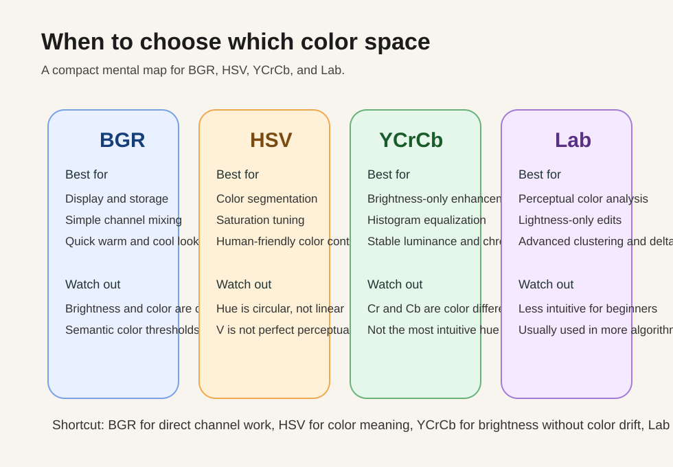

---

## 五、BGR：OpenCV 的默认颜色空间

## 5.1 什么是 BGR

OpenCV 读入彩色图像时，默认顺序通常是：

```cpp
cv::Mat color = cv::imread("cat.jpg", cv::IMREAD_COLOR);
```

此时每个像素通常是 3 通道：

- 第 0 通道：`B`
- 第 1 通道：`G`
- 第 2 通道：`R`

不是 `RGB`，而是 `BGR`。

### 5.2 为什么不是 RGB

这是历史兼容原因。很多底层图像库和早期 Windows 位图格式都习惯按 `BGR` 存。

所以在 OpenCV 里，最常见的坑之一就是：

```cpp
cv::imshow("img", color);
```

没问题。

但如果你把这个 `cv::Mat` 直接塞给某些只认 `RGB` 的界面库，颜色就可能发蓝发红。

这也是本项目里 [mat_to_qimage.cpp](mat_to_qimage.cpp) 需要先做 `BGR -> RGB` 的原因。

---

## 5.3 BGR 的优点和局限

### 优点

1. 读写最直接
2. 和硬件显示链路很接近
3. 做简单的通道加减、滤镜、混色很方便

### 局限

1. 通道之间耦合很强
2. “亮度”和“颜色”没有被拆开
3. 你改一个通道，视觉效果往往不止改一个属性

比如：

```text
原像素: B=60, G=120, R=200
```

如果你只把 `R` 加 30：

```text
B=60, G=120, R=230
```

先看下面这张图，把“只改 R”前后的颜色差异直观看出来：

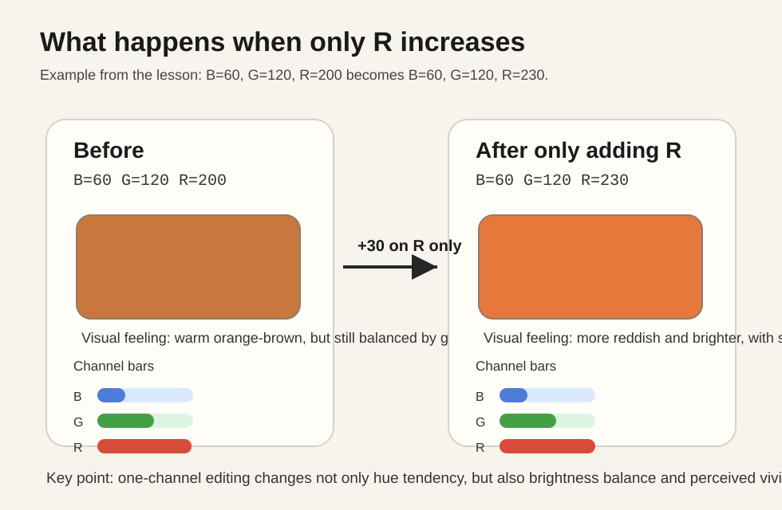

在这个例子里，真正发生的变化可以拆成 3 点：

1. `R` 从 `200` 变成 `230`，红色分量更强，所以整体颜色明显向红橙方向偏。
2. 虽然你没有改 `B` 和 `G`，但画面不会只表现成“多一点红”，还会显得更亮。粗略按亮度权重估算，原来大约是 $Y \approx 0.299 \times 200 + 0.587 \times 120 + 0.114 \times 60 \approx 137$，改完后大约是 $Y \approx 146$。
3. 三个通道之间的差距被进一步拉大，颜色也会更“冲”一些，所以主观上常常还会感觉更艳、更偏色。

这不只是“红色更多了”，还会改变：

- 整体亮度感受
- 色偏
- 饱和感

所以 `BGR` 适合“直接混色”，不适合“精确语义调整”。

---

## 5.4 BGR 通道的直觉理解

把图像拆成三个灰度图时：

- `B` 通道亮，说明这个位置“蓝成分多”
- `G` 通道亮，说明这个位置“绿成分多”
- `R` 通道亮，说明这个位置“红成分多”

注意：

这里的“亮”只是表示**该通道数值大**，不等于“原图看起来亮”。

---

## 六、HSV：最适合给初学者理解“颜色”

先看这张原创示意图，把 `H`、`S`、`V` 的空间含义建立起来：

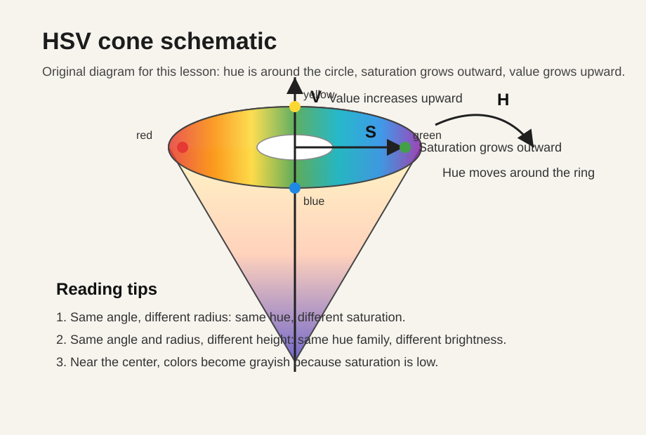

## 6.1 三个通道分别表示什么

`HSV` 表示：

- `H` = Hue，色相
- `S` = Saturation，饱和度
- `V` = Value，明度

### 直觉解释

- `H`：这是哪种颜色
- `S`：颜色浓不浓、鲜不鲜
- `V`：亮不亮

---

## 6.2 Hue 为什么最有用

因为人说颜色时，首先说的是：

- 红
- 黄
- 绿
- 蓝

这本质上就是色相。

在 `BGR` 里，你看见 `(20, 180, 200)` 不容易立刻知道是什么颜色。
但在 `HSV` 里，如果 `H` 接近黄色区间，那就很直观。

---

## 6.3 OpenCV 里的 H 范围为什么是 0~179

理论上色相是一个圆，完整范围是 $0^\circ \sim 360^\circ$。

但 OpenCV 常用 `uint8` 存储，所以把它压缩成了：

$$
H \in [0, 179]
$$

也就是说，大致相当于：

$$
OpenCV\_H \approx \frac{角度}{2}
$$

常见近似值：

| 颜色 | 角度 | OpenCV 中 H 近似值 |
| --- | --- | --- |
| 红 | 0° / 360° | 0 / 179 附近 |
| 黄 | 60° | 30 |
| 绿 | 120° | 60 |
| 青 | 180° | 90 |
| 蓝 | 240° | 120 |
| 紫 | 300° | 150 |

这也是为什么做红色阈值分割时常常要用两段区间。
因为红色跨越了色相环的首尾。

这件事如果只看文字不够直观，可以直接看下面这张色相环图：

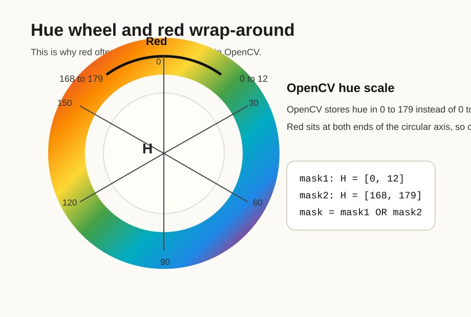

---

## 6.4 Saturation 饱和度到底在说什么

同一个“红色”，可以有两种感觉：

- 灰灰的旧红色
- 鲜艳的正红色

先看这张图：它保持同样的红色色相，只改变 `S`，你就能看到颜色从“发灰”逐渐变成“很纯的红”。

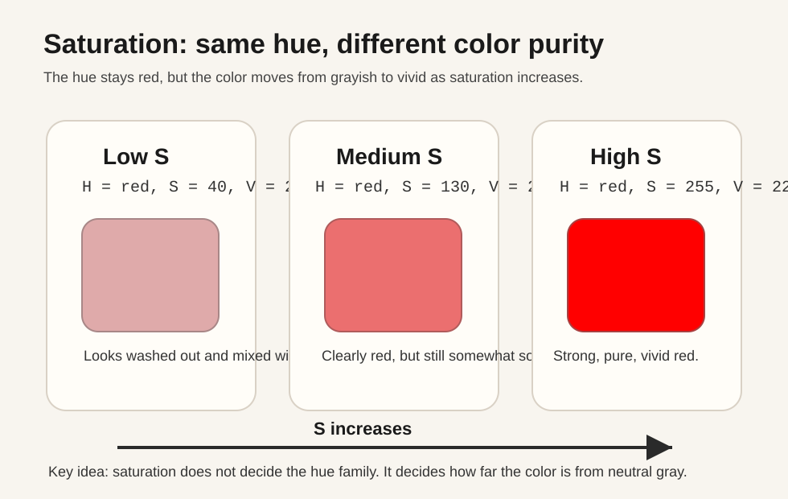

它们的核心区别，不一定是 `H`，而是 `S`。

- `S` 越低，越接近灰
- `S` 越高，越鲜艳

你可以把它粗略理解成：

- `H` 决定“你属于哪一类颜色”
- `S` 决定“你这类颜色有多纯”
- `V` 决定“你看起来有多亮”

所以课程 09 里做“提升饱和度”，本质上就是改 `S` 通道。

---

## 6.5 Value 明度是不是等于真实亮度

不完全等于。

先看这张图：它保持同样的红色色相和同样的高饱和度，只改变 `V`，你会看到“颜色类别没变，但亮暗感明显变化”。

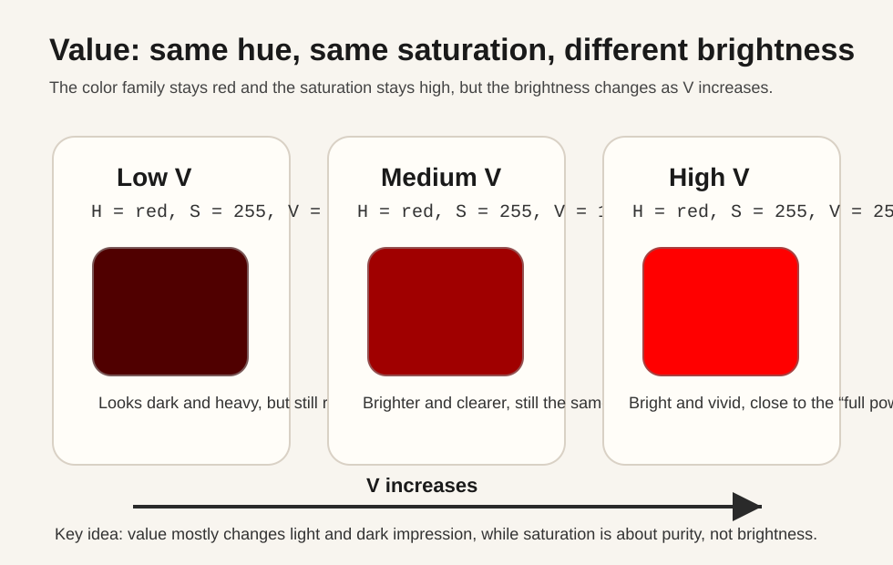

`V` 更多是一种 HSV 定义下的“亮度近似”。

你可以先把它理解成：

- `S` 更像“颜色有多纯”
- `V` 更像“这个颜色现在有多亮”

所以在 HSV 里：

- 降低 `S`，颜色会发灰
- 降低 `V`，颜色会发暗

它对视觉直觉够友好，但如果你追求“亮度分离得更稳”，
通常 `YCrCb` 的 `Y` 或 `Lab` 的 `L` 更适合。

---

## 6.6 HSV 最适合哪些任务

### 任务 1：颜色阈值分割

比如找红色物体、绿色叶子、蓝色按钮。

### 任务 2：调饱和度

比如让画面更鲜艳或者更灰。

### 任务 3：调色相

比如整体偏暖、偏冷、换色风格。

### 任务 4：做 UI 上更直观的调色工具

因为滑块调 `H/S/V`，比调 `B/G/R` 更符合人的语言习惯。

---

## 6.7 HSV 的常见误区

### 误区 1：`V` 就是人眼亮度

不是严格意义上的“感知亮度”。

### 误区 2：`H` 是线性值

不是，`H` 是环形的。

这意味着：

- `H=0` 和 `H=179` 很接近
- 不能把它当普通线性数轴直接做很多算法

### 误区 3：直接把 HSV 三通道图当普通彩图显示

不对。

如果你把 `HSV` 矩阵直接 `imshow`，你看到的不是“正确颜色语义图”，
而是 OpenCV 把那三个数按 BGR 去解释后的结果。

正确做法通常是：

- 单独看各通道灰度图
- 或者把 `H` 通道重新配成 `S=255, V=255` 再转回 `BGR` 显示

---

## 七、YCrCb：把亮度和色度拆开

## 7.1 先记住这三个量

`YCrCb`：

- `Y`：亮度
- `Cr`：红色差分量
- `Cb`：蓝色差分量

最关键的是：

**它不是“红通道 + 蓝通道 + 某个补充通道”。**

它是把原始颜色重新编码成：

- 一份亮度信息
- 两份色差信息

---

## 7.2 为什么很多图像增强喜欢用 YCrCb

因为它很适合回答一个实际问题：

> 我只想让图更亮、更清楚，但不想把颜色关系搞乱。

先看这张图：它固定同样的 `Cr` 和 `Cb`，只提高 `Y`，你会发现主要变化是“更亮了”，而不是颜色突然换了个方向。

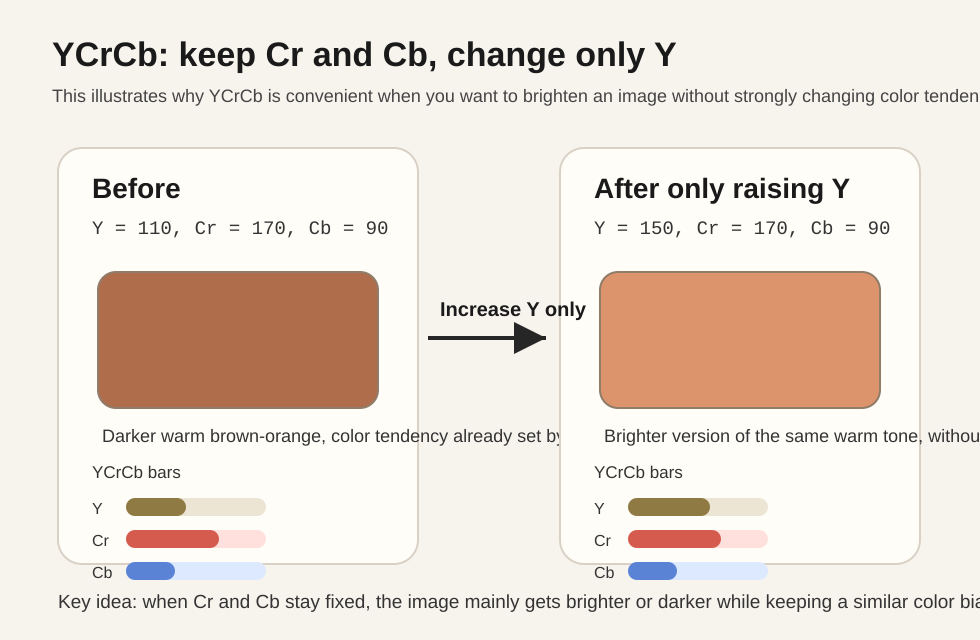

在 `BGR` 里你很难“只改亮度”。

在 `YCrCb` 里就简单很多：

1. `BGR -> YCrCb`
2. 只改 `Y`
3. `YCrCb -> BGR`

这也是为什么 `YCrCb` 特别适合讲“保色提亮”：

- `Y` 负责把整体明暗往上提
- `Cr/Cb` 继续维持原本的色彩倾向
- 所以通常比直接拉 `B/G/R` 更不容易把颜色关系拉歪

这就是课程 07 里“为什么直方图均衡化推荐在 YCrCb 空间做”的根本原因。

---

## 7.3 `Cr` 和 `Cb` 到底是什么

它们可以理解为：

- `Cr`：相对亮度来说，有多偏红
- `Cb`：相对亮度来说，有多偏蓝

如果你对这两个量还是发虚，最直接的办法就是分别固定另外两个量，只观察一个量变化时颜色怎么偏。

先看 `Cr`：固定同样的 `Y` 和 `Cb`，只让 `Cr` 从低到高变化。

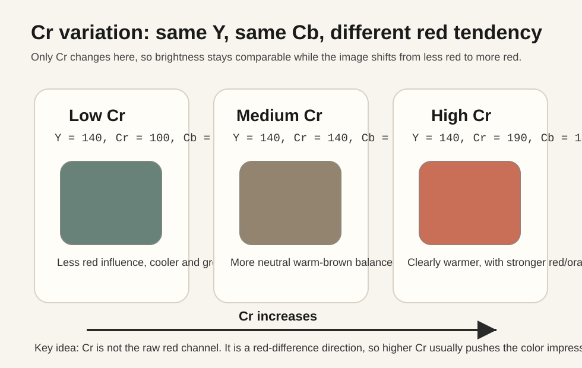

从这张图里你可以抓住 2 个结论：

1. `Cr` 升高时，画面通常会越来越偏红、偏暖。
2. 这不是“R 原始通道直接变大”的同义词，而是“相对当前亮度来说，红色倾向更强了”。

再看 `Cb`：固定同样的 `Y` 和 `Cr`，只让 `Cb` 从低到高变化。

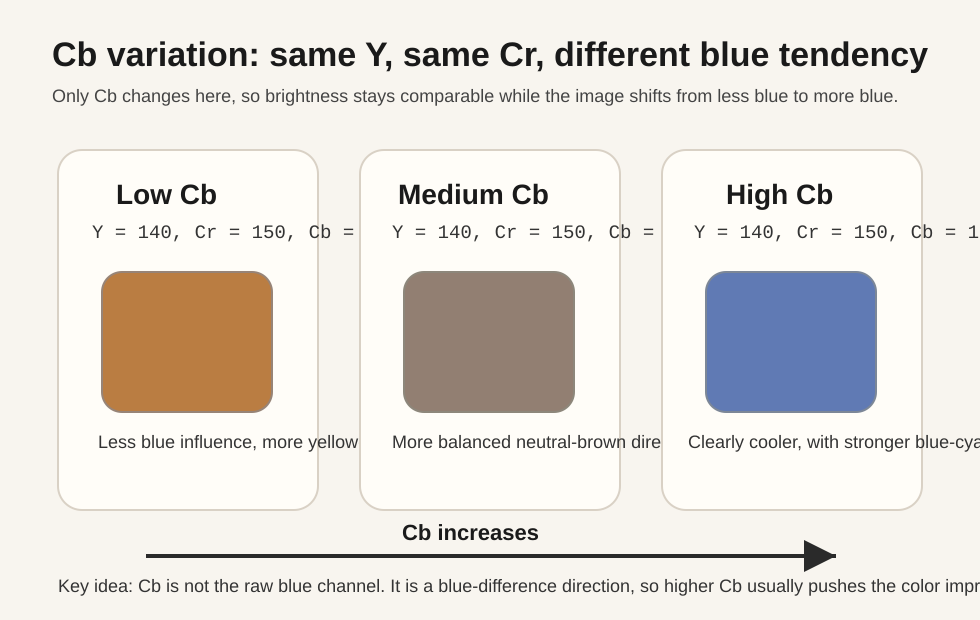

从这张图里你可以抓住 2 个结论：

1. `Cb` 升高时，画面通常会越来越偏蓝、偏冷。
2. 它也不是“B 原始通道直接变大”的同义词，而是“相对当前亮度来说，蓝色倾向更强了”。

所以：

- `Cr` 大，不等于“R 通道值就大”
- `Cb` 大，不等于“B 通道值就大”

它们是**差分编码后的色度信息**。

你可以先用一句更容易记住的话理解：

- `Y` 管明暗
- `Cr` 管偏红方向
- `Cb` 管偏蓝方向

这也是用户最容易误解的地方。

---

## 7.4 为什么没有专门一个“绿色通道”

因为绿色信息并没有消失，而是大量体现在 `Y` 里。

亮度通常不是简单平均，而是更偏重绿色贡献。

可以粗略记成：

$$
Y \approx 0.299R + 0.587G + 0.114B
$$

从这个权重就能看出来，绿色对亮度贡献最大。

所以说“YCrCb 没有绿色”是错误的。

准确说法应该是：

**绿色没有作为独立色差通道出现，但它仍然深度参与了亮度和整体颜色重建。**

---

## 7.5 YCrCb 最适合哪些任务

1. 亮度均衡化
2. 局部对比度增强
3. 保色的亮度调整
4. 视频编码/压缩相关处理
5. 某些肤色检测预处理

---

## 7.6 YCrCb 的常见误区

### 误区 1：它比 HSV 更“颜色直观”

不是。

要讨论“颜色类别”，通常还是 HSV 更直观。

### 误区 2：Cr/Cb 就是红蓝通道

不是，它们是色差。

### 误区 3：Y 一定等于灰度图

不完全等同。

它和灰度图都与亮度相关，但生成方式和用途不完全一样。

---

## 八、Lab：更接近人眼感知的颜色空间

## 8.1 Lab 的三通道是什么

`Lab` 常写成 `L*a*b*`：

- `L`：明度
- `a`：绿 <-> 红 轴
- `b`：蓝 <-> 黄 轴

也就是说：

- `a` 小，偏绿
- `a` 大，偏红
- `b` 小，偏蓝
- `b` 大，偏黄

Lab 对初学者最不友好的地方，不是它难，而是它不像 HSV 那样一眼就能想出画面会怎么变。

所以这里也用和前面一致的方法：固定两个量，只观察一个量变化。

先看 `L`：固定 `a` 和 `b`，只改变 `L`。

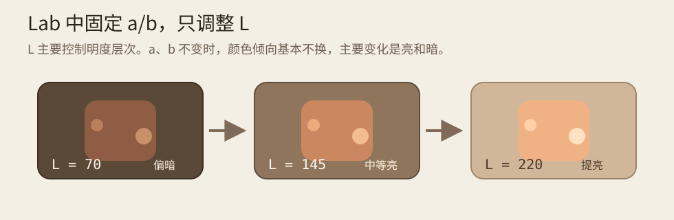

从这张图你应该先抓住一个核心感觉：

1. `L` 升高时，主要变化是整体明度层次被抬高。
2. 颜色倾向大体没换，它不是把画面“偏色”了，而是把同一种颜色变亮了。
3. 这也是为什么很多“只提亮、不想明显改色”的处理会优先考虑 `Lab` 的 `L`。

再看 `a`：固定 `L` 和 `b`，只改变 `a`。

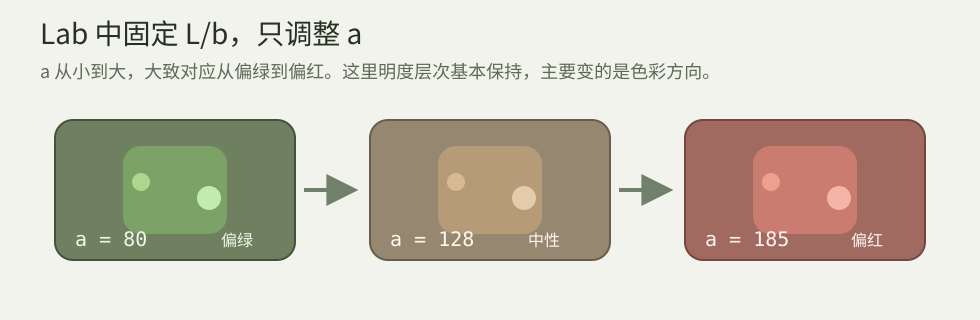

这张图里最重要的结论是：

1. `a` 从小到大，大致就是从偏绿走向偏红。
2. 它表达的是一条“颜色对立轴”，不是某个原始颜色通道。
3. 所以 `a` 大，不等于原始 `R` 通道一定更大；它表达的是感知上的偏红趋势。

最后看 `b`：固定 `L` 和 `a`，只改变 `b`。

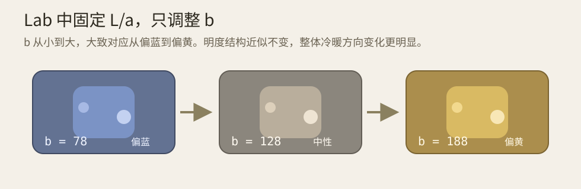

这张图则对应另一条对立轴：

1. `b` 从小到大，大致就是从偏蓝走向偏黄。
2. 它比 BGR 里的“调蓝通道/调红通道”更接近人实际感受到的冷暖变化。
3. 所以 `Lab` 很适合做颜色差异分析、风格迁移前处理、或者更偏感知型的颜色调整。

---

## 8.2 为什么 Lab 常被说成“更感知均匀”

它的设计目标之一，就是让数值上的差异更接近人眼主观感受差异。

粗略理解：

在 `BGR` 里改 10 个数值，不一定对应相似的视觉变化。

但在 `Lab` 里，同样幅度的变化，更有机会接近“相似程度的视觉变化”。

这也是很多高级颜色处理、颜色差异计算喜欢用 `Lab` 的原因。

---

## 8.3 OpenCV 里的 Lab 范围

OpenCV 用 8 位图时，常见近似范围是：

- `L`：0 ~ 255
- `a`：0 ~ 255，其中 128 左右对应“中性”
- `b`：0 ~ 255，其中 128 左右对应“中性”

所以在 OpenCV 中看 `a`、`b` 通道时，别误以为：

- 0 就是“没有这个颜色”

更准确地说：

- `128` 附近表示中性
- 小于 128 往一个方向偏
- 大于 128 往另一个方向偏

---

## 8.4 Lab 最适合哪些任务

1. 只调明度
2. 做颜色差异分析
3. 更接近感知的颜色聚类
4. 一些高级图像风格处理

---

## 8.5 Lab 的代价

相比 `BGR`、`HSV`、`YCrCb`：

- 直观性差一点
- 初学者不容易一眼看懂
- 处理流程通常更偏“算法型”而不是“手工调色型”

所以它很有用，但不一定适合当第一选择。

---

## 九、一个任务到底该选哪种色彩空间？

这是最有用的一节。

如果你只是想先做工程决策，可以先看这张速查表：

| 你想控制的东西 | 优先色彩空间 | 原因 |
| --- | --- | --- |
| 通道混色、简单暖色滤镜 | `BGR` | 直接改通道，成本最低 |
| 某种颜色的提取、颜色阈值分割 | `HSV` | `H` 更接近颜色类别 |
| 饱和度增强或降低 | `HSV` | `S` 的语义最直接 |
| 提亮或增强对比度，但不想明显偏色 | `YCrCb` / `Lab` | 可以优先只动 `Y` 或 `L` |
| 做颜色差异分析、聚类、感知型处理 | `Lab` | 数值变化更接近人眼感知 |

一句更短的记忆方式：

- 想改通道关系，用 `BGR`
- 想改颜色语义，用 `HSV`
- 想保色提亮，用 `YCrCb` 或 `Lab`
- 想做感知分析，用 `Lab`

### 任务 A：我想找“某种颜色”的区域

选：`HSV`

原因：

- `H` 直接对应颜色类别
- 阈值更容易设

---

### 任务 B：我想让图像更鲜艳

选：`HSV`

原因：

- 直接改 `S`
- 语义明确

---

### 任务 C：我想整体偏暖、偏冷

可以选：

- `BGR`：直接改通道比例，简单直接
- `HSV`：改色相或饱和度，更语义化

如果是“滤镜风格”，很多时候 `BGR` 已经够用。

---

### 任务 D：我想提升亮度或对比度，但不想颜色明显失真

优先选：`YCrCb` 或 `Lab`

原因：

- 可以只动 `Y` 或 `L`
- 不需要分别拉扯三个颜色通道

---

### 任务 E：我要做更高级的颜色差异分析

选：`Lab`

---

## 十、课程 07、09 和本课之间的关系

这门课其实是在给前面的课程补地基。

### 课程 07：为什么在 YCrCb 做直方图均衡化

因为你只想改亮度，不想颜色乱掉。

### 课程 09：为什么在 HSV 里提升饱和度

因为你想改的是“鲜艳程度”，不是盲目拉 BGR。

### 本课：把这两件事统一起来

你应该形成这样的理解：

- **不是 OpenCV 喜欢绕远路**
- 而是**任务不同，就应该选不同的坐标系来做**

---

## 十一、常用转换代码总结

```cpp
cv::Mat bgr = cv::imread("cat.jpg", cv::IMREAD_COLOR);

cv::Mat hsv;
cv::cvtColor(bgr, hsv, cv::COLOR_BGR2HSV);

cv::Mat ycrcb;
cv::cvtColor(bgr, ycrcb, cv::COLOR_BGR2YCrCb);

cv::Mat lab;
cv::cvtColor(bgr, lab, cv::COLOR_BGR2Lab);
```

反向：

```cpp
cv::cvtColor(hsv, bgr, cv::COLOR_HSV2BGR);
cv::cvtColor(ycrcb, bgr, cv::COLOR_YCrCb2BGR);
cv::cvtColor(lab, bgr, cv::COLOR_Lab2BGR);
```

---

## 十二、拆分通道的固定套路

```cpp
std::vector<cv::Mat> channels;
cv::split(image, channels);

// channels[0]
// channels[1]
// channels[2]

cv::merge(channels, image);
```

具体到不同色彩空间：

### BGR

```cpp
channels[0] -> B
channels[1] -> G
channels[2] -> R
```

### HSV

```cpp
channels[0] -> H
channels[1] -> S
channels[2] -> V
```

### YCrCb

```cpp
channels[0] -> Y
channels[1] -> Cr
channels[2] -> Cb
```

### Lab

```cpp
channels[0] -> L
channels[1] -> a
channels[2] -> b
```

---

## 十三、四种空间的“最常见正确用法”

### 13.1 BGR：做简单暖色调

```cpp
std::vector<cv::Mat> bgr;
cv::split(color, bgr);
bgr[2].convertTo(bgr[2], -1, 1.15, 0.0); // R 增强
bgr[0].convertTo(bgr[0], -1, 0.85, 0.0); // B 减弱
cv::merge(bgr, result);
```

### 13.2 HSV：做饱和度增强

```cpp
cv::Mat hsv;
cv::cvtColor(color, hsv, cv::COLOR_BGR2HSV);

std::vector<cv::Mat> hsvChannels;
cv::split(hsv, hsvChannels);
hsvChannels[1].convertTo(hsvChannels[1], -1, 1.25, 0.0);
cv::merge(hsvChannels, hsv);

cv::cvtColor(hsv, result, cv::COLOR_HSV2BGR);
```

### 13.3 YCrCb：只增强亮度

```cpp
cv::Mat ycrcb;
cv::cvtColor(color, ycrcb, cv::COLOR_BGR2YCrCb);

std::vector<cv::Mat> channels;
cv::split(ycrcb, channels);
cv::add(channels[0], cv::Scalar(25), channels[0]);
cv::merge(channels, ycrcb);

cv::cvtColor(ycrcb, result, cv::COLOR_YCrCb2BGR);
```

### 13.4 Lab：只提亮 L 通道

```cpp
cv::Mat lab;
cv::cvtColor(color, lab, cv::COLOR_BGR2Lab);

std::vector<cv::Mat> channels;
cv::split(lab, channels);
cv::add(channels[0], cv::Scalar(20), channels[0]);
cv::merge(channels, lab);

cv::cvtColor(lab, result, cv::COLOR_Lab2BGR);
```

### 13.5 OpenCV 实战坑点速查

上面这些代码都能直接跑，但在实际工程里最容易踩的是下面这几类坑：

1. 大多数示例默认处理的是 8 位图，很多加减乘操作最后都会被截断在 `0~255`。
2. `HSV` 里的 `H` 是环形量，红色常常需要两段区间，不能拿普通线性思路硬卡一个连续区间。
3. `YCrCb` 的 `Cr/Cb` 不是原始红蓝通道，`Lab` 的 `a/b` 也不是原始颜色分量，它们都是重新编码后的轴。
4. OpenCV 里 `Lab` 的 `a/b` 常以 `128` 左右作为中性点，所以“数值大于 0 就代表有这个颜色”这种理解是错的。
5. 不要把 `HSV`、`YCrCb`、`Lab` 三通道矩阵直接当普通彩图去 `imshow`，单独看通道时更适合灰度图或先转回 `BGR` 再展示。
6. 同样叫“提亮”，在 `BGR`、`HSV`、`YCrCb`、`Lab` 里改出来的视觉结果不会一样，原因不是代码写错，而是你控制的视觉属性本来就不同。

---

## 十四、一个非常重要的结论

不要问：

> 哪个色彩空间最好？

应该问：

> 当前任务想控制的到底是什么属性？

如果你想控制：

- 通道混色，用 `BGR`
- 颜色类别和饱和度，用 `HSV`
- 亮度增强且保色，用 `YCrCb`
- 更接近感知的亮度/颜色分析，用 `Lab`

如果只想快速查答案，直接回看第九节的决策表就够了；这一节更像一句总原则：

**先想清楚要控制哪种视觉属性，再选坐标系。**

---

## 十五、建议你形成的思维方式

以后看到一个图像处理需求，先在脑子里做这一步：

```text
我到底想改的是：
  1. 通道值？
  2. 颜色类别？
  3. 饱和度？
  4. 亮度？
  5. 感知上的颜色差异？
```

然后再选色彩空间。

这比直接在 `BGR` 上乱调，技术层级要高很多。

---

## 十六、本课配套实验建议

你可以在 lesson 13 的配套界面里重点观察这些现象：

1. `BGR` 通道拆开后，每个通道都只是“该颜色分量强弱图”
2. `HSV` 的 `H` 更接近“颜色类别地图”
3. `YCrCb` 的 `Y` 更像亮度结构图
4. `Lab` 的 `L` 很适合做只看明暗层次的分析
5. 同样是“提亮”，在 `BGR`、`HSV`、`YCrCb`、`Lab` 里视觉结果并不一样

如果你想把这件事一次性看明白，可以直接看下面这张对比图：同样目标都叫“提亮”，但四种空间实际控制的属性并不相同，所以结果也不会一样。

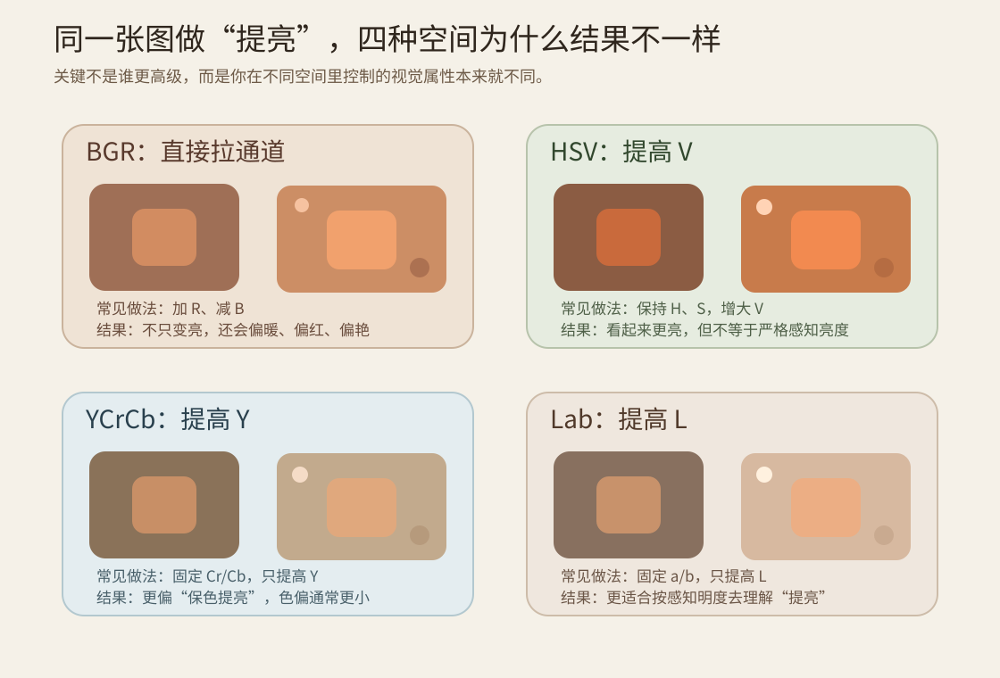

建议把这张图和 lesson 13 里的“用途对比”按钮一起看：

1. `BGR` 提亮通常会顺带改通道平衡，所以更容易出现偏暖、偏冷、偏色。
2. `HSV` 提 `V` 更像“让颜色看起来更亮”，但它不等于严格的人眼感知亮度。
3. `YCrCb` 提 `Y` 更接近“保色提亮”，因为色度主要还留在 `Cr/Cb`。
4. `Lab` 提 `L` 则更适合从“感知明度层次”去理解亮度调整。

---

## 十七、颜色分割实战：为什么大多数教程都绕不开 HSV

前面讲的是“选空间的道理”，这里补两个实战结论。

### 17.1 实战任务：提取红色区域

最常见做法不是在 `BGR` 上直接卡三通道，而是：

1. `BGR -> HSV`
2. 对 `H/S/V` 设定区间
3. 用 `cv::inRange` 得到 mask
4. 用 `bitwise_and` 提取结果

原因是：

- `HSV` 的 `H` 更像“颜色类别”
- 同样是红色，明暗变化主要体现在 `V`
- 鲜艳程度变化主要体现在 `S`
- 所以区间更稳定

### 17.2 红色为什么要两段区间

因为 `H` 是环形：

- 一部分红色靠近 `0`
- 另一部分红色靠近 `179`

所以常见写法是：

```cpp
cv::Mat mask1, mask2, mask;
cv::inRange(hsv, cv::Scalar(0, 80, 50), cv::Scalar(12, 255, 255), mask1);
cv::inRange(hsv, cv::Scalar(168, 80, 50), cv::Scalar(179, 255, 255), mask2);
cv::bitwise_or(mask1, mask2, mask);
```

如果你回头看上面的色相环图，会发现这不是“技巧”，而是 `H` 这个坐标本来就是首尾相接的环。

### 17.3 为什么 BGR 阈值常常不稳

因为你在 `BGR` 里同时把：

- 颜色类别
- 亮度变化
- 饱和变化

混在了一起。

同一个“看起来是红色”的物体，在阴影里、强光下、白平衡不同的情况下，`B/G/R` 数值可能变化很大。

所以：

- `BGR` 阈值：可以用，但通常更脆弱
- `HSV` 阈值：通常更适合颜色提取

### 17.4 本课建议观察什么

在配套界面里你可以重点观察：

1. `HSV 红色提取` 为什么要两段区间
2. `BGR 阈值误区` 为什么同样是“红色检测”，结果更容易乱
3. “颜色空间选择”不是抽象理论，而是直接影响分割质量

---

## 十八、本课小结

### 你至少要记住这 6 句

1. `BGR` 是 OpenCV 默认颜色空间，不是 `RGB`
2. `HSV` 最适合理解“颜色、饱和度、明暗”
3. `H` 是环形量，不是普通线性量
4. `YCrCb` 最适合“只动亮度，不乱颜色”
5. `Cr/Cb` 是色差，不是红蓝原始通道
6. `Lab` 更接近人眼感知，适合更高级颜色处理

### 最后一句话

**色彩空间不是知识点堆砌，它本质上是在为“把问题拆对”服务。**

当你知道“我要控制的是哪一个视觉属性”，你自然就知道该去哪一个空间处理。
