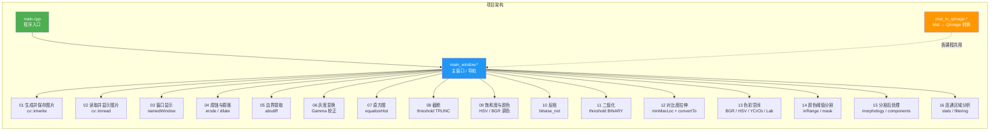
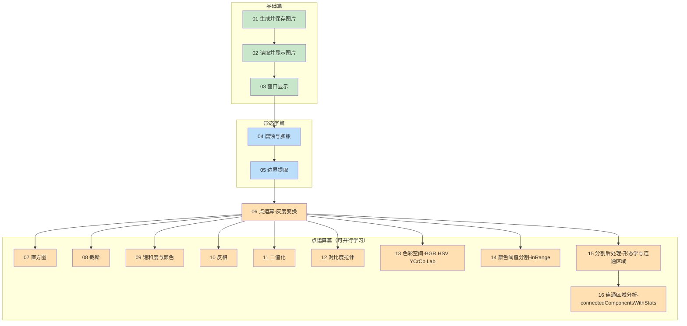

# Qt OpenCV 学习项目

一个最小的 Qt 6 Widgets 学习项目，用 OpenCV 读取/生成图片并展示。

## 依赖
- Qt 6.8.3（安装在 /home/zyh/Qt/6.8.3）
- OpenCV（通过 apt 安装）

## 构建
```bash
cmake -S . -B build -DCMAKE_PREFIX_PATH=/home/zyh/Qt/6.8.3/gcc_64
cmake --build build
```

## 运行
```bash
./build/QtOpenCVWebpViewer
```

## 目录结构



### 课程学习路线图



### 文件列表
- main.cpp：入口
- main_window.*：主窗口（首页+导航）
- 01 生成并保存图片/：imwrite 子项目
- 02 读取并显示图片/：imread 子项目
- 03 窗口显示/：namedWindow 子项目
- 04 腐蚀与膨胀/：滑动条腐蚀/膨胀子项目
- 05 边界提取/：腐蚀边界提取子项目
- 06 点运算-灰度变换/：点运算灰度变换子项目
- 07 点运算-直方图/：点运算直方图子项目
- 08 点运算-截断/：点运算截断子项目
- 09 点运算-提升饱和度与颜色/：点运算颜色调整子项目
- 10 点运算-反相/：点运算反相子项目
- 11 点运算-二值化/：点运算二值化子项目
- 12 点运算-对比度拉伸/：点运算对比度拉伸子项目
- 13 色彩空间-BGR HSV YCrCb Lab/：色彩空间入门与用途对比子项目
- 14 颜色阈值分割-inRange/：颜色分割与 inRange 子项目
- 15 分割后处理-形态学与连通区域/：分割后处理与连通区域筛选子项目
- 16 连通区域分析-connectedComponentsWithStats/：连通区域标号、面积筛选与最大区域子项目
- mat_to_qimage.*：OpenCV 到 QImage 转换

### Lesson 13 补充说明

- lesson 13 现在不仅包含 `BGR / HSV / YCrCb / Lab` 的文字讲解，还带有多张原创 SVG 示意图。
- Qt 界面里可以直接预览这些示意图，包括 `HSV 圆锥`、`Hue 色相环`、`BGR 只增加 R`、`Lab 的 L/a/b`，以及“四种空间提亮对比”。
- 如果你想快速理解“为什么同样叫提亮，结果却不一样”，建议优先查看 lesson 13 文档中的“四种空间提亮对比”图，再配合界面里的“用途对比”按钮观察。
