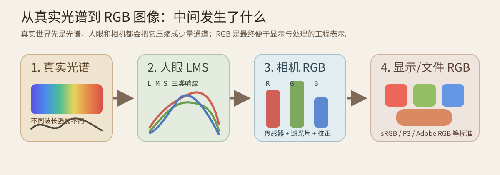
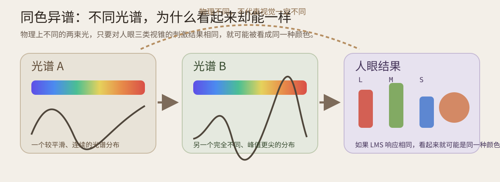
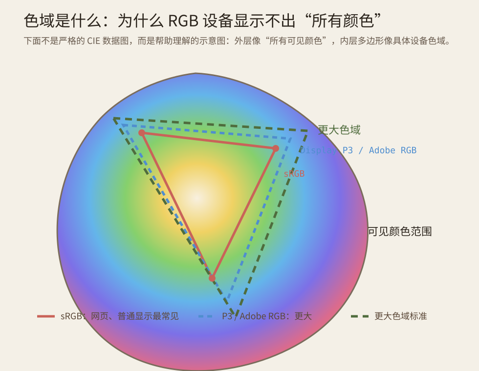

# 同色异谱、色域与颜色再现

这篇是对上一篇 [RGB、人眼与颜色空间的根本理解.md](RGB、人眼与颜色空间的根本理解.md) 的继续展开。

如果上一讲回答的是：

- 为什么世界本身不是 `RGB`
- 为什么人眼和相机最后却能用少量通道描述颜色

那么这一讲要回答的是另外三个更深的问题：

1. 为什么两条不同的光谱，最后却可能看起来是同一种颜色
2. 为什么 `RGB` 设备不可能显示“所有可见颜色”
3. 为什么颜色科学更关心“人看到什么”，而不是“物理光谱是否完全一样”

---

## 一、先把整条链路看成一张图

先看这张图，把“从真实世界到 RGB 图像”的整个过程压缩成一条链路：



这张图最重要的结论有 3 个：

1. 真实世界首先是光谱，不是 RGB。
2. 人眼底层更接近 `LMS` 型响应，相机底层则是传感器加滤光片的响应。
3. 最终输出成 `RGB`，是因为它方便显示、存储和处理，而不是因为世界天生就是 RGB。

所以后面讨论“颜色是否一样”时，必须分清两个层面：

- 物理上光谱是否一样
- 视觉上看起来是否一样

这两个问题不是同一个问题。

---

## 二、什么叫同色异谱

所谓同色异谱，简单说就是：

**两条物理上不同的光谱，最后却可能看起来是同一种颜色。**

这件事刚开始听起来反直觉，但它恰恰是颜色科学最核心的事实之一。

看下面这张图：



图里左边和中间是两条不同的光谱：

- 一条更平滑
- 一条峰值更尖、更离散

它们物理上并不一样。

但如果这两条光谱进入人眼后，三类视锥的响应结果非常接近，也就是 `L/M/S` 三个数差不多一样，那么大脑就可能把它们看成同一种颜色。

这就叫同色异谱。

### 2.1 为什么会这样

因为人眼并不是把光谱逐点记下来。

它会把一整条连续光谱压缩成少量通道响应。

粗略理解就是：

$$
连续光谱 \rightarrow 3 个主要视觉响应值
$$

压缩之后，原来很多不同的输入，可能会落到相同或非常接近的输出。

所以：

- 物理世界里它们不同
- 视觉系统里它们可能等效

### 2.2 这件事为什么这么重要

因为它说明了一个根本事实：

**颜色再现的目标，不一定是复制原始光谱本身，而是复制人眼最终的感觉。**

这正是显示器、相机、打印、颜色匹配实验都能成立的原因。

---

## 三、为什么这能解释“RGB 为什么有用”

如果没有同色异谱，颜色再现就会变得极其困难。

因为那样你要复刻的将不是“人眼效果”，而是完整的原始光谱。

但现实不是这样。

现实是：

只要某套发光系统让人眼获得了与目标颜色相近的三通道刺激，很多情况下人就会认为“颜色匹配了”。

这就是 RGB 的根本意义。

它不是在说：

```text
世界只有红绿蓝三种光
```

而是在说：

```text
对三色视觉的人来说，很多颜色感觉可以通过三通道再现来近似匹配
```

这就是颜色工程和颜色物理的边界。

---

## 四、色域是什么

讲完同色异谱以后，另一个自然问题就是：

既然 RGB 这么有用，那为什么还说 RGB 设备不能显示所有颜色？

这就涉及“色域”。

色域可以先用一句不严格但好懂的话理解：

**某个设备、某个颜色系统，实际能表示出来的颜色范围。**

看下面这张示意图：



这张图不是严格的 CIE 实测图，而是帮助理解的结构图。

它表达的是：

1. 外层像“人眼可见颜色的大范围”
2. 里面不同大小的三角形或多边形，像不同 RGB 设备标准能覆盖的范围

比如常见的：

- `sRGB`
- `Display P3`
- `Adobe RGB`
- 更大的标准如 `Rec.2020`

都还是 RGB 体系，但色域大小不同。

### 4.1 为什么 RGB 设备的色域是有限的

因为一个具体显示器的红、绿、蓝原色不是任意理想原色，而是具体的发光材料和硬件响应。

它只能在自身那三种原色之间混合出一块有限区域。

所以：

- RGB 是三通道表示法
- 但具体的 RGB 设备色域并不无限大

这两个说法并不矛盾。

### 4.2 这意味着什么

意味着有些颜色：

1. 人眼能看到
2. 某个现实设备却显示不出来

这时系统只能做近似映射，也就是：

把超出设备色域的颜色，压到最接近的可表示范围里。

这就是很多“为什么显示器上看起来没那么鲜”“为什么打印和屏幕不一致”的根源之一。

---

## 五、为什么“同色异谱”和“色域”要放在一起理解

因为它们分别回答了颜色再现里的两个不同问题：

### 5.1 同色异谱回答的是

**为什么不需要复刻完整光谱，也能让人感觉颜色一样。**

它解决的是“为什么三通道颜色再现有可能成立”。

### 5.2 色域回答的是

**即使三通道再现成立，为什么具体设备还是会有边界。**

它解决的是“为什么现实设备仍然不能无穷无尽地显示所有颜色”。

把两者合起来，你就会得到一个更完整的认识：

1. 颜色再现不是逐点复制原始光谱
2. 颜色再现本质上是在复制视觉效果
3. 但具体设备复制视觉效果的能力仍然有限

---

## 六、回到相机、显示器和 OpenCV

把这套思路放回工程里，会更清楚。

### 6.1 相机在做什么

相机不是在“记录世界真值”，而是在：

1. 对真实光谱做传感器采样
2. 通过滤光片和校正矩阵把数据压到输出色彩空间
3. 生成更适合显示和后处理的 RGB 图像

### 6.2 显示器在做什么

显示器不是“复现原始物理光谱”，而是在：

1. 用自己的三原色发光
2. 尽量让人眼感觉接近目标颜色

只不过它受设备色域限制。

### 6.2.1 如果浏览器拿到一个 `RGB = (100, 100, 100)`，它到底是怎么显示的

这个问题非常好，因为它能把“颜色编码”和“显示硬件”真正连起来。

先说结论：

**浏览器不是查一个“颜色名字表”来找这个颜色，而是把这三个通道值交给图形系统，最后由显示器对应的红、绿、蓝子像素按相应强度发光。**

以 `RGB = (100, 100, 100)` 为例，它表示：

- 红通道强度是 100
- 绿通道强度是 100
- 蓝通道强度是 100

因为三个值相等，所以它不是偏红、偏绿、偏蓝，而是一种灰色。

### 6.2.2 浏览器内部大致会经历什么

可以粗略理解成下面这条链：

1. HTML / CSS / Canvas 里给出一个颜色值，比如 `rgb(100, 100, 100)`。
2. 浏览器把它当作某个标准颜色空间下的数值，最常见是 `sRGB` 语义。
3. 浏览器在绘制、透明混合、图层合成时，通常会交给图形系统和 GPU 处理。
4. 如果系统开启了颜色管理，还可能根据显示器 ICC 配置文件，把这个颜色从 `sRGB` 转到当前显示器自己的色彩空间。
5. 最后送到显示器时，会变成每个像素三个子像素的驱动强度：红子像素、绿子像素、蓝子像素分别发出对应强弱的光。

所以它本质上确实是在做“混合发光”，而不是拿一张巨大的表说“100,100,100 对应世界上的某个固定颜色”。

### 6.2.3 显示器真的有 RGB 灯吗

对大多数常见屏幕，可以粗略理解成“是的”。

更准确的说法是：

1. 一个屏幕像素通常由三个子像素组成。
2. 这三个子像素分别更偏向发出红、绿、蓝三类光。
3. 通过控制这三个子像素的发光强度，人眼会把它们整合成一个最终颜色。

所以从直觉上说：

**显示器确实像是在用很多微小的 RGB 发光单元做加色混合。**

### 6.2.4 那是不是存在一张“RGB 对应颜色”的查表

分两层看：

第一层，从概念上说，不需要一张“世界颜色字典”。

因为 `RGB = (100,100,100)` 的意思本来就是：

```text
让这个像素的 R、G、B 三个子像素按对应强度发光
```

第二层，从工程实现上说，系统里有时确实会存在一些查表或校正表，但它们的作用不是“查这个 RGB 到底叫什么颜色”，而是：

1. 做伽马校正
2. 做颜色管理
3. 做显卡输出映射
4. 做显示器校准

也就是说，表可能存在，但它不是颜色概念的核心，核心仍然是“按三通道强度驱动发光”。

### 6.2.5 为什么 `(100,100,100)` 不等于“亮度正好 100”

这也是一个很容易混淆的点。

`(100,100,100)` 只是一个编码值，它不直接等于物理亮度，也不直接等于人眼主观亮度。

原因包括：

1. `sRGB` 本身通常带有非线性编码特性，不是简单线性亮度。
2. 显示器的实际发光响应也不一定完全线性。
3. 人眼对亮度的感觉本来就不是线性的。

所以：

- 在编码层面，它只是三个通道都是 100 的灰色
- 在显示层面，它会被转换成某个实际发光强度
- 在视觉层面，你感受到的是一个中等偏暗的灰

### 6.2.6 一句话把这个问题彻底说透

如果浏览器要显示 `RGB = (100,100,100)`，它做的事情不是“找到这个颜色的定义”，而是：

**把这个编码解释成三个通道的目标强度，再让显示器的 RGB 子像素按对应比例发光，最后由人眼把它看成一个灰色。**

### 6.3 OpenCV 在做什么

OpenCV 常见的 `BGR`、`HSV`、`YCrCb`、`Lab`，都不是“颜色真理”，而是为了不同任务方便而设计的坐标系。

其中：

- `BGR/RGB` 更贴近设备与显示
- `HSV` 更贴近颜色类别和调色直觉
- `YCrCb` 更适合亮度与色度拆分
- `Lab` 更适合感知型分析

所以学颜色空间时，最容易提升理解层级的一步就是：

**不要把 RGB 当作世界本身，而要把它当作工程再现系统中的一个中间层。**

---

## 七、把这篇压缩成几句最值得记住的话

1. 真实世界首先是光谱，不是 RGB。
2. 人眼不会保留完整光谱，而是把它压缩成少量通道响应。
3. 同色异谱说明“不同光谱也可能看起来一样”。
4. 这正是 RGB 等三通道颜色再现系统能够成立的理论基础之一。
5. 但具体显示设备仍然受色域限制，所以 RGB 设备不能覆盖所有可见颜色。
6. 颜色工程追求的通常不是复制原始光谱，而是尽量复制人眼最终看到的效果。

---

## 八、建议接着思考的两个问题

如果你已经把这两篇看顺了，后面最值得继续追问的是：

1. 为什么屏幕调亮和相机曝光增加，虽然都叫“更亮”，本质上却不是同一件事
2. 为什么同一张图在 `sRGB`、`Display P3`、打印输出之间看起来会不完全一样